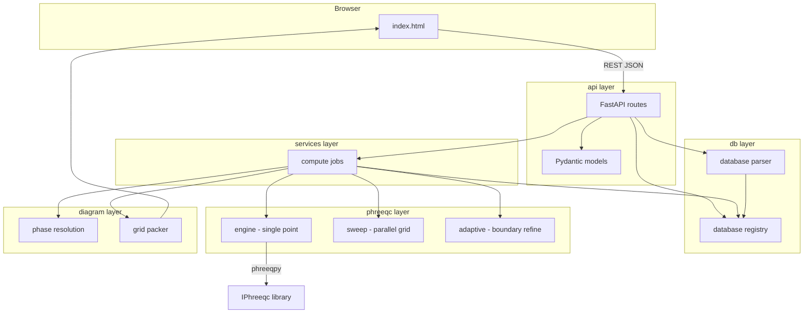
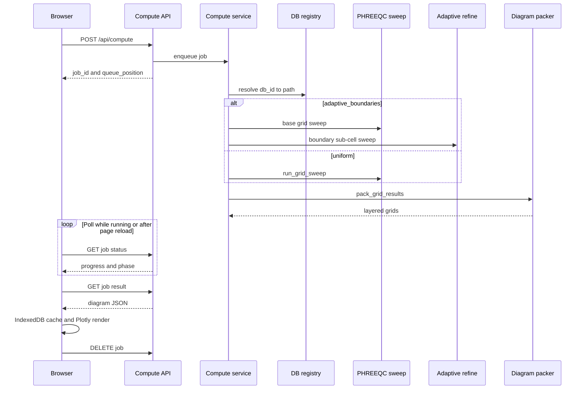

<p align="center">
  
</p>

<p align="center"><em>pH–pe / pH–Eh predominance diagrams from PHREEQC</em></p>

PHASER is a web service for building **pH–pe / pH–Eh predominance diagrams** from PHREEQC thermodynamic databases. Users define a chemical system (total concentrations), select solid phases, and the server evaluates a grid of PHREEQC solutions in parallel to determine which phase or aqueous species is dominant at each point.

Key behaviours:

- **Server-side PHREEQC** with multiprocessing grid sweeps and a **CPU queue** (one sweep at a time by default).
- **Adaptive boundary refinement** — optional mode that evaluates the full selected grid, then subdivides only cells on a phase boundary for a sharper diagram at lower cost than a uniform fine grid.
- **Browser-side settings** and **result cache** — UI state in `localStorage`, diagram results in IndexedDB.
- **Compute reconnect** — refresh or reopen the tab during a run and polling resumes automatically; finished results are fetched when you return.
- **Orphan job cleanup** — a background reaper drops stale queued and finished jobs from server memory when the browser never reconnects.
- **Database registry** — databases are selected by `db_id` from a server-managed catalog.
- **Plotly UI** with resizable sidebar, square diagram, solid/aqueous display layers, Eh/pe toggle, animated header logo during compute, and **phase color persistence** across refreshes.

---

## Quick start

### Linux / WSL (recommended for PHREEQC)

```bash
cd /path/to/Software_dev/PHASER
python3 -m venv .venv-linux
source .venv-linux/bin/activate
pip install -r requirements.txt

# IPhreeqc must be built and available (see phreeqpy docs)
python run_server.py
```

Open [http://localhost:8765](http://localhost:8765) in your browser.

### Windows

Windows Python cannot load Linux `libiphreeqc.so`. Use **WSL** for compute, or install a matching Windows `IPhreeqc` DLL and run natively.

---

## Project layout

```
PHASER/
├── run_server.py          # CLI entry point (uvicorn)
├── config.py              # Paths, limits, defaults (env-overridable)
├── api/                   # HTTP layer (FastAPI)
│   ├── app.py             # Application factory, static files, /icons mount
│   ├── models.py          # Pydantic request bodies
│   ├── dependencies.py    # DB / DLL resolution for routes
│   └── routes/            # One module per API concern
├── db/                    # PHREEQC database handling
│   ├── registry.py        # Server-side database catalog (trusted paths)
│   └── parser.py          # Parse PHASES block from .dat files
├── phreeqc/               # PHREEQC solver integration
│   ├── engine.py          # Single-point evaluation via phreeqpy/IPhreeqc
│   ├── sweep.py           # Multiprocessing grid sweep
│   └── adaptive.py        # Adaptive boundary refinement (optional)
├── diagram/               # Phase diagram assembly
│   ├── phases.py          # Phase name resolution for a chemical system
│   ├── packer.py          # Pack raw results into layered grids for the UI
│   └── vectors.py         # Marching-squares vector polygons for adaptive display
├── services/              # Orchestration logic
│   ├── compute.py         # FIFO compute queue + background grid jobs
│   └── species.py         # Species picker suggestions
├── Icon/                  # Branding assets (served at /icons/)
│   ├── phaser_logo.svg        # Animated header logo (in-app)
│   ├── phaser_logo_v8.png     # Static wordmark (README / docs)
│   └── phaser_favicon.svg     # Square browser-tab icon (spectrum P)
├── static/
│   └── index.html         # Single-page web UI
├── tests/
│   ├── test_adaptive.py   # Adaptive boundary logic unit tests
│   └── test_vectors.py    # Vector display packing + species validation tests
└── data/
    └── databases/
        └── generated/     # User-generated .dat files (+ optional .meta.json)
```

---

## Architecture overview



### Layer responsibilities

| Layer | Role |
|-------|------|
| **api** | HTTP endpoints only. Validates requests, resolves `db_id` to trusted paths, returns JSON. |
| **services** | FIFO compute queue, job lifecycle, and species helpers. No PHREEQC math here. |
| **db** | Discover and register `.dat` files; parse phase catalogs for the UI. |
| **phreeqc** | Build PHREEQC input strings, call IPhreeqc, run parallel sweeps, optional adaptive boundary refinement. |
| **diagram** | Turn per-point SI / species data into 2D predominance grids and display layers. |
| **static** | Client UI: species editor, phase picker, plot canvas, job polling, browser-side settings and result cache. |

---

## Database system

Users select a database by **`db_id`** from a server-managed catalog. Filesystem paths are resolved on the server only.

### Sources

1. **builtin** — `.dat` files scanned from the PHREEQC installation directory (`BUILTIN_DB_DIRS` in `config.py`, default: USGS Phreeqc Interactive `database/` folder).
2. **generated** — `.dat` files in `data/databases/generated/`, for output from external tools (e.g. PyGCC).

### Registry flow

1. On startup / first request, `db/registry.py` scans configured directories.
2. Each file becomes a `DatabaseRecord` with `id`, `name`, `source`, `filename`.
3. Optional sidecar metadata: `mydb.meta.json` next to `mydb.dat` (display name, `origin_service`, etc.).
4. `GET /api/databases` returns client-safe records (**no filesystem paths**).
5. Compute requests pass `db_id`; the server resolves to a trusted absolute path internally.

### Registering a generated database

```bash
# 1. Copy the .dat file into the generated directory
cp custom.dat data/databases/generated/

# 2. Optional: add metadata
cat > data/databases/generated/custom.meta.json <<'EOF'
{
  "name": "My custom thermo DB",
  "origin_service": "pygcc",
  "origin_job_id": "job-123"
}
EOF

# 3. Register (or restart server to rescan)
curl -X POST http://localhost:8765/api/databases/register \
  -H "Content-Type: application/json" \
  -d '{"filename": "custom.dat", "metadata": {"name": "My custom thermo DB"}}'
```

### Environment variables

| Variable | Purpose |
|----------|---------|
| `PHASER_DB` | Default Thermoddem `.dat` path (fallback if not in scan dirs) |
| `PHASER_DEFAULT_DB_ID` | Force default registry id |
| `PHASER_BUILTIN_DB_DIRS` | Extra builtin scan dirs (`os.pathsep`-separated) |
| `PHASER_GENERATED_DB_DIR` | Override generated database directory |
| `PHASER_IPHREEQC_LIB` | Path to `libiphreeqc.so` / `IPhreeqc.dll` |
| `PHASER_HOST` | Bind address (default `0.0.0.0`) |
| `PHASER_PORT` | Listen port (default `8765`) |
| `PHASER_MAX_CONCURRENT_JOBS` | Max simultaneous grid sweeps (default `1`) |
| `PHASER_ADAPTIVE_REFINE_FACTOR` | Boundary subdivision factor in adaptive mode (default `5`) |
| `PHASER_MAX_ADAPTIVE_POINTS` | Max total PHREEQC evaluations in adaptive mode (default `120000`) |
| `PHASER_JOB_RESULT_TTL_SEC` | Drop finished job results from server memory after this (default `3600`) |
| `PHASER_JOB_QUEUE_TTL_SEC` | Drop queued jobs never picked up after this (default `7200`) |
| `PHASER_JOB_REAPER_INTERVAL_SEC` | Background reaper wake interval in seconds (default `60`) |

---

## PHREEQC solver (`phreeqc/`)

### Single-point evaluation (`engine.py`)

For each grid point `(pH, pe)`:

1. **`format_grid_input`** builds a PHREEQC input string:
   - `SOLUTION` with temperature, totals, charge balance species
   - Fixed `pH` and `pe` (Eh is converted in the browser for display)
   - `SELECTED_OUTPUT` requesting saturation indices (`si`) for selected phases
   - `USER_PUNCH` blocks to extract dominant aqueous species per element

2. **`evaluate_point`** runs the string through **phreeqpy** → **IPhreeqc**:
   - Parses selected output and USER_PUNCH results
   - Returns `GridPointResult`: convergence flag, SI dict, dominant solid, aqueous species per element

3. **`validate_phreeqc_setup`** loads the library and database once before spawning workers (fail-fast with clear errors).

### Parallel grid sweep (`sweep.py`)

A phase diagram with 100×100 resolution = **10,000 independent PHREEQC runs**.

- `ProcessPoolExecutor` spawns worker processes (default up to `MAX_WORKERS`).
- Each worker initializes its own IPhreeqc instance (`_worker_init`).
- `pool.map` evaluates all `(pH, pe)` pairs, preserving order.
- Progress callback updates job status for the UI poll loop.

### Adaptive boundary refinement (`adaptive.py`)

The optional **Adaptive boundaries** mode hunts and tracks phase boundaries so they render much sharper for far less compute than a uniform fine grid.

**Algorithm:**

1. **Base sweep** — the full selected grid is evaluated (e.g. 100×100 = 10,000 runs). Nothing is downsampled, so no phase region is missed.
2. **Boundary detection (all layers)** — for each base point a composite signature is built across *every* plottable layer: each solid-element subset (e.g. Fe-only, Cu-only, Fe-Cu, …) and each aqueous-element map. A base cell is flagged when this signature differs across its four corners, so boundaries are refined even when only a sub-system layer (not the full-system solid predominance) changes there.
3. **Subdivision** — only those boundary cells are subdivided by `ADAPTIVE_REFINE_FACTOR` (default 5). New sub-grid points are evaluated with **real PHREEQC runs** (not interpolation).
4. **Vector extraction** — a fine category grid is assembled (interior cells taken from the nearest base node, boundary cells from the refined results) and marching-squares contours (`scikit-image`) trace each region into smooth filled polygons plus thin boundary lines.

For display, regions are delivered as **vector polygons and boundary lines**, so they stay crisp at any zoom. Each region polygon carries its area so enclosed regions are painted in the correct front-to-back order. Only the base grid is packed for hover and per-point data.

**Result metadata** (`adaptive_stats` in the packed JSON):

| Field | Meaning |
|-------|---------|
| `refine_factor` | Subdivision factor actually used (may be downgraded if `MAX_ADAPTIVE_POINTS` would be exceeded) |
| `fine_levels_ph`, `fine_levels_pe` | Fine category-grid dimensions used for contour extraction |
| `base_levels_ph`, `base_levels_pe` | Base grid dimensions (same as the user's plot resolution) |
| `boundary_cells` | Number of base cells flagged as straddling a boundary |
| `n_evaluated` | Total PHREEQC runs (base + boundary sub-cells) |

Limits (`config.py`):

| Constant | Default | Purpose |
|----------|---------|---------|
| `GRID_LEVELS` | 100 | Default resolution for both pH and pe/Eh axes |
| `MAX_GRID_POINTS` | 40,000 | Hard cap on `ph_levels × pe_levels` for the **base** grid |
| `ADAPTIVE_BOUNDARIES_DEFAULT` | true | UI and API default for adaptive mode |
| `ADAPTIVE_REFINE_FACTOR` | 5 | Boundary-cell subdivision factor (env `PHASER_ADAPTIVE_REFINE_FACTOR`) |
| `MAX_ADAPTIVE_POINTS` | 120,000 | Max total PHREEQC evaluations in adaptive mode; refine factor is downgraded only if exceeded (env `PHASER_MAX_ADAPTIVE_POINTS`) |
| `MAX_PHASES_PER_JOB` | 200 | Max phases per compute request |
| `MAX_WORKERS` | 8 | Worker processes per sweep (capped by CPU count) |
| `MAX_CONCURRENT_JOBS` | 1 | Max simultaneous sweeps server-wide |
| `JOB_RESULT_TTL_SEC` | 3600 | Drop finished jobs from memory after this (env `PHASER_JOB_RESULT_TTL_SEC`) |
| `JOB_QUEUE_TTL_SEC` | 7200 | Drop abandoned queued jobs after this (env `PHASER_JOB_QUEUE_TTL_SEC`) |
| `JOB_REAPER_INTERVAL_SEC` | 60 | Reaper thread interval (env `PHASER_JOB_REAPER_INTERVAL_SEC`) |

### Compute queue (`services/compute.py`)

When several users (or tabs) submit computes at once, extra jobs wait in a **FIFO queue** until a compute slot is free.

1. `POST /api/compute` creates a job with status **`queued`**.
2. A dispatcher starts the job when `running_count < MAX_CONCURRENT_JOBS`.
3. Status becomes **`running`** while the sweep executes; progress is polled via `GET /api/job/{id}`.
   - Job payload includes **`progress`** (0–1) and **`phase`** (`grid`, `boundaries`, `packing`, or `compute` for uniform mode).
4. On completion: **`done`** or **`error`**.
5. Queued jobs expose **`queue_position`** (1-based) and **`queue_size`** so the UI can show *"Queued — position 2 of 3"*.
6. After the browser fetches the result, it calls **`DELETE /api/job/{id}`** to free server memory.
7. **Page reload during compute:** the UI stores the active `job_id` in `sessionStorage` and resumes polling on load. If the job finished while the tab was away, the result is fetched automatically.
8. **Orphan cleanup:** a background reaper drops finished jobs after `JOB_RESULT_TTL_SEC` (default 1 h) and queued jobs that were never started after `JOB_QUEUE_TTL_SEC` (default 2 h). Polls update `last_seen_at` on each job.

Job statuses: `queued` → `running` → `done` | `error`.

---

## Phase diagram building (`diagram/`)

### Phase selection (`phases.py`)

Before compute:

1. Derive **system elements** from total concentrations (e.g. `Fe`, `C(4)` → `Fe`, `C`).
2. **`filter_phases`** (from `db/parser.py`) returns phases whose element sets are subsets of the system.
3. User-selected phases (or auto-discovered set) become the `phases` tuple passed to PHREEQC.

### Result packing (`packer.py`)

After the sweep, each grid point has SI values and aqueous dominance data. The packer:

1. Builds axis arrays (pH, pe or Eh).
2. For each **element subset** of the system, determines the **dominant solid** (highest SI ≥ 0 among eligible phases) or falls back to the dominant aqueous species.
3. Produces integer category grids mapping each `(pH, y)` cell to a phase/species index.
4. Builds **layers**:
   - `solid_subsets` — predominance among solids + aqueous fallback per subset
   - `elements` — per-element aqueous species maps

The UI (`static/index.html`) renders these layers as colored regions with Plotly. Display options (solid vs aqueous-by-element, Eh vs pe, boundaries, labels) are handled client-side.

---

## Web UI (`static/index.html`)

### Chemistry defaults

- Default units: **`mmol/kgw`**, default concentration **1** per species.
- Mol-family unit changes auto-convert concentrations in the UI.
- Charge balance species selectable (default `Na`); `0` concentration means no contribution to balance.

### Settings persistence

User settings (database, species, axes, phase selection, plot resolution, adaptive boundaries, display options, **phase colors**) are stored in the browser:

| Storage | Key / store | Contents |
|---------|-------------|----------|
| `localStorage` | `phaseDiagramState.v7` | UI settings (auto-saved on every edit) |
| `localStorage` | `phaserLayout.v1` | Sidebar width |
| `sessionStorage` | `phaserLastResultKey.v1` | Pointer to the last cached diagram |
| `sessionStorage` | `phaserActiveJob.v1` | Active compute job (`jobId` + cache key) for reconnect after refresh |
| IndexedDB | `phaserResultCache.v2` / `results` | Packed diagram JSON (large results) |

Closing the tab or clearing site data resets settings. Cached diagrams persist until TTL or cache eviction.

### Plot resolution

A single **plot resolution** slider in the Configuration panel sets both `ph_levels` and `pe_levels` sent to the compute API (e.g. 100 → 100×100 = 10,000 PHREEQC runs). The server default is `GRID_LEVELS` in `config.py`, exposed as `defaults.grid_levels` from `/api/config`.

The **Adaptive boundaries** toggle evaluates that same selected grid in full, then subdivides only the cells on a phase boundary (by `ADAPTIVE_REFINE_FACTOR`, default 5×) so the rendered diagram has much sharper boundaries for a fraction of the runs a uniform fine grid would need. The Configuration panel shows an estimated run count and output resolution (e.g. *Base 100 × 100, boundaries refined 5× → up to 496 × 496 output*).

Phase/species **colors are persisted** in `colorByName` (localStorage). New phases get a stable hash-based palette color on first encounter.

### Result cache

Identical compute requests are served from the browser cache when possible. The cache key includes `adaptive_boundaries` and `adaptive_refine_factor`, so toggling adaptive mode or changing the refine factor forces a fresh compute.

1. The browser hashes the compute request and checks **IndexedDB**.
2. On **cache hit**, the diagram loads from the browser without starting a server job.
3. On **cache miss**, the job is enqueued; when the result is fetched it is stored in IndexedDB.
4. The browser calls **`DELETE /api/job/{job_id}`** to release the result from server memory.

Cache limits: **12 results max**, **12-hour TTL** per entry.

On page load, if the tab session still references a cached result, the diagram is restored from IndexedDB without recomputing.

### Compute reconnect

If you refresh or close and reopen the tab while a job is **queued** or **running**, the UI resumes polling from `sessionStorage` (`phaserActiveJob.v1`). If the job finished while you were away, the result is downloaded, cached, and rendered automatically.

Starting a **new** compute abandons the previous job (server `DELETE`). Running PHREEQC sweeps are not interrupted mid-run — they continue on the server until completion or TTL cleanup.

### Progress and queue feedback

While a job is **queued**, the status line shows **"Queued — position N of M"**.

While **running**, the progress bar and status text reflect the active phase:

| Phase | Status text | Progress bar |
|-------|-------------|--------------|
| `grid` | Computing grid… X% | Determinate (base PHREEQC sweep) |
| `boundaries` | Refining boundaries… X% | Determinate (adaptive boundary sub-cells only) |
| `packing` | Packing diagram… | Indeterminate (server-side grid packing) |
| *(after `done`)* | Downloading diagram result… X% | Determinate when `Content-Length` is available |
| *(client)* | Caching diagram in this browser… | Indeterminate |
| *(client)* | Rendering diagram… | Indeterminate (Plotly) |

Adaptive mode deliberately **resets** the bar between the grid and boundaries phases so each PHREEQC pass reports 0→100% accurately. Post-compute stages (packing, download, cache, render) are tracked separately so a large JSON transfer or slow render does not look like a stuck compute.

### Adaptive display vs hover

When adaptive refinement is active (`refine_factor > 1`):

| Layer | Source | Role |
|-------|--------|------|
| **Packed grid** (`layers` in JSON) | Base grid only (e.g. 100×100) | Hover, per-point data (future: concentrations), never shown as colors |
| **Vector display** (`display` in JSON) | Marching-squares contours of the fine category grid | Smooth colored filled polygons and thin boundary lines |

Each display layer is a list of region polygons (`{cat, area, x, y}`) plus a single `boundaries` polyline set. The browser sorts polygons by `area` (largest first) and fills each with `fill: "toself"`, so a region enclosed inside another is drawn on top; white `none` regions are painted explicitly.

Uniform mode (or adaptive with `refine_factor = 1`) uses the base heatmap for both display and hover.

### Display and layout

- **Solid predominance** vs **aqueous species (by element)** display modes.
- **pe / Eh** axis toggle — Eh is converted for display; the compute API always uses `pe`.
- Non-convergent / `none` cells render **white**; aqueous fallback species use light grey in solid view.
- Resizable left sidebar (desktop); double-click the divider to reset width.
- Square phase diagram area (`aspect-ratio: 1 / 1`).
- **Header logo** — animated inline SVG (`phaser_logo.svg`) with a rainbow scan while computing (`animation-play-state` toggled via `.is-computing` on the brand link).
- **Favicon** — square spectrum **P** (`phaser_favicon.svg`, served at `/icons/`). The README uses the static PNG wordmark because GitHub cannot render the animated SVG logo.

---

## HTTP API

| Method | Path | Description |
|--------|------|-------------|
| `GET` | `/` | Web UI |
| `GET` | `/api/health` | Liveness check |
| `GET` | `/api/config` | Defaults, limits (`max_concurrent_jobs`, `grid_levels`, `adaptive_refine_factor`, `max_adaptive_points`, `job_result_ttl_sec`, `job_queue_ttl_sec`, …), default `db_id` |
| `GET` | `/api/databases` | List available databases |
| `GET` | `/api/databases/{db_id}` | Database details |
| `POST` | `/api/databases/register` | Register generated database metadata |
| `GET` | `/api/elements?db_id=` | Elements in a database |
| `POST` | `/api/phases` | Discover phases for a chemical system |
| `POST` | `/api/compute` | Enqueue grid job → `{job_id, status, queue_position?, queue_size?}` |
| `GET` | `/api/job/{job_id}` | Job status (`queued` \| `running` \| `done` \| `error`), `progress`, `phase`, queue position |
| `GET` | `/api/job/{job_id}/result` | Packed diagram JSON |
| `DELETE` | `/api/job/{job_id}` | Release job/result from server memory (called by UI after fetch) |

### Compute request (`POST /api/compute`)

Key fields in the JSON body:

| Field | Default | Description |
|-------|---------|-------------|
| `totals` | — | Required. Element totals, e.g. `{"Fe": 1.0, "C(4)": 1.0}` |
| `ph_levels`, `pe_levels` | `GRID_LEVELS` | Grid resolution (both axes) |
| `ph_min`, `ph_max`, `pe_min`, `pe_max` | config defaults | Axis bounds |
| `phases` | auto-discover | Selected solid phase names |
| `system_elements` | from totals | Explicit element list for layers |
| `db_id` | server default | Database from registry |
| `adaptive_boundaries` | `true` | Enable adaptive boundary refinement |
| `adaptive_refine_factor` | server default (5) | Subdivision factor (optional; included in browser cache key) |

### Compute flow



---

## Configuration (`config.py`)

Central defaults for grid bounds, worker count, concurrency, IPhreeqc library path, and database directories.

| Setting | Env override | Default | Notes |
|---------|--------------|---------|-------|
| Host / port | `PHASER_HOST`, `PHASER_PORT` | `0.0.0.0:8765` | Used by `run_server.py` and Docker |
| Grid resolution | — | `GRID_LEVELS = 100` | Default for both axes (`ph_levels` and `pe_levels` in API requests) |
| Max base grid points | — | `MAX_GRID_POINTS = 40000` | Cap on `ph_levels × pe_levels` (e.g. 200×200) |
| Adaptive refine factor | `PHASER_ADAPTIVE_REFINE_FACTOR` | `5` | Boundary subdivision in adaptive mode |
| Max adaptive evaluations | `PHASER_MAX_ADAPTIVE_POINTS` | `120000` | Total PHREEQC runs allowed in adaptive mode |
| Max workers per sweep | — | `MAX_WORKERS = 8` | Capped by `os.cpu_count()` in `sweep.py` |
| Max concurrent sweeps | `PHASER_MAX_CONCURRENT_JOBS` | `1` | FIFO queue when exceeded |
| Job result TTL | `PHASER_JOB_RESULT_TTL_SEC` | `3600` | Drop finished jobs from server memory |
| Job queue TTL | `PHASER_JOB_QUEUE_TTL_SEC` | `7200` | Drop abandoned queued jobs |
| Job reaper interval | `PHASER_JOB_REAPER_INTERVAL_SEC` | `60` | Background cleanup wake interval |
| Default units | — | `mmol/kgw` | UI and API default |
| Default species conc. | — | `1.0` | Per species in UI |

See also the database environment variables in the table above.

---

## PyGCC integration

PHASER can consume databases produced by external tools:

1. PyGCC (or another service) generates a `.dat` file.
2. The file is copied into `data/databases/generated/` or registered via `POST /api/databases/register`.
3. PHASER exposes it through `/api/databases` like any builtin database.

---

## Development notes

- **Package name** = folder name (`PHASER`). `run_server.py` adds the parent directory to `sys.path` so `import PHASER` works when run from inside the folder.
- **WSL + Windows**: run the server in WSL; edit files on the Windows side; paths in `config.py` use `/mnt/c/...` when running under Linux.
- **Networking**: with WSL2 **mirrored networking** (`networkingMode=mirrored` in `%UserProfile%\.wslconfig`), the app is reachable on your LAN at the machine's IP (e.g. `http://192.168.x.x:8765`). You may need a Windows Firewall inbound rule for TCP port 8765.
- **Multi-user**: each browser session is isolated (local settings + IndexedDB cache). Compute jobs are independent but share the server queue and CPU pool. Orphaned jobs are reclaimed by the reaper after the configured TTLs.
- **Tests**:
  ```bash
  python scripts/smoke_check.py
  # Adaptive boundary logic (no PHREEQC required):
  python -m pytest tests/test_adaptive.py -q
  ```

---

## Docker

The container builds Linux IPhreeqc from the official USGS source tarball, installs Python dependencies, and includes the PHREEQC database directory from that source package.

Build and run:

```bash
cp .env.example .env
docker compose up --build phaser
```

Open:

```text
http://localhost:8765
```

Generated databases are mounted into the container:

```text
./data/databases/generated -> /app/PHASER/data/databases/generated
```

The container defaults are:

```env
PHASER_IPHREEQC_LIB=/usr/local/lib/libiphreeqc.so
PHASER_BUILTIN_DB_DIRS=/opt/phreeqc/database
PHASER_GENERATED_DB_DIR=/app/PHASER/data/databases/generated
PHASER_MAX_CONCURRENT_JOBS=1
PHASER_ADAPTIVE_REFINE_FACTOR=5
PHASER_MAX_ADAPTIVE_POINTS=120000
PHASER_JOB_RESULT_TTL_SEC=3600
PHASER_JOB_QUEUE_TTL_SEC=7200
```

Run a smoke check inside the image:

```bash
docker compose run --rm phaser python scripts/smoke_check.py
```

Stop services:

```bash
docker compose down
```

---

## Cloudflare Tunnel

For a temporary public test URL from your local machine:

```bash
cloudflared tunnel --url http://localhost:8765
```

For Docker Compose with a named Cloudflare tunnel:

1. Create a tunnel in Cloudflare and obtain the tunnel token.
2. Copy `.env.example` to `.env`.
3. Set:

   ```env
   CLOUDFLARE_TUNNEL_TOKEN=<your-token>
   ```

4. Start PHASER plus the tunnel:

   ```bash
   docker compose --profile tunnel up --build
   ```

The tunnel container connects to the internal Compose service (`phaser:8765`), so no router port forwarding is required.

Never commit the real tunnel token.

---

## Deployment Notes

The Docker image is the deployment unit. A typical deployment path is:

1. Build the Docker image on a VPS or container platform.
2. Mount persistent storage for `data/databases/generated`.
3. Expose the app through Cloudflare Tunnel or a reverse proxy.

The main deployment decisions:

- Built-in PHREEQC databases can live inside the image.
- User-generated databases should live in a persistent mounted volume.
- Set `PHASER_MAX_CONCURRENT_JOBS` based on available CPU/RAM (default `1` is safe for shared hosts).
- A PyGCC service can copy `.dat` files into that volume or call `/api/databases/register` after generating them.
