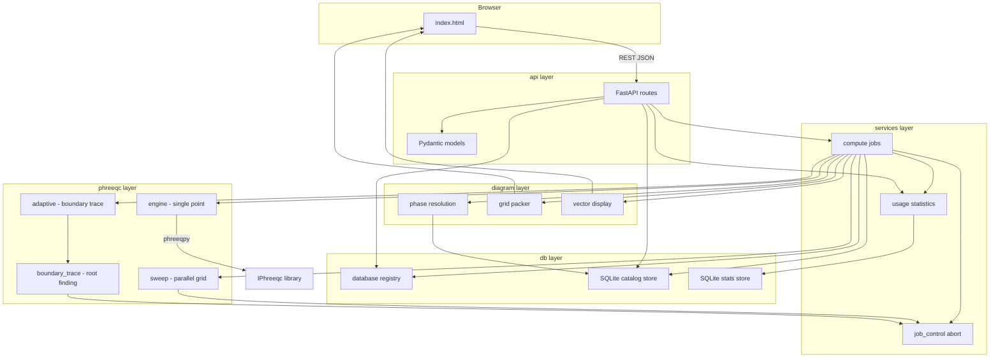
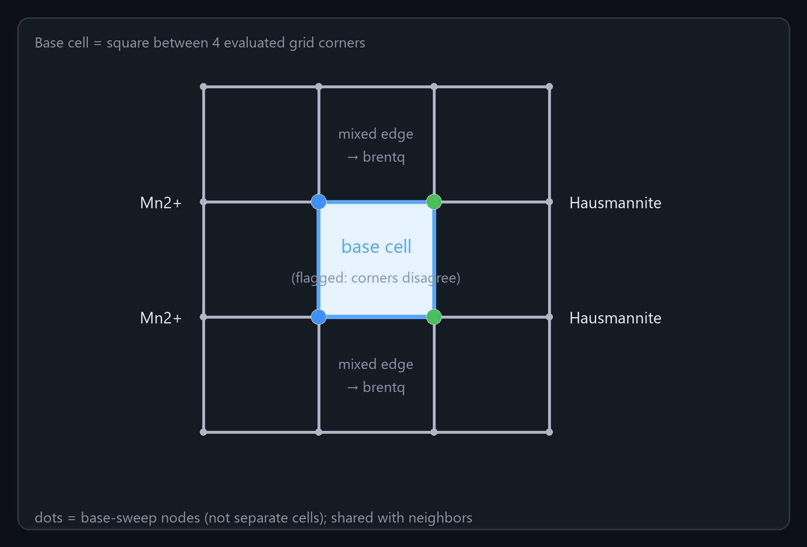
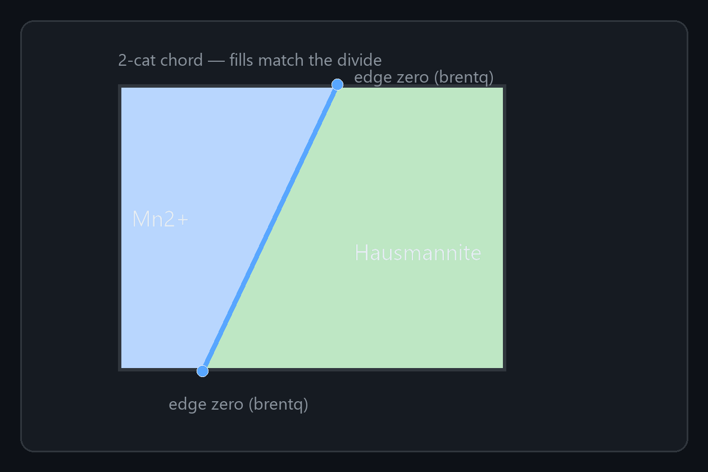
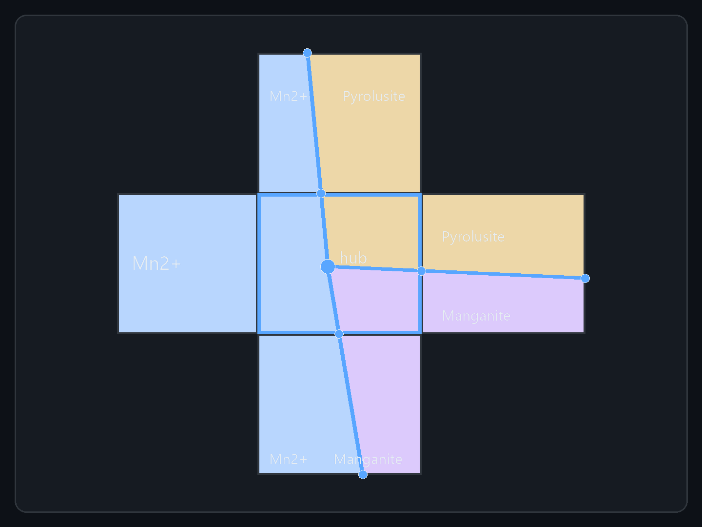
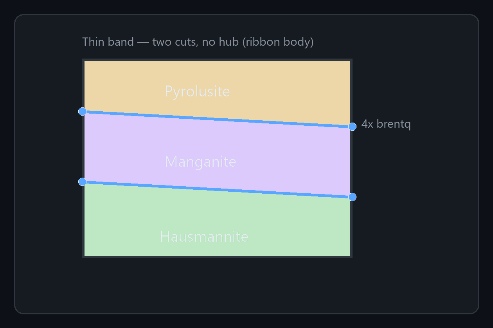
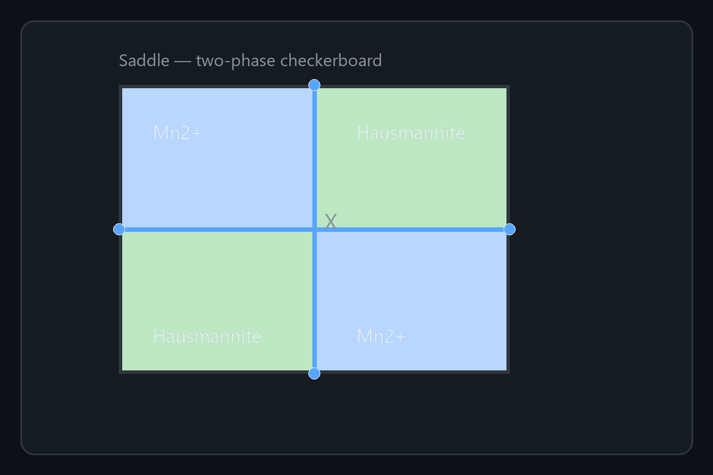
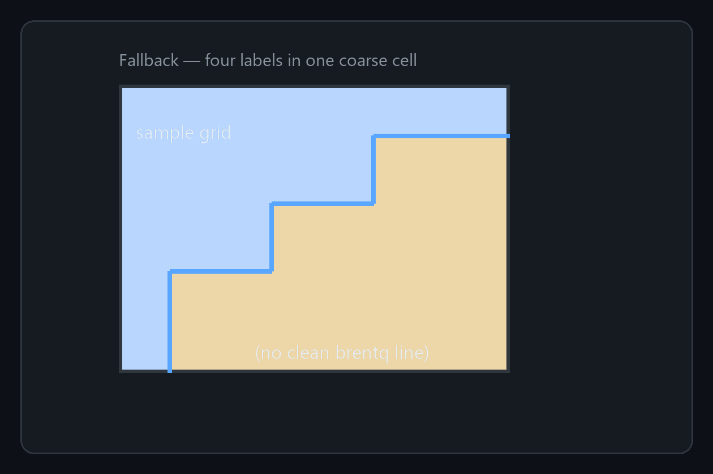
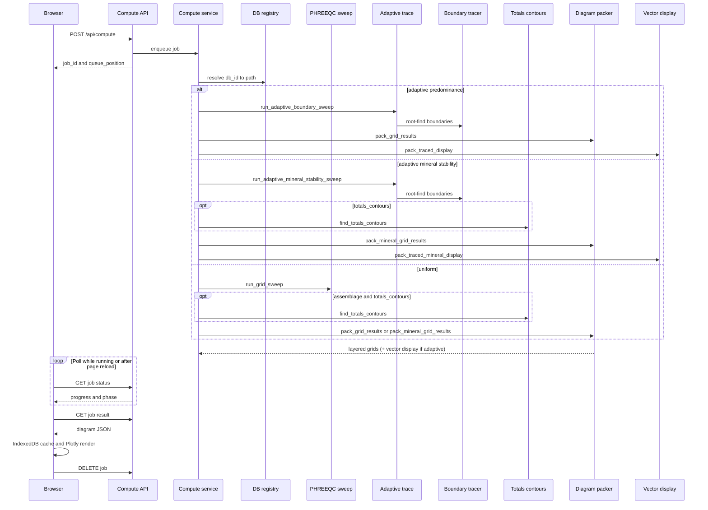

# PHASER

<p align="center">
  
</p>

<p align="center"><em>pH–pe / pH–Eh predominance and mineral-stability diagrams from PHREEQC</em></p>

<p align="center">
  <a href="https://github.com/matteo-loche/phaser/blob/main/LICENSE.txt"></a>
  &nbsp;
  <a href="https://doi.org/10.5281/zenodo.21145794"></a>
</p>

PHASER is a web app for building **pH–pe / pH–Eh / pH-fO2 geochemical phase diagrams** with PHREEQC. You set a chemical system and solid phases; the server runs a multiprocessed grid of equilibria and draws the map. Run it via **Docker** (databases and IPhreeqc included) or from source on Linux/WSL.

Two diagram products share the same workspace:

- **Saturation** — which solid or dissolved species is thermodynamically preferred at each point (highest Saturation Index).
- **Mineral Stability** — which solids form when selected phases are held at equilibrium. **Predominant mineral** colours by the solid with the most precipitated amount; **Co-stability** shows every solid that is present (joined as `A + B` when several coexist).

**Main features**

- **Smooth phase boundaries** (default) — boundaries are refined after the base grid so regions draw as clean fills and lines, not only a coarse heatmap style diagram.
- **Layers** — solid/mineral and aqueous maps, optional per-element filter views; hover on the diagram lists top aqueous species and precipitated amounts in Mineral Stability at this location.
- **Concentration heatmap & contours** *(Mineral Stability)* — colour by aqueous `log₁₀ TOT` (mol/kgw) for system elements, plus optional log-spaced isolines refinement.
- **Rich display options** — labels (name / formula / both), colours per phase, fill opacity, boundary width, axis ticks/fonts, callouts, system badges, and more — tweak the figure without recomputing.
- **PNG download** — export the plot (or selected layers) at chosen size, aspect, and DPI.
- **No login — stays in your browser** — diagram history, sidebar settings, layout, and colour choices are stored locally on your machine; nothing of that is kept as a user account on the server. Leave mid-run and the job can resume when you return (same browser/origin).
- **Database picker** — choose a thermodynamic database from the ones included with Phreeqc or add a new one.
- **Statistics** — server usage dashboard: see the most used chemical systems, average compute times and more.


| Topic | Go to |
|----------|--------|
| Architecture / repo map | [Architecture overview](#architecture-overview), [Project layout](#project-layout) |
| Run a diagram | [Part I: Using PHASER](#part-i-using-phaser) |
| Screens, controls, browser behaviour | [Part II: Web UI](#part-ii-web-ui) |
| Chemistry / tracing | [Part III: Chemistry engine](#part-iii-chemistry-engine) |
| Jobs, packing, diagram JSON | [Part IV: Compute and packing](#part-iv-compute-and-packing) |
| API, security, config | [Part V: API, security and configuration](#part-v-api-security-and-configuration) |
| Docker / production | [Part VI: Deployment](#part-vi-deployment) |
| Roadmap | [Part VII: Future features](#part-vii-future-features) |

## Table of contents

- [Getting started](#getting-started)
- [Architecture overview](#architecture-overview)
  - [Layer responsibilities](#layer-responsibilities)
- [Project layout](#project-layout)
- [Part I: Using PHASER](#part-i-using-phaser)
  - [1.1 Diagram modes](#11-diagram-modes)
  - [1.2 Build a diagram](#12-build-a-diagram)
  - [1.3 Reading the diagram](#13-reading-the-diagram)
  - [1.4 Useful settings](#14-useful-settings)
  - [1.5 Water window and gas lines](#15-water-window-and-gas-lines)
  - [1.6 Databases](#16-databases)
- [Part II: Web UI](#part-ii-web-ui)
  - [2.1 Modes and routing](#21-modes-and-routing)
  - [2.2 Layout (diagram modes)](#22-layout-diagram-modes)
  - [2.3 Statistics dashboard (`#/stats`)](#23-statistics-dashboard-stats)
  - [2.4 Header: database](#24-header-database)
  - [2.5 Left sidebar](#25-left-sidebar)
  - [2.6 Header: compute and progress](#26-header-compute-and-progress)
  - [2.7 Right plot panel](#27-right-plot-panel)
    - [Display](#display)
    - [Labels](#labels)
    - [Fill](#fill)
    - [Overlays](#overlays)
    - [Concentration heatmap and contours (Mineral Stability)](#concentration-heatmap-and-contours-mineral-stability)
    - [Axes](#axes)
    - [Download](#download)
  - [2.8 Diagram rendering](#28-diagram-rendering)
  - [2.9 Settings persistence](#29-settings-persistence)
  - [2.10 Result cache and reconnect](#210-result-cache-and-reconnect)
  - [2.11 Redox axis (log fO₂ / Eh / pe)](#211-redox-axis-log-fo-eh-pe)
- [Part III: Chemistry engine](#part-iii-chemistry-engine)
  - [3.1 Chemistry pipeline](#31-chemistry-pipeline)
  - [3.2 Database system](#32-database-system)
    - [Sources](#sources)
    - [Registry flow](#registry-flow)
    - [The PHREEQC catalog (`data/catalog.sqlite`)](#the-phreeqc-catalog-datacatalogsqlite)
  - [3.3 Single-point evaluation and titration frames](#33-single-point-evaluation-and-titration-frames)
  - [3.4 Convergence rescue (KNOBS)](#34-convergence-rescue-knobs)
  - [3.5 Water-band mask and gas-limit chemistry](#35-water-band-mask-and-gas-limit-chemistry)
  - [3.6 Trace phase edges](#36-trace-phase-edges)
  - [3.7 Element-total contours (Mineral Stability)](#37-element-total-contours-mineral-stability)
- [Part IV: Compute and packing](#part-iv-compute-and-packing)
  - [4.1 End-to-end compute flow](#41-end-to-end-compute-flow)
  - [4.2 Compute queue and job lifecycle](#42-compute-queue-and-job-lifecycle)
  - [4.3 Parallel workers (grid sweep, boundary trace, and totals contours)](#43-parallel-workers-grid-sweep-boundary-trace-and-totals-contours)
  - [4.4 Phase selection, packing, and hover](#44-phase-selection-packing-and-hover)
  - [4.5 Vector display and gas overlay rendering](#45-vector-display-and-gas-overlay-rendering)
- [Part V: API, security and configuration](#part-v-api-security-and-configuration)
  - [5.1 HTTP API](#51-http-api)
  - [5.2 API security and rate limiting](#52-api-security-and-rate-limiting)
  - [5.3 Configuration reference](#53-configuration-reference)
- [Part VI: Deployment](#part-vi-deployment)
  - [6.1 Docker image and compose](#61-docker-image-and-compose)
  - [6.2 Cloudflare Tunnel](#62-cloudflare-tunnel)
  - [6.3 Image publishing (GitHub Actions)](#63-image-publishing-github-actions)
  - [6.4 Production server](#64-production-server)
  - [6.5 CPU, workers, and concurrent jobs](#65-cpu-workers-and-concurrent-jobs)
  - [6.6 Network access (LAN & Tailscale)](#66-network-access-lan-tailscale)
  - [6.7 Deployment checklist](#67-deployment-checklist)
- [Part VII: Future features](#part-vii-future-features)
  - [External / generated thermodynamic databases](#external--generated-thermodynamic-databases)

---

## Getting started

### Docker

Pull the pre-built image from GHCR — no local compiler required:

```bash
cd /path/to/PHASER
cp .env.example .env          # Windows: copy .env.example .env
docker compose pull
docker compose up -d
```

Open [http://localhost:8765](http://localhost:8765). See [Part VI — Deployment](#part-vi-deployment) for VPS setup, runtime tuning, and optional Cloudflare Tunnel / Watchtower profiles.

To **build the image from source** instead of pulling (developers / CI only):

```bash
docker compose up --build -d
```

### From source (Linux / WSL)

```bash
cd /path/to/PHASER
python3 -m venv .venv-linux
source .venv-linux/bin/activate
pip install -r requirements.txt

# IPhreeqc must be built and available (see phreeqpy docs)
python run_server.py
```

Open [http://localhost:8765](http://localhost:8765).

### Windows

Windows Python cannot load Linux `libiphreeqc.so`. Use **WSL** or **Docker** for compute, or install a matching Windows `IPhreeqc` DLL and set **`PHASER_IPHREEQC_LIB`** to its path (see `.env.example` / `config.py`).


---

## Architecture overview

How the browser, API, services, databases, PHREEQC solver, and diagram packers fit together. Folder map: [Project layout](#project-layout). Product use: [Part I](#part-i-using-phaser).



### Layer responsibilities

| Layer | Role |
|-------|------|
| **api** | HTTP endpoints only. Validates requests, resolves `db_id` to trusted paths, returns JSON. |
| **services** | FIFO compute queue, job lifecycle (reaper + wall-clock abort via `job_control.py` with **spawn** ProcessPools), species helpers, and usage-statistics recording. No PHREEQC math here. |
| **db** | Discover/register `.dat` files; build and serve the SQLite PHREEQC catalog (`catalog_store.py`); persist per-server compute events (`stats_store.py`). |
| **phreeqc** | Build PHREEQC input strings, call IPhreeqc (with KNOBS ladder), run parallel sweeps / boundary tracing (SI predominance and mineral-stability plugins) / optional totals-contour root-find; register live ProcessPools for hard-kill on timeout. Lazy imports avoid circular deps under multiprocessing **spawn**. |
| **diagram** | Turn per-point SI / precipitated-mole / species / `TOT` data into 2D category grids, `totals_heatmap` packs, and traced display layers (vector fills batched per category). |
| **static** | Client UI: species editor, phase picker, plot canvas (incl. totals heatmap fill + contour overlays), job polling, browser-side settings and result cache. |


---

## Project layout

Repository tree (main packages and entry points). Layer roles: [Architecture overview](#architecture-overview).

```
PHASER/
├── run_server.py          # CLI entry point (uvicorn)
├── __version__.py         # App version and optional DOI (SemVer)
├── config.py              # Paths, limits, defaults (env-overridable)
├── LICENSE.txt            # AGPL-3.0
├── api/                   # HTTP layer (FastAPI)
│   ├── app.py             # Application factory, static files, rate-limit middleware
│   ├── rate_limit.py      # Per-IP sliding-window limits and post-burst cooldowns
│   ├── models.py          # Pydantic request bodies
│   ├── dependencies.py    # DB resolution for routes
│   └── routes/            # One module per API concern
│       ├── compute.py     # GET /api/queue, POST /api/compute, job status / result / DELETE
│       ├── config_routes.py
│       ├── databases.py
│       ├── elements.py
│       ├── phases.py
│       ├── stats.py
│       └── health.py
├── chemistry/             # Unit conversion; formal charge guesses (dummy medium)
│   ├── units.py
│   └── charges.py         # formal_eq_of_total_key() for charge-side guessing
├── db/                    # PHREEQC database handling
│   ├── registry.py        # Server-side database catalog (trusted paths)
│   ├── catalog_store.py   # SQLite PHREEQC catalog (elements/phases/species/collisions)
│   └── stats_store.py     # SQLite per-server compute usage statistics
├── phreeqc/               # PHREEQC solver integration
│   ├── catalog.py         # .dat text parsers + optional SI probe → catalog snapshot
│   ├── engine.py          # Single-point evaluation via phreeqpy/IPhreeqc
│   ├── knobs.py           # Numerical KNOBS retry ladder (convergence rescue)
│   ├── input_titration.py # Real electrolyte (Cl⁻/NaOH) pH + O₂(g) titration input
│   ├── input_dummy_titration.py # Dummy-electrolyte titration (SI predominance)
│   ├── input_assemblage_dummy.py # Dummy titration + EQUI solids (mineral stability)
│   ├── input_assemblage_titration.py # Real electrolyte + EQUI solids (mineral stability)
│   ├── mineral_stability.py # Precipitated-mole categories + root scalars (moles / costability)
│   ├── mineral_stability_trace.py # Adaptive trace orchestration for mineral modes
│   ├── totals_contours.py # log₁₀(TOT) isoline root-find + polyline stitch (process-pooled)
│   ├── dummy_medium.py    # Bgc+/Bga- inert medium definitions
│   ├── gas_limits.py      # O₂/H₂ water window and component-gas helpers
│   ├── sweep.py           # Multiprocessing grid sweep (killable ProcessPool)
│   ├── adaptive.py        # Adaptive boundary orchestration (SI predominance)
│   └── boundary_trace.py  # Root-finding tracer (brentq; predominance + mineral plugins)
├── diagram/               # Phase diagram assembly
│   ├── phases.py          # Phase name resolution for a chemical system
│   ├── packer.py          # Pack grid results; SI + mineral-stability category grids + totals_heatmap
│   └── vectors.py         # Vector fills (predominance + mineral-stability traced display)
├── services/              # Orchestration logic
│   ├── catalog.py         # Startup / background catalog scans (text parse + SI probe)
│   ├── compute.py         # FIFO compute queue, reaper, wall-clock timeout
│   ├── job_control.py     # Cancel tokens, spawn ProcessPool, hard-kill on abort
│   ├── stats.py           # Per-server usage statistics recording
│   └── species.py         # Species picker suggestions
├── Icon/                  # Branding assets (served at /icons/)
│   ├── phaser_logo.svg        # Animated header logo (in-app)
│   ├── phaser_logo_v8.png     # Static wordmark (README / docs)
│   └── phaser_favicon.svg     # Square browser-tab icon (spectrum P)
├── static/
│   └── index.html         # Single-page web UI
├── scripts/
│   └── smoke_check.py     # Import/registry smoke test
├── docker-compose.yml     # Server deployment (pull GHCR; optional local build)
├── Dockerfile             # Image build (used by GitHub Actions and compose --build)
├── .github/workflows/
│   └── docker-publish.yml # Build & push to GHCR on main / tags
└── data/
    ├── catalog.sqlite     # Auto-created PHREEQC catalog cache (gitignored)
    ├── stats.sqlite       # Auto-created per-server usage log (gitignored)
    └── databases/
        └── generated/     # External .dat drop zone (future ingest; optional .meta.json)
```


## Part I: Using PHASER

Short guide for **running diagrams**: what the modes mean, what to click, and how to fix common plot issues. Screen layout: [Part II — Web UI](#part-ii-web-ui). Chemistry: [Part III](#part-iii-chemistry-engine). Compute/packing: [Part IV](#part-iv-compute-and-packing). API/config: [Part V](#part-v-api-security-and-configuration).

### 1.1 Diagram modes

| Mode | What it answers |
|------|-----------------|
| **Saturation** | Which solid or dissolved species is preferred at each (pH, redox) point? |
| **Mineral Stability** | Which solids form when your selected phases are held at equilibrium? **Predominant mineral** = the solid with the largest precipitated amount; **Co-stability** = every solid that is present (`A + B` when several coexist). |
| **Statistics** | Server usage only — no diagram compute. |

Saturation and Mineral Stability share the workspace (database, History, O₂/H₂ overlays) but keep **separate** results.

**Dummy vs Real** (sidebar): Dummy uses a simple charge-balance medium (typical for predominance maps); Real uses a chloride electrolyte. Pick what matches your modelling intent; chemistry details are in Part III.

### 1.2 Build a diagram

1. Choose **Saturation** or **Mineral Stability**.
2. Pick a **database** (green status = ready).
3. Set the **chemical system** (totals; default mmol/kgw) and **temperature**.
4. Set **pH** and **redox** ranges. Display can be **Eh**, **pe**, or **log fO₂**. pe↔Eh is display-only; switching to/from log fO₂ needs a new compute.
5. Select **phases** offered for your system.
6. Choose **layers** (solid/mineral and/or aqueous; optional per-element views). On Mineral Stability, pick Predominant vs Co-stability; optionally enable **Compute element-total contours** (+ log step) if you want `log₁₀ TOT` isolines.
7. Under **Configuration**: resolution (50–200, default 100), leave **Trace phase edges** on for smooth boundaries, set **Convergence rescue** if needed.
8. **Compute** — watch the job slot. Long jobs time out around **5 minutes** by default.
9. **Inspect** — hover for species (and precipitated amounts in Mineral Stability). Right panel: labels, colours, **Concentration heatmaps** fill / contour overlays, PNG export.
10. **History** — reopen prior diagrams (up to 24 in the browser). Closing the tab mid-job: the run can resume when you return.

### 1.3 Reading the diagram

| What you see | What it usually means | What to try |
|--------------|----------------------|-------------|
| **White holes / blank patches** inside the chemistry field | Those grid points did not converge | Raise **Convergence rescue** (Standard → Maximum). Slightly coarser chemistry or a different database can also help. |
| **White bands at oxidising / reducing extremes** with O₂/H₂ labels | Outside the water-stability window (overlay), not a failed solve | Expected with overlays on; adjust O₂/H₂ limits in Configuration if you want a different window. |
| **Blocky / pixelated map** | Trace phase edges is off | Turn **Trace phase edges** on and recompute. |
| **Jagged stairs on thin ribbons or tips** | Grid coarser than the feature | Raise **plot resolution**, or accept a local stepped look where many phases meet in one cell. |
| **Grey regions in the solid/mineral view** | Dissolved species shown as a muted fallback colour | Switch the display to **Aqueous** to colour them properly. |
| **Stale** pill / Compute active after an edit | Inputs no longer match the plotted result | Press **Compute** again. |
| **Cached** in the job slot | Same request served from browser history | Expected — no server run. |

Hover always reflects the **base grid** point under the cursor (species list, precipitated amounts). Smooth edges are a drawing refinement of that grid.

### 1.4 Useful settings

| Control | Why it matters |
|---------|----------------|
| **Trace phase edges** | On (default): smooth region fills and boundary lines. Off: fast uniform heatmap only. |
| **Convergence rescue** | How hard the solver retries hard points before leaving them **white**. Off = fastest / more blanks; Standard = recommended; Maximum = fewest blanks / slowest. |
| **Plot resolution** | Density of the base grid (and compute cost). Higher helps thin fields and reduces stepped fallback. |
| **Dummy / Real** | Electrolyte frame for the speciation (see modes above). |
| **O₂ / H₂ limits** | Where the water-window overlay is drawn (defaults 0.21 and 1.0 atm). |
| **Predominant vs Co-stability** | Mineral Stability only — one “winner” solid vs all solids present. |
| **Element-total contours** | Mineral Stability only — optional log-spaced isolines of aqueous **bare-element** totals (`TOT("Fe")`, …, mol/kgw). Enable **Compute element-total contours** in Plot options **before** Compute (default **Concentrations log steps** **2** log₁₀ mol/kgw); style/show afterward in Overlays (default stroke **dot**). |
| **Concentration heatmap** | Mineral Stability always punched — Fill mode colours by `log₁₀ TOT` (mol/kgw) for a bare system element (`Fe`, `C`, …). Mutually exclusive with category colour fills; contour overlays stay independent. |

How edges are located numerically: [Trace phase edges](#36-trace-phase-edges) in Part III.

### 1.5 Water window and gas lines

O₂/H₂ (and other gas) lines are **overlays**. They do not change which solid/aqueous category won underneath.

- **Water window** — conventional Pourbaix-style band where neither O₂ nor H₂ is over-pressured relative to your limits (defaults: O₂ 0.21 atm, H₂ 1.0 atm). Toggle and limits are in the UI; lines are drawn analytically (no extra PHREEQC per pixel).
- **Component gases** (CO₂, CH₄, … when in the system) — over-pressure edges from the gas saturation index; refined on the grid.

Equations, packing, and solver wiring: [Vector display and gas overlay rendering](#45-vector-display-and-gas-overlay-rendering) in Part IV.

### 1.6 Databases

Choose a thermodynamic database from the header list. Today that means **builtin** sets shipped with the install / Docker image (green status = catalog ready).

Catalog scanning and name collisions: [Database system](#32-database-system) in Part III. Loading databases from external generators (e.g. PyGCC) is planned — see [Future features](#part-vii-future-features).

---

## Part II: Web UI

Layout, controls, History/cache, and redox display behaviour.

The browser app lives in `static/index.html` (single page at `/`). Fixed **header** (logo, mode switcher, History, Compute, job slot, database). Diagram modes use a three-panel workspace: **left** chemistry/axes/phases/config, **centre** Plotly diagram, **right** display options. **Statistics** hides the diagram chrome.

### 2.1 Modes and routing

Modes are client-side hash routes inside the same `index.html` shell (no extra backend routes):

| Route | Label | Compute |
|-------|-------|---------|
| `#/saturation` | Saturation | Yes — `/api/compute` (SI predominance packing) |
| `#/mineral-stability` | Mineral Stability | Yes — `/api/compute` (assemblage packing + `mineral_category_mode`) |
| `#/stats` | Statistics | No — server usage dashboard (`GET /api/stats`) |

- **Mode switcher** — dropdown beside the logo (`Mode · Saturation ▼`). The active mode is shown on the button and highlighted in the menu; the document title updates per mode.
- **Compute dispatch** — the header **Compute** button calls the active mode's handler. On **Statistics**, only the button is hidden; **progress and status stay visible** if a job is still running.
- **Cross-mode jobs** — switching modes during a compute does not cancel polling. Finished results are stored under the job’s `mode_id`; switching back restores that mode’s diagram from memory or IndexedDB without clobbering the sibling.
- **Cache keys** include `mode_id` plus the request body (including `mineral_category_mode` for Mineral Stability). Active jobs are tracked in `phaserActiveJob.v2` with a `modeId` field.
- **Calculation mode** radios always show Dummy / Real electrolyte frames only. Saturation sends `dummy_titration` / `titration`; Mineral Stability maps the same radios to `assemblage_dummy_titration` / `assemblage_titration`.
- **Plot options (Mineral Stability only)** — exclusive **Predominant mineral** (`moles`) vs **Co-stability** (`costability`) with `?` help; **Concentration contour lines** block with `?` help, **Compute element-total contours** + **Concentrations log steps** (default **2** log₁₀ mol/kgw, range **0.5–6**). Contour geometry is computed only when that checkbox is on at job start; changing it (or the log step) marks the diagram stale until recompute. Bare-element `TOT` fields for the heatmap are always punched on Mineral Stability jobs (no extra toggle).

### 2.2 Layout (diagram modes)

```
┌──────────────────────────────────────────────────────────────────────────┐
│  [☰]  PHASER  [Mode ▼]  [History] [Compute] [job slot]   Database [▼] ●  │
├──────────────┬──────────────────────────────┬───┬───────────────────────┤
│  Sidebar     │                              │ ║ │  Plot panel           │
│  (controls)  │   Saturation / Mineral     │ ║ │  (display)            │
│              │       Stability (Plotly)     │ ║ │                       │
└──────────────┴──────────────────────────────┴───┴───────────────────────┘
```

| Region | Role |
|--------|------|
| **Header** | Animated PHASER logo (rainbow scan while computing), **mode switcher**, **History** control then standalone **Compute** button, **job slot** (queue pill / progress / report), **Database** label + selector + status dot |
| **Left sidebar** | Chemical system, axes, phases, configuration — collapsible cards (database card on narrow screens only; see below). Soft-scroll; darker `--panel-side` fill |
| **Diagram** | Plotly canvas sized by `fitPlotBox`: up to **1.1:1** when the container is wider than tall, and **1:1.2** when taller than wide (avoids a stretched wide plot while still filling tall space) |
| **Right plot panel** | Six foldable cards — **Display**, **Labels**, **Fill**, **Overlays**, **Axes**, **Download** — plus plot meta. Same `--panel-side` fill, padding, and soft-scroll as the sidebar; scrollbar sits on the **inner** edge flush with the plot resizer |
| **Resizers** | Drag the divider between sidebar and diagram, or between diagram and plot panel; double-click resets. On ≤1280px the display bar sits above the plot — drag the horizontal strip between them to resize bar vs diagram height. Sizes persist in `phaserLayout.v1` |

Side columns use `--panel-side` (darker than the header `--panel`, slightly lifted from the plot workspace `--bg`) and tighter `--panel-pad` so cards sit close to the soft scrollbar without large empty gutters. Soft-scroll thumbs stay invisible until hover or while scrolling (same behaviour on both panels).

**Responsive behaviour**

- **≤1280px** — header becomes a **two-row grid**: row 1 = menu · logo · History+Compute · job slot · database; row 2 = mode switcher. The right plot panel moves **above** the diagram as a wrapping toolbar with a persistent scrollbar and a **horizontal resizer** between the bar and the plot (drag to grow/shrink the bar; double-click resets).
- **≤900px** — sidebar becomes a slide-out drawer (☰ menu). The database selector moves into the drawer's **Database** card; the header keeps the **Database** / **DB** label and status dot (tap the dot to open the drawer on that card). Job slot moves onto the **mode row** (mode left, queue/progress/report right). Compact queue/report copy (`Queued 2/3`, `Done · 8.2s · 27k runs`).
- **≥901px** — database selector stays in the header; the sidebar **Database** card is hidden (redundant).
- **≤760px** — compute button label shortens to **Run**; **Database** label shortens to **DB**; progress bar compacts.
- **≤560px** — display cards stack full-width in the top toolbar.

**Statistics mode** hides the sidebar and diagram workspace; only the statistics dashboard is shown. The mode switcher and database control remain in the header. Stats load when you open the page (or change the period); there is no background auto-refresh.

### 2.3 Statistics dashboard (`#/stats`)

Per-server usage metrics stored in **`data/stats.sqlite`** (env `PHASER_STATS_DB`, gitignored like other `*.sqlite` files). Recorded **only on successful server computes** for Saturation and Mineral Stability (`mode_id` `phase-diagram` / `mineral-stability`) — browser IndexedDB cache hits are excluded.

The dashboard **Period** control selects a trailing window (`24h`, `7d`, `30d` default, `90d`, `1y`, or `all`). KPIs, ranked lists, and activity charts all use that window. Ranked lists are capped at the **top 15** entries.

| Metric | Description |
|--------|-------------|
| **Diagram count** | Successful server jobs in the selected window |
| **Top mode** | Most-used product mode (`Saturation` / `Mineral Stability`) with a Modes bar chart (`top_modes`) |
| **Top databases** | Most-used `db_id` values (≤15) |
| **Top grid sizes** | Most common `grid_levels` (= `ph_levels` = `pe_levels`) (≤15) |
| **Layer configurations** | Solid / aqueous / per-element subset combinations (≤15) |
| **Chemical systems** | Full `system_elements` set per job (e.g. `Fe · C · Mg`), ranked by frequency (≤15) |
| **Avg compute time** | Wall-clock duration from queue dispatch through packing (stored as ms; dashboard displays seconds) |
| **Avg queue at start** | Mean number of jobs ahead when each job began running, captured at enqueue time (`0` = started immediately) |
| **Avg wait time** | Mean time spent queued before compute started; jobs with nothing ahead record exactly `0` (stored as ms, dashboard displays seconds) |
| **Adaptive vs uniform** | Breakdown of boundary-tracing mode usage |
| **Activity** | Compute counts in window-scaled buckets (`activity`, also aliased as `activity_24h`): 5 min (24 h), 30 min (7 d), 2 h (30 d), 6 h (90 d), 12 h (1 y); `all` picks a bucket width from the data span (~250–400 points). Each entry is `{bucket_start, count, avg_wait_ms}`. Companion graph plots average queue wait (seconds) per bucket. |

`GET /api/stats?window=24h|7d|30d|90d|1y|all` (default `30d`). Schema and queries live in `db/stats_store.py`; events are written from `services/compute.py` after each successful job.

### 2.4 Header: database

The active PHREEQC database is chosen from the **header** on desktop:

- **Label** — `Database` (or `DB` on very narrow screens).
- **Selector** — dropdown of catalog-ready databases (`db_id`). Changing it reloads species suggestions, element counts, and phase lists automatically.
- **Status dot** — green = catalog ready, red = missing/offline. Hover for details; on mobile, tap to open the drawer to the database card.

Elements no longer need a manual reload button — everything refreshes when the database changes.

### 2.5 Left sidebar

| Card | Contents |
|------|----------|
| **Database** | *(narrow screens only)* Same `db_id` selector as the header, plus filename / source / catalog-status meta |
| **Chemical system** | Element picker with concentrations (general element symbols only, e.g. `C` not `C(4)`), unit selector (`mol/kgw` / `mmol/kgw` / `µmol/kgw`), temperature |
| **Axes** | pH min/max (default **2–12**); redox axis **Eh / pe / log fO₂** (default **Eh**); redox min/max — **pe −14 to 20** for Eh/pe (stored as `peMin`/`peMax`), independent **log fO₂** bounds for log fO₂ mode. See [Redox axis](#211-redox-axis-log-fo-eh-pe) |
| **Phases** | Searchable checklist of catalog solids; select all/none |
| **Plot options** | **Compute layers** — solid/mineral map / aqueous / per-element subset toggles; on Mineral Stability also exclusive **Predominant mineral** vs **Co-stability** (`mineral_category_mode`) with help tips, plus **Concentration contour lines** (**Compute element-total contours** + **Concentrations log steps** in log₁₀ mol/kgw; see [Concentration heatmap and contours](#concentration-heatmap-and-contours-mineral-stability)) |
| **Configuration** | Plot resolution (`ph_levels` = `pe_levels`, **50–200**, default 100) via slider plus editable − / value / +; **Trace phase edges** toggle (vector boundary tracing; with help tip); **Calculation mode** (Dummy / Real electrolyte only — assemblage ids are mapped for Mineral Stability); **Convergence rescue** (`knobs_mode`: **Off** / **Standard** (default) / **Maximum** — how hard to retry points that fail to converge before leaving them blank); **O₂/H₂ stability limits** (atm) |

Changing units auto-converts species concentrations. Editing chemistry, axes, phases, or layer toggles marks the diagram **stale** until recomputed. Layer toggles in Configuration apply to the **next** compute; display controls in the plot panel always reflect the **currently plotted** result (see below).

### 2.6 Header: compute and progress

**Compute** enqueues a server job (or loads an identical request from the browser cache). The **History** control to its left opens saved diagrams for the current mode (see [Result cache and reconnect](#210-result-cache-and-reconnect)). Progress and status live in a shared **job slot** beside the button:

| Slot mode | What shows |
|-----------|------------|
| **queued** | Wide/mid: status line (`Queued — position 2 of 3`). Mobile (≤900px): compact pill (`Queued 2/3` or `Queued…`); progress bar hidden |
| **running** | Spectrum progress bar + phase status (`Computing grid…`, `Tracing phase edges…`, `Tracing element-total contours…`, …) |
| **idle** | Done / error / cache report in the status line (e.g. `Done · 8.2s · 27k runs`) |

While a job runs:

- The logo animates (`.is-computing` on the brand link).
- A **single unified progress bar** advances through the whole pipeline — one 0–100% fill, not per-phase resets.

**Done** messages put duration first so the narrow job-slot ellipsis does not hide it, e.g. `Done · 8.2s · 40k runs`. Cache hits show **`Cached`**.

The bar is a skewed parallelogram (`skewX(-12deg)`, matching the logo) filled with a **blue → red** spectrum gradient; the percentage is rendered inside the bar.

**Unified progress budget** — packing and client finish are always `90–95 → 95–100`. The front of the bar depends on mode and whether contours run:

| Step | Adaptive, no contours | Adaptive + contours | Uniform, no contours | Uniform + contours |
|------|----------------------|---------------------|----------------------|--------------------|
| Grid sweep | 0–20% | 0–20% | 0–90% | 0–70% |
| Trace phase edges | 20–90% | 20–70% | — | — |
| Element-total contours | — | 70–90% | — | 70–90% |
| Packing | 90–95% | 90–95% | 90–95% | 90–95% |
| Download / cache / render | 95–100% | 95–100% | 95–100% | 95–100% |

Contour root-find runs inside the wall-clock timeout and cooperatively checks the job abort flag. Workers: [§4.3](#43-parallel-workers-grid-sweep-boundary-trace-and-totals-contours).

### 2.7 Right plot panel

Display controls describe the **plotted result**, not pending Configuration toggles. Recompute after changing sidebar **Compute layers** to update what can be shown. The six foldable cards match the UI (**Display** open by default). Soft-scroll matches the left sidebar; on phones (≤900px) opening one card closes the others. Open/closed state is remembered in browser storage.

**Configuration vs display.** Sidebar layer checkboxes set the *next* job. The Display card reads the cached result (`layer_solids`, `layer_aqueous`, `layer_elements`). At least one of Solid or Aqueous must stay enabled for compute. The **stale** pill means inputs no longer match the plot.

#### Display

| Control | Effect |
|---------|--------|
| **Layer dropdown** | *Solid predominance* / *Mineral map* (label depends on mode) and/or *Aqueous predominance* — only families that were computed |
| **Element filter** | Which elements define the active subset map (only when per-element subsets were packed); label switches with display mode |

#### Labels

| Control | Effect |
|---------|--------|
| **Phase / species names** | Show/hide region name labels on the diagram (on by default). Format / size / hide-below / callouts apply only while this is on |
| **Format** | Solid/mineral region labels: name, formula, or both (aqueous always chem-formatted). Co-stability / moles-tie joins (`"A + B"`) format each part the same way. Tip uses max clearance inside the **visible** vector fill when tracing is on |
| **Size** | Phase annotation font (default **14** px, range 10–20) |
| **Hide labels below** | Connected regions smaller than this **% of the grid** are unlabeled (default **0.1%**, range 0–1%; square-curve slider). Threshold `max(4, floor(n_cells × pct/100))` |
| **Arrow callout…** | On (default): overlapping / crowding labels shift aside with an arrow when the leader is clear. Off: names stay at the region tip |

#### Fill

| Control | Effect |
|---------|--------|
| **Fill mode** *(Mineral Stability)* | **Category colors** (default) or **Concentration heatmaps**. Choosing heatmap **replaces** category colour filling (opacity / no-fill / per-phase picker hide). Contours remain independent overlays |
| **Element total** / **Colormap** *(heatmap)* | Bare-element key from packed `totals_heatmap` (e.g. `Fe`, `C`) and colormap (`Viridis`, `Inferno`, `Plasma`, `Magma`, `Cividis`, `Turbo`, `Hot`, `Jet`, `YlOrRd`, `YlGnBu`, `Blues`, `Greens`, `Greys`, `RdBu`, `Spectral`), each shown with a CSS color swatch beside the name in the dropdown. **Opacity** (10–100%, default 100%) fades the heatmap fill; contours/labels stay opaque. Optional **Invert colors** flips the scale (swatches update too). Short **horizontal** inset colorbar along the top edge (`log₁₀ TOT …`), just left of the system-element badge. **Show legend** toggles the colorbar. **Legend size** (70–150%) sets length/thickness only; **Legend font** (8–28 px, default 15) sets title/tick type only — the two are independent. Each channel is auto-scaled from the plot box on small screens (no font→box feedback) |
| **Opacity** | Region fill transparency for category fills (default **100%**, range 10–100%). Boundaries stay opaque |
| **No fill** | Labels only, no category fill colours (hidden while Concentration heatmaps are active) |
| **Phase / species colour** | Pick a plotted category (**name (formula)**) and set its colour; redraw without recompute. **Reset** restores the built-in/hash default |

Colours persist in `colorByName` (`phaseDiagramState.v8`). In solid/mineral view, aqueous fallback categories stay light grey; switch to Aqueous to recolour them. Non-convergent / `none` cells are **white**; O₂/H₂ over-pressure regions are white gas fills (see [Water window and gas lines](#15-water-window-and-gas-lines)). Concentration heatmap / contours: [Concentration heatmap and contours](#concentration-heatmap-and-contours-mineral-stability).

#### Overlays

| Control | Effect |
|---------|--------|
| **Hover species** | How many aqueous species in the tooltip (default **4**; 2 / 4 / 6 / 8). Display truncate of packed data (jobs pack up to **8** per element) |
| **System label** | Top-right badge (e.g. `Fe-C`): show/hide + font size (default **20** px, 15–35). Full system, or active element subset when filters are on |
| **Initial system [C]** | Bottom-left composition box (always the full input system): show/hide + font size (default **16** px, 15–35) |
| **Boundaries width** / **Boundaries color** | Phase and gas-limit polylines on/off + stroke width (default **1** px, 0.25–2.5) + phase-boundary colour (default `#222222`; **Reset** restores it). O₂/H₂ gas dashes stay red and scale with width |
| **Element-total contours** *(Mineral Stability)* | Show/hide isolines when computed (enable under Plot options → **Concentration contour lines** first); **one element** at a time; line style (default **dot**); **Line width** (0.25–3, default **1**); **Line color** (default `#111827`, with **Reset**; inline labels match); **Labels** — inline level numbers (8–20 px, default **11**). Labels show the log level only (e.g. `−6.0`), sitting in a break in the stroke (same colour, no halo box), oriented along the line and clustered near mid-arc while avoiding collisions. **Element label** toggles the bottom-right badge (element + units, e.g. `Contours for Mn · log₁₀(mol/kgw)`) and sets its font size (10–22 px, default **13**) |

**Touch / hover.** Plotly hover sticks on touch until another plot tap; tap outside the data area (or redraw) dismisses via `Plotly.Fx.unhover`.

#### Concentration heatmap and contours (Mineral Stability)

Aqueous **element totals** from PHREEQC `TOT("…")` for **bare system elements** only (e.g. `Fe`, `C`) in **mol/kgw** — the same molality basis as hover. Valence masters (`Fe(2)`, `C(4)`, …) are **not** punched for heatmap/contours (often empty once solids precipitate). USGS `C(+4)`-style catalog spellings normalize to `C(4)` elsewhere; heatmap/contour keys stay the bare symbols selected for the system.

| Piece | When | What you get |
|-------|------|----------------|
| **`totals_heatmap`** | Always on Mineral Stability jobs | Continuous mol/kgw grids packed as `grids[key][pe_index][ph_index]`; UI colours `log₁₀` of those values |
| **`totals_contours`** | Only if **Compute element-total contours** was on at job start | Log-spaced isoline polylines (`log_step` default **2**, clamp **0.5–6**) |

- **Fill exclusivity** — **Concentration heatmaps** XOR **Category colors**. Contour overlays are independent of both and can sit on either fill.
- **Water window** — heatmap cells are **not** nulled outside the O₂/H₂ band (avoids stair gaps). Analytic **white half-plane masks** (drawn after heatmap + contours) cut colour and strokes cleanly at the gas lines. Contour geometry is **not** pre-clipped on the server (clipping would break polyline stitching); the same masks hide strokes past the limit.
- **Phase labels** — mineral/aqueous region labels stay available in heatmap fill mode.
- **Not available** in Saturation / SI predominance mode.
- **Stale** — turning the compute checkbox off/on or changing the log step marks the diagram stale until recompute. Overlay style (dash, width, labels, which element) redraws without recompute.

Server root-find details: [Element-total contours](#37-element-total-contours-mineral-stability). Request fields: `totals_contours`, `totals_contour_log_step` in [Compute request](#compute-request-post-apicompute). Defaults: [Configuration reference](#53-configuration-reference).

#### Axes

Live axis styling only (no recompute; also applied to PNG exports):

| Control | Effect |
|---------|--------|
| **Ticks X** / **Ticks Y** | **Standard** (Plotly automatic) or fixed step (`every 0.25` … `30` as Plotly `dtick`); wider steps suit log fO₂ |
| **Tick font** | 8–28 px (default 15) |
| **Title font** | Axis title (pH / Eh / …), 10–30 px (default 18); `automargin` avoids overlap |
| **Axis width** | Frame/axis line thickness, 0.5–4 px (default 1) |

#### Download

PNG export (replaces the Plotly camera icon). Ephemeral — not stored in the browser.

| Control | Effect |
|---------|--------|
| **Size** | Matches the on-screen plot box (e.g. `842×842 px`, or scaled at higher DPI) |
| **Aspect** | Export width÷height (0.85–1.25, step 0.025, default **1:1**); live plot unchanged |
| **DPI** | 100–400 (step 25, default **300**) → Plotly `toImage` **scale** (`dpi/96`) so fonts/lines grow with the image |
| **Layers** | Active plot plus every packed solid/mineral and aqueous subset (full-system layers labeled **all**); **All** / **None**; **Download selected** uses current Display / Labels / Fill / Overlays without mutating the live plot |

Filenames include bracketed system, family, subset (or **all**), and DPI (e.g. `phaser_[Fe-C]_solids_all_300dpi.png`).

Below the cards, **plot meta** shows convergence count, active layer, temperature, and adaptive stats when a result is loaded.

### 2.8 Diagram rendering

| Mode | Display | Hover |
|------|---------|-------|
| **Adaptive** (default) | Vector polygons + exact boundary lines from `diagram/vectors.py` | Invisible base-grid heatmap with phase name + top aqueous species |
| **Uniform** | Coloured category heatmap | Same hover layer |
| **Concentration heatmap** *(Mineral Stability fill)* | Continuous `log₁₀ TOT` Plotly heatmap from packed `totals_heatmap` (replaces category fills) | Same hover layer; phase/species name labels still drawn |

Vector polygons are batched by category (largest phase first) so Plotly uses one fill trace per phase; within a trace, null-separated rings paint correctly. Stability limits (converged↔failed) render as distinct dashed lines.

On Mineral Stability, when the concentration heatmap or contour overlay is on, analytic **white O₂/H₂ half-plane masks** are drawn after the fill and isolines so colour/strokes stop at the true gas lines (see [Concentration heatmap and contours](#concentration-heatmap-and-contours-mineral-stability)).

Redox axis choice (**Eh / pe / log fO₂**): **pe ↔ Eh** is a free display remap on pe-native results (no recompute). **log fO₂** is a separate compute mode — switching to or from log fO₂ marks the diagram stale until recomputed.

### 2.9 Settings persistence

| Storage | Key / store | Contents |
|---------|-------------|----------|
| `localStorage` | `phaseDiagramState.v8` | UI settings (auto-saved on every edit) |
| `localStorage` | `phaserLayout.v1` | Sidebar width, plot-panel width, and stacked display-bar height |
| `localStorage` | `phaserLastResultKey.v2` | Pointer to the last cached diagram (browser-scoped) |
| `localStorage` | `phaserActiveJob.v2` | Active compute job (`jobId`, `cacheKey`, `modeId`, `request`) for reconnect after refresh / browser quit |
| `localStorage` | `phaserTabLock.v1` | Single-tab ownership marker (Web Locks primary; heartbeat fallback on non-HTTPS LAN) |
| IndexedDB | `phaserResultCache.v23` / `results` | History meta: `modeId`, compute `request`, plot thumbnail (JPEG blob) |
| IndexedDB | `phaserResultCache.v23` / `resultData` | Packed diagram JSON (loaded only on restore / cache hit) |

Closing the tab or clearing site data resets settings. Cached diagrams and UI settings persist until the browser clears site data (or the user clears History). The result cache keeps at most **24** diagrams (newest kept; oldest evicted).

### 2.10 Result cache and reconnect

Identical compute requests (including `mode_id`, `adaptive_boundaries`, `adaptive_refine_factor`, gas limits, **layer toggles**, and Mineral Stability **`totals_contours` / `totals_contour_log_step`**) are served from **IndexedDB** when possible — no server job, status shows **`Cached`**.

On **cache miss**, the job is enqueued; after download the packed result is stored in `resultData`, a lightweight history record (request + later thumbnail) in `results`, and the server job is **`DELETE`**d to free memory. Plot thumbnails are captured **once** after a successful compute (or cache hit without a thumb), not when opening the History menu.

**History menu** — the **History** control to the left of **Compute** lists saved diagrams for the **current mode** (newest first). Each card shows chemistry totals, temperature/units, **pH** and redox ranges (**log fO₂** or **pe**), grid size, absolute compute time, redox + `db: <name>` pills, and a plot thumbnail when available. **Details** lists Layers (including subsets), Mineral Stability category mode and concentration contours (on/off + log step when on), Convergence, electrolyte/grid settings, O₂/H₂ limits, and the full phase list (scrollable). The menu is `position: fixed` and clamped to the viewport. Clicking a row restores sidebar parameters (including contour compute options) and redraws that result as fresh (Compute greys out), opening on the main full-system solid/mineral view (or aqueous if solids were not computed) with **category colours** (not totals heatmap) rather than a leftover element subset. Listing the menu reads only the lightweight `results` store so it stays fast as the cache grows. Entries without a stored request are omitted; retyping the same inputs still hits the cache by key. **Clear history** removes listed entries for the active mode only.

If you refresh, close the tab, or quit the browser during a **queued** or **running** job, polling resumes from `phaserActiveJob.v2` when you reopen the same origin (within server TTLs). A job that finished while you were away is fetched and rendered automatically (into the mode that started it) if it is still in server memory; otherwise the UI asks you to recompute. Opening a **second tab** shows a gate (PHASER logo + message + **Transfer here**); transferring moves poll ownership without killing the server job. Closing the other tab (or a stale lock after a crash) also lets the waiting tab take over.

Starting a **new** compute (Compute again on the leader tab) abandons the previous server job via `DELETE`. Tab transfer / browser close does **not** abandon the job.

### 2.11 Redox axis (log fO₂ / Eh / pe)

The vertical axis can be shown as **Eh**, **pe**, or **log fO₂**. **pe** and **Eh** are one family: the grid is swept in **`pe`**, and switching between pe and Eh only remaps the y-axis for display (no recompute). **log fO₂** is a separate **native compute mode**: the grid is swept in `(pH, log fO₂)`, typed min/max are exact axis bounds, and switching to or from log fO₂ requires **recompute**. Default display axis: **Eh**; default pe bounds: **−14 to 20** (`PE_MIN`/`PE_MAX`); default log fO₂ bounds: **−90 to 10** (`LOG_FO2_MIN`/`LOG_FO2_MAX`).

**Conversion relations** (all logs base-10; `T` in °C, `T_K = T + 273.15`) — used for pe-mode PHREEQC pinning and pe↔Eh display:

| Axis | From `pe` | Back to `pe` |
|------|-----------|--------------|
| **pe** | `pe` | `pe` |
| **Eh (V)** | `Eh = pe · (ln10 · R · T_K / F)` | `pe = Eh / (ln10 · R · T_K / F)` |
| **log fO₂** | `log fO₂ = 4 · (pe + pH − log K_O₂)` | `pe = log fO₂ / 4 − pH + log K_O₂` |

where `R = 8.314462618 J mol⁻¹ K⁻¹`, `F = 96485.33212 C mol⁻¹`, `ln10 ≈ 2.302585`, and

```
log K_O₂ = 20.75 + 0.0018 · (T − 25)      # O2(g) + 4H+ + 4e- = 2H2O, ≈20.75 at 25 °C
```

(`log_k_o2_water()` / `log_f_o2()` in `phreeqc/gas_limits.py`; same relation used for `O2(g)` in equilibration.)

**Compute API.** Send `redox_axis`: `"pe"` (default; Eh UI maps here) or `"log_fo2"`. Use `pe_min`/`pe_max` for pe mode; `log_fo2_min`/`log_fo2_max` for log fO₂ mode. Packed results include `redox_axis` so the client knows whether y is native pe or log fO₂.

**Display behaviour.**

| Switch | Recompute? |
|--------|------------|
| pe ↔ Eh | No — linear remap, same pe-native grid |
| pe/Eh ↔ log fO₂ | Yes — stale until recomputed; no remapping of the other mode's grid |

O₂/H₂ stability limits are horizontal in a log fO₂ plot (constant fugacity). Region label placement stays in grid-index space so pe ↔ Eh does not re-pick labels.

---

## Part III: Chemistry engine

Internals for **geochem modelers**: databases, equilibration frames, water-band policy, and boundary geometry. Jobs and packing: [Part IV](#part-iv-compute-and-packing). API and config: [Part V](#part-v-api-security-and-configuration). Product use: [Part I](#part-i-using-phaser).

### 3.1 Chemistry pipeline

PHASER turns a chemical system and axis bounds into labelled (pH, redox) maps: load a thermodynamic database, evaluate each grid point with PHREEQC, optionally trace phase edges, then pack fills/boundaries for the UI. This part covers **what a point means** (databases, titration frames, convergence rescue, water-band policy, tracing geometry). Phase selection, result packing, and vector/gas display: [Part IV — Compute and packing](#part-iv-compute-and-packing). HTTP surface and env: [Part V — API, security and configuration](#part-v-api-security-and-configuration).

### 3.2 Database system

Users select a database by **`db_id`** from a server-managed catalog. Filesystem paths are resolved on the server only.

#### Sources

1. **builtin** — `.dat` files scanned from `BUILTIN_DB_DIRS` (default: USGS Phreeqc Interactive `database/` on Windows/WSL dev; `/opt/phreeqc/database` in the Docker image via `PHASER_BUILTIN_DB_DIRS`).
2. **generated** — directory `data/databases/generated/` exists for external `.dat` files; product integration is still evolving ([Future features](#part-vii-future-features)).

#### Registry flow

1. On startup, `db/registry.py` scans configured directories.
2. Each file becomes a `DatabaseRecord` with `id`, `name`, `source`, `filename`.
3. Optional sidecar metadata: `mydb.meta.json` next to `mydb.dat` (display name, `origin_service`, etc.).
4. `GET /api/databases` returns client-safe records (**no filesystem paths**).
5. Compute requests pass `db_id`; the server resolves to a trusted absolute path internally.

#### The PHREEQC catalog (`data/catalog.sqlite`)

Per-database cache of what the UI and compute need from a `.dat` file (elements, phases, species, collisions). Built by `phreeqc/catalog.py`, stored by `db/catalog_store.py`. **Inventories come from parsing `.dat` text once at scan time**; later API/compute calls read SQLite only (no per-job re-parse).

**Scan timing.** On startup (`services/catalog.py`), the **default** database is scanned synchronously; the rest run in a background thread. Databases in `PHASER_DISABLED_DB_STEMS` are skipped. A failed scan marks the DB `failed` and hides it from the selector. Re-scan without restart for newly dropped files is part of the planned generated-DB flow ([Future features](#part-vii-future-features)).

##### SQLite layout

Path: `PHASER_CATALOG_DB` (default `data/catalog.sqlite`). One logical snapshot per `.dat`, keyed by file **SHA-256** (`db_key`). Freshness = matching size / mtime / sha256 **and** `schema_version == SCHEMA_VERSION` (currently `9` in `phreeqc/catalog.py`; bumping it invalidates all caches).

| Table | Key | Columns / contents |
|-------|-----|-------------------|
| `databases` | `db_key` | `db_id`, `path`, `filename`, `source`, fingerprint (`size`, `mtime_ns`, `sha256`), `status` (`ready` / `failed`), `error`, `scanned_at`, `schema_version` |
| `totals` | `(db_key, total_key)` | Accepted master totals + resolved `element` |
| `elements` | `(db_key, name, kind)` | Dissolved element symbols for the UI picker (`kind = "dis"`) |
| `phases` | `(db_key, name)` | `kind` (`solid` / `gas`), display `formula`, optional `si_probe` |
| `phase_elements` | `(db_key, phase_name, element)` | Stoichiometric elements of each phase (subset eligibility) |
| `species` | `(db_key, element, name)` | Aqueous species names grouped by element (`kind = "aq"`) |
| `solid_aqueous_collisions` | `(db_key, phase_name)` | Names that exist as both a phase and an aqueous species |

##### Text parsers (authoritative inventory)

Parsers read PHREEQC datablocks from the `.dat` file. Blocks are bounded by keywords so trailing `PITZER` / `SIT` / `EXCHANGE_*` are not mis-read.

| Parser | `.dat` block | Writes | Notes |
|--------|--------------|--------|-------|
| `parse_solution_master_species` | `SOLUTION_MASTER_SPECIES` | `totals`, `elements` | Keeps element-resolvable keys (`Fe`, `Fe(3)`, `C(4)`, …); USGS `.dat` `Fe(+3)` / `C(+4)` spellings are normalized to `Fe(3)` / `C(4)`. Drops pseudo-totals (`Alkalinity`, `Acetate`, `E`). UI picker shows **general symbols only** (`C`, `S`, …) |
| `parse_solution_species_names` | `SOLUTION_SPECIES` | `species` | Tokens from **both sides** of each `=` line (so `… = Fe(OH)3 + …` still yields `Fe(OH)3`). Coefficients may be spaced or glued (`1.000Cu+2`) |
| `parse_phases` | `PHASES` | `phases`, `phase_elements` | Name = first token (drops legacy numbers like `Brucite 19`). Composition and display formula from the **reaction** LHS (e.g. Goethite → `FeOOH`), not the label suffix. Gases: name ends with `(g)`. Supports two-line and same-line `Name = reaction` (Thermoddem) |
| *(derived)* | — | `solid_aqueous_collisions` | Phase names ∩ aqueous species names (e.g. `Fe(OH)3`). At compute time colliding solids are labelled `"<name>(s)"` |

**Element-subset eligibility** (“which solids can form from these elements?”) is set logic on `phase_elements` (`phase ⊆ system`). No per-subset PHREEQC runs.

PHASES-only add-ons (e.g. `Concrete_PHR.dat`) may have empty master/species blocks; the registry can still list them, but they are not ordinary compute databases.

##### SI probe (metadata only)

After text parse, the scanner runs **one** converging IPhreeqc equilibration (`converging_phases_probe`) and attaches a best-effort **`si_probe`** on each text phase name via `SYS("phases")`. Totals prefer bare element keys; H/O/E skipped. Amount retries: scales of `PHASER_CATALOG_PROBE_AMOUNT` (default `1.0` mmol/kgw).

| Probe **does** | Probe **does not** |
|----------------|--------------------|
| Fill `phases.si_probe` for display / sorting hints | Decide which phases, species, or totals exist |
| | Drive subset eligibility (`phase_elements` does) |
| | Guarantee an SI for every phase (missing → `nan`) |
| | Validate that the `.dat` parse was correct |

Text parse is used instead of `SYS("aq")` / `SYS("phases")` for inventories because those lists are **condition-dependent** and can omit species/phases (e.g. LLNL `Fe(OH)3` as aqueous).

Env overrides for databases: [Configuration reference](#53-configuration-reference).

---

### 3.3 Single-point evaluation and titration frames


Each grid point `(pH, pe)` is evaluated through **`format_grid_input`**, which dispatches on **`solution_mode`**:

| `solution_mode` | Role |
|-----------------|------|
| `dummy_titration` (default) | SI predominance — dummy electrolyte, no solid assemblage |
| `titration` | SI predominance — Cl⁻/NaOH electrolyte, no solid assemblage |
| `assemblage_dummy_titration` | Mineral stability — dummy electrolyte + selected solids in `EQUILIBRIUM_PHASES` |
| `assemblage_titration` | Mineral stability — Cl⁻/NaOH + selected solids in `EQUILIBRIUM_PHASES` |

The sweep coordinate is **`pe`** when `redox_axis` is `pe` (Eh display maps to pe for compute), or **`log fO₂`** when `redox_axis` is `log_fo2` (see [Redox axis](#211-redox-axis-log-fo-eh-pe)).

#### Titration-style modes (dummy + real electrolyte titration)

**Dummy-electrolyte titration** and **real electrolyte titration** share the same two-step frame: an acidic seed (`pH 1.8`, `pe 4.0`) plus `EQUILIBRIUM_PHASES` that pins the grid point. They differ only in the supporting electrolyte and pH titrant (`Bgc/Bga` + `BgcOH` vs `Cl⁻` + `NaOH`). Assemblage variants reuse that frame and add selected solids (see [Mineral stability](#mineral-stability-assemblage-modes)).

**Redox control (both modes).** **`O2(g)`** is fixed at target `log10(fO₂)` (`-force_equality true`):

```
log10(fO₂) = 4 · (pe + pH − log K_O₂)        # O2(g) + 4H+ + 4e- = 2H2O
```

with `log K_O₂` from `gas_limits.log_k_o2_water()`. Redox is therefore imposed as an oxygen fugacity reservoir — the same thermodynamic definition used for O₂/H₂ water-stability overlays and the `log fO₂` diagram axis (see [Water window and gas lines](#15-water-window-and-gas-lines) and [Redox axis](#211-redox-axis-log-fo-eh-pe)).

**Output row.** Both modes produce one `SELECTED_OUTPUT` row per reaction step; `evaluate_point` uses the **last** row (equilibrated state at target pH and O₂ fugacity).

#### Dummy-electrolyte titration (`input_dummy_titration.py`, default)

Charge-balanced predominance mode using a **fictitious inert medium** (`Bgc+` / `Bga-`) instead of `Cl⁻` / `NaOH`:

1. **`SOLUTION`** — acidic seed, user totals, and dummy-medium charge balance (`Bgc` or `Bga` with `charge`; minimal convention at `background_molality = 0`).
2. **`EQUILIBRIUM_PHASES`** — `Fix_H+` titrated with **`BgcOH`** at `−pH`, and **`O2(g)`** at the target `log10(fO₂)` (see above).
3. **No solids** in the assemblage — saturation indices come from selected phases only (SI predominance diagram).

On convergence failure, a **flip-retry** swaps the charge-carrier side (required when hydrolysis inverts the formal charge guess, e.g. Fe(III) at high pH). Dummy elements (`Bgc`, `Bga`, `BgcOH`) are excluded from `system_elements` and dominance layers. O₂/H₂ overlays apply.

#### Real electrolyte titration (`input_titration.py`)

Electroneutral equilibration with **`Cl … charge`** on the acidic seed and **`NaOH`** as the `Fix_H+` titrant. **Inclusion of Cl and Na may alter the speciation** relative to the dummy-electrolyte frame.

1. **Seed `SOLUTION`** — temperature, element totals, and a stable starting point (`pH 1.8`, `pe 4.0`). Electroneutrality is enforced with **`Cl … charge`**. The seed is cation-heavy; PHREEQC adjusts `Cl⁻` upward without bound, which keeps charge balance well posed across the full diagram range. The seed pH/pe are not the target — they are only a numerically benign initial state.

2. **`EQUILIBRIUM_PHASES` titration** — `USE solution 1` followed by:
   - **pH control** — fictitious phase `Fix_H+` (`H+ = H+`, `log_k 0`) titrated with **`NaOH`** at saturation index `−pH` (`-force_equality true`). As pH rises, `Na⁺` from the titrant supplies the required cations.
   - **Redox control** — **`O2(g)`** at the target `log10(fO₂)` (same relation as dummy titration; see above).

3. **Charge balance** — `Cl⁻` balances the acidic seed; `Na⁺` from NaOH titration balances the equilibrated solution.

4. **`SELECTED_OUTPUT`** — saturation indices (`si`) for selected solid phases and any component trace gases, plus **`USER_PUNCH`** for dominant aqueous species and the **top-N ranked species per element** (`TOP_AQ_SPECIES_PER_ELEMENT`, default 64). For each element, `SYS("Fe", count, name$, type$, moles)` returns the element's total moles as its value and sets `count` by reference; the punch loop must not assign the return value back into `count` (that would break the species loop). `moles(i)` is the element's stoichiometric moles in each species, so multi-element complexes (e.g. `FeHCO3+`) appear under every element they contain.

#### Shared

- **`evaluate_point`** — runs the input through **phreeqpy** → **IPhreeqc**, parses selected output and USER_PUNCH, assigns gas-domain labels per point, and returns `GridPointResult` (convergence, SI, dominant solid, aqueous species by element, full per-element species rankings in `aq_species_by_element`, gas SI/domain, `knobs_level`, optional `synthetic_label`). Assemblage modes additionally fill **`phase_moles`** (precipitated moles per selected solid), **`dominant_precip`** (argmax moles among solids), and **`aq_total_by_key`** (bare-element `TOT` mol/kgw when `tot_keys` is set).
- **`validate_phreeqc_setup`** — loads library and database once before worker spawn (fail-fast with clear errors).

#### Mineral stability (assemblage modes)

Mineral-stability jobs use **`assemblage_dummy_titration`** / **`assemblage_titration`** (`phreeqc/input_assemblage_dummy.py`, `input_assemblage_titration.py`). They keep the same pH / O₂(g) pins as the SI-predominance titration frames, and add every selected solid to **`EQUILIBRIUM_PHASES`** with target SI = 0 and initial moles = 0 so PHREEQC may precipitate them.

**Isolation from SI predominance.** Assemblage and predominance share `evaluate_point` / `sweep.py`, but:

- Saturation-mode inputs never list solids in the assemblage; `phase_moles` stays empty.
- Assemblage `USER_PUNCH` filters `SYS` contributors to `ty$ = "aq"` so precipitated solids do not leak into aqueous rankings. Saturation mode keeps the original short SYS-by-rank punch (no `ty$` filter).
- Assemblage jobs also punch bare-element **`TOT("Fe")`** (etc.) into `GridPointResult.aq_total_by_key` via `GridJobParams.tot_keys` from `bare_system_tot_keys` — packed as `totals_heatmap` and optionally root-found as isolines ([Element-total contours](#37-element-total-contours-mineral-stability)).
- Category helpers in `phreeqc/mineral_stability.py` are used only on assemblage paths; SI predominance still uses max-SI packing (`category_solid_subset`).

**Category modes** (`MineralCategoryMode` in `mineral_stability.py`):

| Mode | Fill rule | Typical use |
|------|-----------|-------------|
| `moles` | Argmax precipitated moles in the element subset (near-equal moles → rare `"A + B"` join) | Mineral predominance after precipitation |
| `costability` | Join **all** solids with moles > ε (sorted `"A + B + …"`) | Post-precip co-stability (phases held at SI ≈ 0 by EQUI) |

When no solid has precipitated above ε, both modes fall back to the dominant aqueous species in the subset (same idea as SI predominance falling back when all SI < 0).

**Adaptive tracing** (`mineral_stability_trace.py` + `boundary_trace.py` plugins):

| Trace mode | Alias | Category mode |
|------------|-------|---------------|
| `mineral_moles` | `mineral` | `moles` |
| `mineral_costability` | `mineral_si` (historical name; **not** free-SI co-stability) | `costability` |

Layer ids are `mineral:<subset>` and `aqueous:<subset>`. Root scalars differ from SI predominance:

- solid↔solid (`moles`): precipitated-mole difference (`mol`)
- solid-set edges (`costability`): moles of the phase entering/leaving the set, centered on the presence threshold ε (`mol` / `mol_set`) so nested solid↔join edges bracket for `brentq`
- solid↔fluid: moles-gated SI = 0 (`aq_solid`) — under EQUI, precipitated solids stay near SI = 0 across their field, so ungated SI alone often fails to bracket
- aqueous↔aqueous / convergence: unchanged (`aq` / `conv`)

Entry point: `run_adaptive_mineral_stability_sweep(..., category_mode=...)`. O₂/H₂ water-band masking and gas overlays apply the same way as for SI predominance.

**Packing / vector display** (wired in `services/compute.py` when `solution_mode` is an assemblage mode):

- `diagram.packer.pack_mineral_grid_results` — hover grids with `layers.mineral_subsets`, `diagram_kind="assemblage"`, `mineral_category_mode`, and `hover_precip`
- `diagram.vectors.pack_traced_mineral_display` — traced fills/boundaries from `mineral:*` trace layers

SI predominance continues to use `pack_grid_results` / `pack_traced_display` (`layers.solid_subsets`, `diagram_kind="predominance"`).

---

### 3.4 Convergence rescue (KNOBS)

Some pH–redox points are hard for the chemical solver to converge. **Convergence rescue** (UI Configuration; compute field / env `knobs_mode` / `PHASER_KNOBS_MODE`) chooses how many **KNOBS profiles** `evaluate_point` tries before leaving the cell blank (white). Implementation: `phreeqc/knobs.py` + the ladder loop in `phreeqc/engine.py`.

| UI label | API / env id | Profiles tried (in order) |
|----------|--------------|---------------------------|
| **Off (fastest)** | `default` | `default` only |
| **Standard (recommended)** | `standard` | `default` → `damped` |
| **Maximum** | `maximum` | `default` → `damped` → `robust` |

Server default is `standard`. Legacy env aliases: `off` / `none` / `fast` → `default`; `ladder` / `full` / `max` → `maximum`.

Each attempt prefixes the grid input with a PHREEQC **`KNOBS` … `END`** block from `KNOBS_PROFILES`, then runs the body (`run_single_profile`). **`-convergence_tolerance` stays `1e-8` on every profile** — rescue never loosens the tolerance; it only changes path controls (iterations, step sizes, diagonal scaling, numerical derivatives):

| Profile | `-iterations` | `-step_size` | `-pe_step_size` | `-diagonal_scale` | `-numerical_derivatives` |
|---------|---------------|--------------|-----------------|-------------------|--------------------------|
| `default` | 100 | 100 | 10 | false | false |
| `damped` | 400 | 10 | 5 | true | false |
| `robust` | 1200 | 2 | 2 | true | true |

Example of what is sent for the `damped` profile (other profiles differ only in the numeric flags above):

```
KNOBS
    -iterations            400
    -convergence_tolerance 1e-8
    -step_size             10
    -pe_step_size          5
    -diagonal_scale        true
    -numerical_derivatives false
END
```

**Dummy charge flip** (independent of KNOBS depth): for `dummy_titration` / `assemblage_dummy_titration`, each of `default` and `damped` is tried with `flip_charge=False` then `True` (swap `Bgc`/`Bga` charge carrier). The expensive `robust` profile is tried **once** without flip. Real-electrolyte modes have no flip loop.

On success, `GridPointResult.knobs_level` is the profile index (`0` / `1` / `2` for `default` / `damped` / `robust`). Boundary tracing uses the same depth because `PointEvaluator` calls `evaluate_point`. Selected output is read only on the success path (never after a swallowed exception — stale-output hazard).

---

### 3.5 Water-band mask and gas-limit chemistry

In titration-style modes (`dummy_titration`, `titration`, and their assemblage counterparts), the base grid sweep can skip PHREEQC for points outside the analytic O₂/H₂ window (`SWEEP_SKIP_OUTSIDE_WATER = true` by default). Points with `pe + pH` above the O₂ line or below the H₂ line (plus **`SWEEP_WATER_MARGIN_CELLS`** margin in cell units) receive **synthetic** `GridPointResult` rows: `converged=True`, `synthetic_label` such as `O2(g) > 0.21 atm`, and matching `gas_domain` — no PHREEQC call.

Synthetic categories flow through packing and adaptive tracing; numeric boundary tracing **skips** cells that mix real chemistry with synthetic gas labels (O₂/H₂ lines remain **analytic** via `trace_gas_limit_segments`). Job metadata may include **`n_skipped_water`** (internal diagnostic only).

Expected savings: roughly 30–40% fewer base-sweep PHREEQC runs on typical pe–pH frames when the water band covers a minority of the plot.

For Mineral Stability **concentration heatmap / contours**, the UI does **not** null heatmap cells or hard-clip isolines to this band (that produced stair gaps and broken polylines). Instead it paints analytic white half-planes after the fill/contours so the cut matches the gas lines — see [Concentration heatmap and contours](#concentration-heatmap-and-contours-mineral-stability).

---

### 3.6 Trace phase edges

UI toggle **Trace phase edges** (`adaptive_boundaries` in the API). When on, PHASER evaluates the full user-selected grid, then traces phase boundaries on mixed cells so the diagram renders as smooth vector geometry without evaluating every fine-grid node.

**SI predominance** uses `run_adaptive_boundary_sweep` (`trace_mode="predominance"`). **Mineral stability** uses `run_adaptive_mineral_stability_sweep` with `trace_mode` `mineral_moles` or `mineral_costability` (see [Mineral stability](#mineral-stability-assemblage-modes)). Both share the same cell geometry, ProcessPool, crossing cache, and fallback machinery in `boundary_trace.py`.

**Pipeline:**

1. **Solid/aqueous name collisions** — names shared by a solid phase and an aqueous species come from the SQLite catalog (`solid_aqueous_collisions`, from `PHASES` ∩ `SOLUTION_SPECIES` text at scan time). `services/compute.py` loads them onto `GridJobParams` before the sweep; colliding solids are labelled `"<name>(s)"` during packing and tracing (not inferred from grid results).
2. **Base sweep** — the full selected grid is evaluated (e.g. 100×100 = 10,000 runs). The base grid is kept for hover and per-point data; nothing is downsampled.
3. **Boundary detection** — for each base point a composite signature is built across every **enabled** plottable layer family (solid/mineral and/or aqueous, respecting `layer_elements`). A base cell is flagged when this signature differs across its four corners.

   

4. **Boundary tracing** (`boundary_trace.py`) — only flagged cells are processed, in parallel (separate ProcessPool after the base sweep; Morton-ordered `_chunk_cells` — see [Parallel workers](#43-parallel-workers-grid-sweep-boundary-trace-and-totals-contours)). For each layer and cell, `brentq` runs **only on cell edges** (1D between corner nodes); lines inside a cell are geometry from those zeros (fills use the same divides). Mn mineral-stability examples below: aqueous **Mn²⁺**, **Pyrolusite**, thin **Manganite** ribbon, **Hausmannite**.
   - **2-category cells (chord)** — two corner labels, two edge zeros. `brentq` on each mixed edge finds the zero of a continuous pair scalar; the boundary is the **straight chord** between those zeros (fills = both half-planes of that chord). Example: long Hausmannite | Mn²⁺ edge, or Pyrolusite | Manganite. Pair scalars:
     - SI predominance solid↔solid: `SI_A − SI_B`
     - mineral moles solid↔solid: precipitated-mole difference
     - mineral costability set edges: moles of the phase entering/leaving the co-stable set
     - aqueous↔aqueous: `log(m_A) − log(m_B)` (absent species floored so corners always bracket)
     - solid↔aqueous / solid↔fluid: SI predominance uses `SI_solid = 0`; mineral modes use **moles-gated** SI = 0 under EQUI pinning
     - converged↔failed (`none`): convergence scalar (+1 / −1) for the **stability limit**

     

   - **Solid/aqueous scalar choice** — the tracer reads solid vs aqueous from the category label (`label_is_solid` in `packer.py`): `"<name>(s)"` ⇒ solid, bare colliding name ⇒ aqueous; co-precip joins `"A + B"` count as solid sets. No per-corner SI guess.
   - **3-category cells** — split into **convex fill regions** (a category fills where every oriented line's signed distance is ≥ 0). Two topologies:
     - *Triple Y* (three edge crossings) — e.g. the **tip** of a thin Manganite ribbon where Pyrolusite, Manganite, and Mn²⁺ meet. The figure shows the usual case: three phase fields around a **hub**, with edge dots from 1D `brentq` on mixed edges. How the hub is placed (in order):

       1. **Geometric continuation (preferred)** — each neighboring cell that already has only two phases has a straight chord between its own edge zeros. That chord is continued as the **same straight line** through the shared edge into the central cell (no kink, no new slope). The hub is the intersection of those lines; the Y legs inside the center are just the inner parts of those same lines. Fills are the three convex sectors around the hub.
       2. **Interior search with PHREEQC (fallback)** — sometimes a neighbor is missing, is itself a triple/band cell, or does not give a clean two-phase chord, so step 1 cannot build two usable lines. In that case the tracer asks PHREEQC for points **inside** the cell until it finds a location where **two** phase-boundary conditions are satisfied at once (the numerical analogue of “all three phases meet here”). That is a 2D root find on pair scalars (e.g. SI or mole differences), not another walk along the edges — edges stay 1D `brentq`. If a point is found, rays are drawn from it to the three edge zeros and fills use that hub.
       3. **Centroid of the three edge zeros (last resort)** — if that interior search also fails, the hub is placed at the average of the three edge zeros. The diagram is still a Y (three sectors), not the stepped sampled fallback used for four-or-more labels in one cell.

       

     - *Thin band* (four edge crossings) — e.g. **middle** of the Manganite strip (Pyrolusite above, Hausmannite below). Three labels but four edge zeros (thin phase on two opposite corners); no single hub inside the cell. Two nearly parallel cuts from the edge zeros keep the ribbon at **base-cell** scale so you do not need sub-cell refinement / sampled fallback just to resolve the strip.

       

   - **2-category saddles (X)** — only two labels but all four edges cross (checkerboard), e.g. Mn²⁺ / Hausmannite / Mn²⁺ / Hausmannite. Two chords join opposite edge zeros — not a three-phase Y.

     

   - **Fallback** — four+ labels in one cell (e.g. Mn²⁺, Pyrolusite, Manganite, Hausmannite crushed into one coarse square), or lost `brentq` brackets. True 4-phase points are non-generic in 2D; this usually means the grid is coarser than the features. One local `(factor+1)²` sub-grid per cell, then marching squares → can look stepped / jagged. On an Mn plot: long edges = chord; ribbon tips = triple Y; ribbon body = band; stairs at crushed tips often = fallback.

     

   - **Crossing cache** — edge `brentq` results are keyed by canonical grid-node pairs (shared by adjacent cells) and category pair, so each physical edge is root-found once per worker; converged↔failed edges use the same deduplication. Hits apply across layers that share geometry.
   - **Tolerances** — phase-boundary `brentq` uses `BOUNDARY_TRACE_TOLERANCE` (default `1e-3`); converged↔failed edges use the looser `BOUNDARY_TRACE_STABILITY_TOLERANCE` (default `1e-2`). Straight chord geometry dominates display error, so sub-node brentq precision is unnecessary; stability frontiers are numerical artifacts, not thermodynamic boundaries.
5. **Vector display** — SI predominance uses `diagram/vectors.pack_traced_display` (`solid:*` layers → `solid_subsets`). Mineral stability uses `pack_traced_mineral_display` (`mineral:*` layers → `mineral_subsets`). Both share the same local geometry:
   - **Traced 2-category cells** — the base-cell rectangle is clipped by the same local dividing line used for the world-space boundary segment (Sutherland–Hodgman half-planes).
   - **Traced 3-category / band cells** — the cell rectangle is clipped by the same oriented region lines emitted for convex fill regions.
   - **Interior (untraced) cells** — merged mask contours of the coarse category field (one ring family per category) so large regions get a single fill suitable for region labels; avoids a per-cell rectangle mesh.
   - **Fallback cells** — mask contours on the fine categorical sample; their black edges are also marching-squares from that sample (no `brentq` line exists).
   - **Boundaries** — polylines taken directly from the trace bundle. O₂/H₂ overlays and water-band clipping apply when `water_stability_limits_enabled`. Despeckle removes isolated fallback pixels on the categorical sample before mask fills.

Trace mode requests fewer aqueous species per element (`BOUNDARY_TRACE_TOP_AQ_SPECIES`, default 4) while keeping explicit `-mol` output for species seen on boundaries.

**Result metadata** (`adaptive_stats` in the packed JSON):

| Field | Meaning |
|-------|---------|
| `refine_factor` | Display subdivision factor (`ADAPTIVE_REFINE_FACTOR`, default 5) |
| `base_levels_ph`, `base_levels_pe` | Base grid dimensions (same as the user's plot resolution) |
| `boundary_cells` | Number of base cells flagged as straddling a boundary |
| `n_evaluated` | Total PHREEQC runs (base grid + trace/fallback evaluations) |
| `n_trace_evals` | On-demand PHREEQC evaluations during root-finding |
| `n_fallback_evals` | PHREEQC evaluations in sampled fallback sub-grids |
| `n_trace_segments` | Exact boundary line segments emitted |
| `n_stability_segments` | Stability-limit segments (converged↔failed) |
| `refinement_method` | Always `"trace"` in adaptive mode |
| `display_mode` | `"traced"` when vector display is produced, else `"grid"` |
| `trace_mode` | `"predominance"`, `"mineral_moles"`, or `"mineral_costability"` when present |
| `mineral_category_mode` | `"moles"` or `"costability"` on mineral-stability sweeps |
| `n_brentq_mol` | Root finds using precipitated-mole scalars (mineral modes) |

**Trace-related defaults** (full env list: [Configuration reference](#53-configuration-reference)):

| Constant | Default | Purpose |
|----------|---------|---------|
| `ADAPTIVE_BOUNDARIES_DEFAULT` | true | UI/API default for Trace phase edges |
| `ADAPTIVE_REFINE_FACTOR` | 5 | Fallback sub-grid / local geometry (`PHASER_ADAPTIVE_REFINE_FACTOR`) |
| `MAX_ADAPTIVE_POINTS` | 120,000 | Soft cap on total PHREEQC evals in adaptive mode |
| `BOUNDARY_TRACE_TOLERANCE` | 1e-3 | Phase-boundary `brentq` / 2D roots |
| `BOUNDARY_TRACE_STABILITY_TOLERANCE` | 1e-2 | Converged↔failed edges (looser) |
| `BOUNDARY_TRACE_TOP_AQ_SPECIES` | 4 | USER_PUNCH top-N during tracing |
| `TRACE_CHUNK_MULTIPLIER` / `TRACE_MIN_CELLS_PER_CHUNK` | 16 / 4 | Worker chunking for mixed cells |

Worker count, packing, and wall-clock timeout: [Part IV — Compute and packing](#part-iv-compute-and-packing).

---

### 3.7 Element-total contours (Mineral Stability)

Optional post-grid step (`phreeqc/totals_contours.py`) when the compute request sets `totals_contours=true` on an assemblage job. It traces isolines of **`log₁₀(TOT(key))`** in mol/kgw for each bare-element key in `tot_keys`.

**Levels.** From the finite field min/max on the base grid, levels are spaced by `totals_contour_log_step` (default **2**, clamp **0.5–6**): floor/ceil to the step grid so labels land on round log values.

**Root-find.** Same idea as phase-boundary edges: for each grid cell and level, `brentq` finds zeros of `log₁₀(TOT) − level` on the four cell edges (shared edges rooted once per worker via a canonical edge cache). Two crossings → one chord; four crossings (saddle) → two chords in edge-walk order. Chords are **stitched** into continuous polylines by matching endpoints (grid-aware snap). Water-band clipping is **not** applied here — the UI white masks cut strokes at the gas lines (see [Concentration heatmap and contours](#concentration-heatmap-and-contours-mineral-stability)).

**Parallelism.** Contiguous **pH-line bands** (`workers × CONTOUR_BANDS_PER_WORKER`, default **2** interleaved strips per worker), not Morton cell shards — isolines need locality along consecutive `i` rows. Each worker gets a `PointEvaluator` that **trusts** the base-grid seed `aq_total_by_key` (no corner re-PHREEQC). Band results are merged and **re-stitched** across band seams. Abort/timeout uses the same `managed_process_pool` kill path as sweep/trace. Progress phase: **`contours`**.

**Packed shape** (attached on the job result):

```json
{
  "units": "mol/kgw",
  "log_step": 2.0,
  "by_key": {
    "Fe": [
      { "level": -6.0, "segments": [ [[ph, pe], …], … ] }
    ]
  }
}
```

UI display controls: [Overlays](#overlays) / [Concentration heatmap and contours](#concentration-heatmap-and-contours-mineral-stability). Workers: [§4.3](#43-parallel-workers-grid-sweep-boundary-trace-and-totals-contours).

---

## Part IV: Compute and packing

How a diagram job runs on the server: enqueue → PHREEQC sweep (and optional edge tracing / totals contours) → pack layers / hover → vector display for adaptive mode. Covers the FIFO queue, workers, timeouts, and the JSON the UI renders. System map and tree: [Architecture overview](#architecture-overview), [Project layout](#project-layout). Chemistry of a point: [Part III](#part-iii-chemistry-engine). CPU sizing in production: [Part VI — Deployment](#part-vi-deployment).

### 4.1 End-to-end compute flow



Details below: [queue](#42-compute-queue-and-job-lifecycle), [parallel workers](#43-parallel-workers-grid-sweep-boundary-trace-and-totals-contours), [packing](#44-phase-selection-packing-and-hover), [vector display](#45-vector-display-and-gas-overlay-rendering).

---

### 4.2 Compute queue and job lifecycle

When several users (or tabs) submit computes at once, extra jobs wait in a **FIFO queue** until a compute slot is free. Admission stops when `running + queued` reaches **`PHASER_MAX_QUEUE`** (default 20); see [5.2](#52-api-security-and-rate-limiting).

1. `POST /api/compute` creates a job with status **`queued`** (or **503** `queue_full` if admission is full).
2. A dispatcher starts the job when `running_count < MAX_CONCURRENT_JOBS`.
3. Status becomes **`running`** while the sweep executes; progress is polled via `GET /api/job/{id}`.
   - Job payload includes **`progress`** (0–1) and **`phase`** (`grid`, `boundaries`, `contours` when element-total isolines run, `packing`, or `compute` for uniform mode).
4. On completion: **`done`** or **`error`**.
5. Queued jobs expose **`queue_position`** (1-based) and **`queue_size`** so the UI can show *"Queued — position 2 of 3"*.
6. After the browser fetches the result, it calls **`DELETE /api/job/{id}`** to free server memory.
7. **Browser reconnect during compute:** the UI stores the active `job_id` in `localStorage` (`phaserActiveJob.v2`) and resumes polling on load after refresh, tab close, or full browser quit (same origin). If the job finished while you were away and is still within `JOB_RESULT_TTL_SEC`, the result is fetched automatically. If the job was already reaped or the server restarted, the UI shows **Job was deleted from the server. Please recompute.** A second tab shows a branded gate (logo + **Transfer here**); only the leader tab polls or starts compute. Closing the browser does **not** DELETE the server job.
8. **Orphan cleanup:** a background reaper drops finished jobs after `JOB_RESULT_TTL_SEC` (default 1 h from `finished_at`) and queued jobs after `JOB_QUEUE_TTL_SEC` (default 2 h from `created_at`). Status/result GETs refresh `last_seen_at` for diagnostics, but the reaper does **not** use it for pruning.
9. **Wall-clock timeout:** once PHREEQC compute starts (base grid and, when enabled, boundary tracing and totals-contour root-find), a timer (and the reaper as a safety net) hard-aborts after `JOB_WALL_TIMEOUT_SEC` (default 5 min). DB/catalog setup, packing, and stats persistence are **outside** that wall clock. Process pools use the **`spawn`** start method (not `fork`) so workers do not inherit the server listen socket. The pool stays **bound** for the whole shutdown so a mid-join abort can still `terminate_pool`; unbinding first used to leave `_running_count` held and block the FIFO queue after a timeout. Children are **SIGTERM/SIGKILL'd first**, then the executor is shut down without waiting. Sweep/trace/contour waits use a short timeout so the job thread can observe the cancel event instead of hanging inside `pool.map` / `as_completed`. Abort checks run through the grid→category-map→trace→contours gap and on packing ticks (client `DELETE` still cancels packing). The concurrent slot is freed and the job is marked `error` with `error_code=timed_out`. `DELETE /api/job/{id}` on a running job uses the same abort path.
10. **Usage statistics:** on successful completion, `services/stats.py` records job metadata (database, grid size, layers, jobs ahead at enqueue, wait time, compute duration) to `data/stats.sqlite`. Failed jobs and browser cache hits are not counted.

Job statuses: `queued` → `running` → `done` | `error` (including `error_code` `timed_out` / `cancelled`).

---

### 4.3 Parallel workers (grid sweep, boundary trace, and totals contours)

The base grid, (when **Trace phase edges** is on) boundary tracing, and (when **Compute element-total contours** is on) totals isolines each use a **`ProcessPoolExecutor`** sized by `PHASER_MAX_WORKERS`, bound through `managed_process_pool` so abort/timeout can hard-kill children. They are **separate pools for separate job phases** (sweep → optional trace → optional contours) — not one shared pool across stages. Geometry: [Trace phase edges](#36-trace-phase-edges), [Element-total contours](#37-element-total-contours-mineral-stability).

#### Base grid (`sweep.py`)

A phase diagram with 100×100 resolution = **10,000 independent PHREEQC runs** (minus any synthetic outside-water points).

- Pool initializer `_worker_init`: each child loads IPhreeqc and receives **`GridJobParams` once** (`grid_job_params_from_dict`).
- Work units are chunks of `(pH, pe)` points (`_worker_eval_chunk`), size **`SWEEP_MAP_CHUNKSIZE`** (default `200`, env `PHASER_SWEEP_MAP_CHUNKSIZE`), submitted via `pool_map_abortable` so wall-timeout abort cannot hang inside a blocking `map`.
- Progress counts completed points for the UI poll loop.

#### Boundary trace (`boundary_trace.py`)

After the base grid is labelled, only **mixed cells** (disagreeing corner signatures) are traced.

- Pool initializer `_trace_worker_init`: each child gets IPhreeqc plus `trace_params`, base axis arrays, `brentq` tolerances, refine factor, and `trace_mode` (predominance / mineral moles / costability).
- Mixed cells are **Morton-sorted** (Z-order) and split by `_chunk_cells` into about **`workers × TRACE_CHUNK_MULTIPLIER`** contiguous chunks (floor `TRACE_MIN_CELLS_PER_CHUNK`), so neighboring boundary cells stay on the same worker and reuse its point/crossing caches.
- Each future runs `_trace_worker_job` with only that chunk’s cell indices and corner seed data (not the full grid).
- Futures are collected with `iter_futures_abortable`; progress is **chunks completed**. Results are merged in Morton-chunk order for a deterministic bundle.

#### Totals contours (`totals_contours.py`)

After the base grid (and optional boundary trace), Mineral Stability jobs with `totals_contours` root-find `log₁₀(TOT)` isolines.

- Pool initializer `_contour_worker_init`: each child gets IPhreeqc, `GridJobParams`, axis arrays, a light seed of base-grid `aq_total_by_key`, and `brentq` tolerance (`trust_seed_cache=True` on the evaluator).
- The cell grid is split into **`workers × CONTOUR_BANDS_PER_WORKER`** contiguous pH-line strips (`_chunk_contour_cells`, default **2** bands/worker), then round-robin assigned so each worker owns that many strips in **one** pool job — isolines stay local; results are merged and re-stitched across band seams.
- Futures run `_contour_chunk_job` (key + levels + cells); progress is **jobs completed** (`phase=contours`).

| | Grid sweep | Boundary trace | Totals contours |
|--|------------|----------------|-----------------|
| Unit of work | `(pH, pe)` points | Mixed base cells | Cell bands × element key |
| Chunking | Fixed point batches (`SWEEP_MAP_CHUNKSIZE`) | Morton-ordered cell blocks (`TRACE_CHUNK_*`) | Contiguous pH-line bands (`CONTOUR_BANDS_PER_WORKER` strips/worker) |
| Heavy payload in init | `GridJobParams` | `trace_params` + axes + tolerances + mode | `GridJobParams` + axes + seed totals |
| Per-task payload | Point coordinates | Cell indices + corner seeds | Cells + key + levels |
| Progress | Points done | Chunks done | Band jobs done |

Production CPU / worker sizing: [6.5 CPU, workers, and concurrent jobs](#65-cpu-workers-and-concurrent-jobs).

---

### 4.4 Phase selection, packing, and hover

The `diagram` package exports packers via lazy `__getattr__` so spawned ProcessPool workers can import `diagram.packer` without pulling `vectors` → `gas_limits` → `boundary_trace` into a circular import.

#### Phase selection (`phases.py`)

Before compute:

1. Derive **system elements** from total concentrations (e.g. `Fe`, `C` → `Fe`, `C`).
2. **`list_phases`** (from `db/catalog_store.py`) returns phases whose element sets are subsets of the system, computed from each phase's stored element composition (`phase_elements`) in the PHREEQC catalog. Each phase also includes a **`formula`** field parsed from the PHASES reaction for display (the UI toggles mineral name / formula / both client-side without repacking; join labels format each part the same way).
3. User-selected phases (or auto-discovered set) become the `phases` tuple passed to PHREEQC.

#### Result packing (`packer.py`)

After the sweep, each grid point has SI values and aqueous dominance data (assemblage points also carry `phase_moles`). Two pack entry points keep SI predominance and mineral stability separate:

| Entry | Diagram | Solid / mineral layers |
|-------|---------|------------------------|
| `pack_grid_results` | `diagram_kind="predominance"` | `layers.solid_subsets` — max SI ≥ 0 |
| `pack_mineral_grid_results` | `diagram_kind="assemblage"` | `layers.mineral_subsets` — moles or costability |

Shared behaviour:

1. Builds axis arrays in the native compute coordinate (`pe` or `log fO₂`; see [Redox axis](#211-redox-axis-log-fo-eh-pe)). Packed results echo `redox_axis`.
2. For each **element subset** enabled by the layer toggles, assigns a category per point:
   - **Solid predominance** (`layer_solids` + SI pack) — highest SI ≥ 0 among eligible phases in that subset; otherwise dominant aqueous species in the subset.
   - **Mineral stability** (`layer_solids` + mineral pack) — `moles` (argmax precipitated moles) or `costability` (all moles > ε joined); otherwise dominant aqueous species in the subset.
   - **Aqueous predominance** (`layer_aqueous`) — highest-ranked aqueous species containing an element from the subset (from `aq_species_by_element`; multi-element complexes such as `FeHCO3+` are valid candidates).
3. **Solid/aqueous name collisions** — some databases define a solid phase and an aqueous complex with the same name (e.g. `FeO`, `CuCO3`, `Fe(OH)3`). Collisions are detected at **catalog scan time** from `.dat` text (`PHASES` ∩ `SOLUTION_SPECIES`) and stored in SQLite; compute receives them on `GridJobParams.solid_aqueous_collisions`. The precipitated solid is then labelled `"<name>(s)"` (e.g. `Fe(OH)3(s)`); the aqueous complex keeps the bare name.
4. Produces integer category grids mapping each `(pH, y)` cell to a phase/species index.
5. Builds **layers** (only the families requested on the compute job):
   - `solid_subsets` / `mineral_subsets` — category maps (`aqueous_names` lists categories rendered grey in solid/mineral view). Co-stability / moles-tie joins (`"A + B"`) count as solids via `label_is_solid`, so they are **not** in `aqueous_names`.
   - `aqueous_subsets` — aqueous species predominance maps
6. Packs **`hover_species`** — per grid cell, top `HOVER_SPECIES_PER_ELEMENT` (default 8) species **per element**, stored as `[name, element_moles, element]` so the client can filter to any active element subset and truncate for display.

Mineral packs also set **`mineral_category_mode`** (`moles` | `costability`) and always include **`totals_heatmap`** via `pack_totals_heatmap`:

| Field | Content |
|-------|---------|
| `totals_heatmap.units` | `"mol/kgw"` |
| `totals_heatmap.keys` | Bare system-element masters (`Fe`, `C`, …) |
| `totals_heatmap.grids[key]` | `[pe_index][ph_index]` molality (or `null`); matches Plotly heatmap `z[y][x]` |

When `totals_contours` is requested, `services/compute.py` runs `find_totals_contours` **inside the wall-clock window** (after the sweep/trace, before packing) and attaches **`totals_contours`** plus flags `totals_contours_requested` / `totals_contour_log_step`. Contour math: [§3.7](#37-element-total-contours-mineral-stability). The Saturation compute path calls `pack_grid_results`; the Mineral Stability path calls `pack_mineral_grid_results` / `pack_traced_mineral_display`.

**Per-element subsets** (`layer_elements`):

| Toggle | Maps computed | Example (Fe–C system) |
|--------|---------------|------------------------|
| **On** | One map per non-empty element subset | `Fe`, `C`, `Fe-C` (7 subsets for a 3-element system such as Fe–C–Mg) |
| **Off** | One combined map over the full system | `Fe-C` only |

With **one element** in the system, per-element subsets are ignored automatically (only the full-system map is computed).

The packed JSON records which toggles were used: `layer_solids`, `layer_aqueous`, `layer_elements`.

The UI (`static/index.html`) renders these layers as colored regions with Plotly. In adaptive mode, **display** polygons come from `diagram/vectors.py` instead; the packed grids remain for hover only.

#### Hover tooltips

Hover uses an invisible heatmap over the base grid. At each point the tooltip shows the active category plus aqueous species ranked for the **current display context**:

- In **aqueous** view with per-element subsets enabled, species are filtered to the checked element(s).
- In **solid / mineral** view, species are filtered the same way when per-element subsets were computed.
- With per-element subsets off, all system elements contribute to the hover pool.
- Multi-element species appear once in the tooltip (deduplicated by name after filtering).
- The **Hover species** control (Overlays) sets how many aqueous entries are shown (2–8, default 4). The packed grid keeps up to `HOVER_SPECIES_PER_ELEMENT` (default 8) per element so higher UI settings work after a fresh compute; older cached results may only have 4 packed.

Species molalities in hover are PHREEQC's per-element moles (`stoichiometry × species molality`), matching the `SYS` ranking used for predominance.

**Mineral Stability** packs an extra **`hover_precip`** grid: every solid with precipitated moles > 0 at that point (`[label, moles]`, moles descending). The tooltip lists those solids under *Precipitated* and the aqueous ranking under *Aqueous*.

---

### 4.5 Vector display and gas overlay rendering

When boundary tracing is active, each plottable layer is converted into fill polygons and boundary polylines that are meant to **coincide on the same edges**:

- **`pack_traced_display`** — SI predominance; reads `solid:<subset>` / `aqueous:<subset>` from the trace bundle; emits `layers.solid_subsets` / `aqueous_subsets` with `diagram_kind="predominance"`.
- **`pack_traced_mineral_display`** — mineral stability; reads `mineral:<subset>` / `aqueous:<subset>`; emits `layers.mineral_subsets` / `aqueous_subsets` with `diagram_kind="assemblage"` and `mineral_category_mode`.

Shared geometry:

- **Boundary polylines** — taken directly from the trace bundle (`brentq` / triple rays for clean cells; marching-squares rings for fallback cells).
- **Fill polygons (traced cells)** — each mixed base cell is clipped in world `(pH, pe)` space by the same dividing line or convex region lines stored with the trace (local `0…factor` coords map linearly onto the cell). Adjacent same-color rings stay geometrically separate (no topology union), then **`batch_polygons_by_category`** concatenates them into one null-separated MultiPolygon per phase so Plotly paints **one fill trace per category** (not one SVG path per cell). Hairline stroke in the fill color still seals antialias seams between rings.
- **Fill polygons (interiors)** — untraced cells of one category are merged into mask contours so labels (area-gated in the UI) still place on large regions.
- **Fill polygons (fallback)** — mask contours on the fine categorical sample, matching how fallback boundaries are drawn (there is no separate root-traced edge to match).

Chemistry rings are clipped to the analytic O₂/H₂ water band in titration-style modes; gas outside regions use closed half-plane polygons.

User-facing behaviour: [Water window and gas lines](#15-water-window-and-gas-lines). Chemistry of the water band: [Water-band mask and gas-limit chemistry](#35-water-band-mask-and-gas-limit-chemistry).

**Analytic water-stability limits (O₂ / H₂)** — functions of `(pH, pe, T)`; no extra PHREEQC runs:

```
log10(fO₂) =  4 · (pe + pH − log K_O₂)        # O2(g) + 4H+ + 4e- = 2H2O
log10(fH₂) = -2 · (pe + pH)                   # 2H+ + 2e- = H2(g),  log K ≈ 0 at 25 °C
log K_O₂   = 20.75 + 0.0018 · (T − 25)        # ≈20.75 at 25 °C, linear dT approximation
```

A point lies outside the water window when its O₂ or H₂ fugacity exceeds a configured limit (defaults `0.21` / `1.0` atm). Each limit line has slope `−1` in `(pH, pe)` space (constant `pe + pH`).

**Component gases** (CO₂, CH₄, …): PHREEQC SI is treated as log fugacity; over-pressure where `SI(gas) − log10(P_ref) > 0` (default `P_ref = 1.0` atm). Edges are refined numerically along the grid (`trace_gas_limit_segments`).

In `diagram/vectors.py` the gas limits become overlay geometry:

- O₂/H₂ regions are clipped half-planes (Sutherland–Hodgman against the plot box and the chemistry fills). Chemistry fills and boundary segments are clipped to the `pe + pH` water window so they do not bleed past the gas cut. Analytic O₂/H₂ lines are appended in `_pack_one_layer`.

Component-gas edges from `trace_gas_limit_segments` are stored in the trace bundle (`gas_limits`); O₂/H₂ analytic segments are included whenever water-stability overlays are enabled.

---

## Part V: API, security and configuration

HTTP catalogue, abuse protection, and the env / `config.py` reference. Compute and packing: [Part IV](#part-iv-compute-and-packing). Chemistry: [Part III](#part-iii-chemistry-engine).

### 5.1 HTTP API

| Method | Path | Description |
|--------|------|-------------|
| `GET` | `/` | Web UI |
| `GET` | `/api/health` | Liveness check (**exempt** from rate limits) |
| `GET` | `/api/config` | Defaults, worker/queue limits (`max_queue`, `compute_min_interval_sec`), `rate_limits`, `about`, default `db_id`, database list, `solution_modes` / `assemblage_solution_modes` / `mineral_category_modes` (and their defaults), plus `totals_contours_default` / `totals_contour_log_step` (and min/max) |
| `GET` | `/api/databases` | List available databases |
| `GET` | `/api/databases/{db_id}` | Database details |
| `POST` | `/api/databases/register` | Provisional — notify the server of a generated `.dat` already on disk ([Future features](#part-vii-future-features)); not the intended long-term UX |
| `GET` | `/api/elements?db_id=` | Elements in a database |
| `POST` | `/api/phases` | Discover phases for a chemical system |
| `GET` | `/api/queue` | Admission snapshot → `{running, queued, depth, max_queue, full}` (**`api` bucket only** — polling does not burn compute tokens) |
| `POST` | `/api/compute` | Enqueue grid job → `{job_id, status, queue_position?, queue_size?}`; **503** `{detail, error_code: "queue_full"}` when `running + queued >= max_queue` |
| `GET` | `/api/job/{job_id}` | Job status (`queued` \| `running` \| `done` \| `error`), `progress`, `phase`, queue position |
| `GET` | `/api/stats` | Per-server compute usage summary; query `window=24h`, `7d`, `30d` (default), `90d`, `1y`, or `all`. Includes diagram counts, `top_modes`, top-15 DBs/grids/layers/systems, timing, queue, and `activity` |
| `GET` | `/api/job/{job_id}/result` | Packed diagram JSON |
| `DELETE` | `/api/job/{job_id}` | Release job/result from server memory (called by UI after fetch) |

FastAPI also serves **`/docs`**, **`/redoc`**, and **`/openapi.json`** by default (API discovery; not rate-limited).


---

#### Compute request (`POST /api/compute`)

Key fields in the JSON body:

| Field | Default | Description |
|-------|---------|-------------|
| `totals` | — | Required. Element totals, e.g. `{"Fe": 1.0, "C": 1.0}` |
| `ph_levels`, `pe_levels` | `GRID_LEVELS` | Grid resolution (both axes; clamped to `MIN_GRID_LEVELS`–`MAX_GRID_LEVELS`) |
| `ph_min`, `ph_max`, `pe_min`, `pe_max` | config defaults | Axis bounds |
| `phases` | auto-discover | Selected solid phase names |
| `system_elements` | from totals | Explicit element list for layers |
| `db_id` | server default | Database from registry |
| `adaptive_boundaries` | `true` | Enable adaptive boundary tracing |
| `solution_mode` | `dummy_titration` | `dummy_titration`, `titration`, `assemblage_dummy_titration`, or `assemblage_titration` — see [Single-point evaluation](#33-single-point-evaluation-and-titration-frames) and [Mineral stability](#mineral-stability-assemblage-modes) |
| `mineral_category_mode` | `moles` | `moles` or `costability` — used when `solution_mode` is an assemblage mode; ignored for SI predominance |
| `totals_contours` | `false` (`PHASER_TOTALS_CONTOURS`) | Mineral Stability: root-find log₁₀(TOT) isolines after the base grid (packed as `totals_contours`; job `phase=contours`). Ignored for SI predominance. Bare-element `TOT` heatmap data is always punched on assemblage jobs regardless of this flag |
| `totals_contour_log_step` | `2` | Spacing of contour levels in log₁₀(molality); clamped to `PHASER_TOTALS_CONTOUR_LOG_STEP_MIN`–`_MAX` (0.5–6). Included in the browser cache key with `totals_contours` |
| `adaptive_refine_factor` | server default (5) | Display subdivision factor (included in browser cache key) |
| `gas_phases` / `include_common_gases` | none / `false` | Component trace gases (CO₂, CH₄, …) for over-pressure boundaries |
| `o2_limit_atm` | `0.21` | O₂ water-stability limit (atm); see [Water window and gas lines](#15-water-window-and-gas-lines) |
| `h2_limit_atm` | `1.0` | H₂ water-stability limit (atm) |
| `layer_solids` | `true` | Pack and trace solid maps (`solid_subsets` for SI predominance, `mineral_subsets` for assemblage) |
| `layer_aqueous` | `true` | Pack and trace aqueous species predominance maps |
| `layer_elements` | `false` | When `true`, one map per element subset (ignored when the system has only one element); when `false`, one combined map per enabled family. At least one of `layer_solids` / `layer_aqueous` must be `true`. |

Parallel worker count and the IPhreeqc library path are configured on the server (`PHASER_MAX_WORKERS`, `PHASER_IPHREEQC_LIB`); see [Configuration reference](#53-configuration-reference).

Grid bounds and results use **`pe`** as the redox coordinate. **`solution_mode`** selects the titration frame and whether solids may precipitate (assemblage modes); see [Single-point evaluation](#33-single-point-evaluation-and-titration-frames). Packed SI-predominance results echo `solution_mode` and `diagram_kind="predominance"`. Assemblage packs (via `pack_mineral_grid_results`) also set `diagram_kind="assemblage"` and `mineral_category_mode`.

Per-IP rate limits, cooldowns, and client-IP detection: see **API security and rate limiting** below. Job pipeline sequence: [End-to-end compute flow](#41-end-to-end-compute-flow) in Part IV.

---

### 5.2 API security and rate limiting

Abuse protection and public-host hardening (no built-in login). Endpoint catalogue and compute payloads: [HTTP API](#51-http-api).

PHASER has **no built-in user authentication**. On a public host, abuse protection is layered:

1. **In-app per-IP limits** (enabled by default; tunable via `.env`)
2. **`PHASER_COMPUTE_MIN_INTERVAL_SEC`** — minimum gap between compute attempts from the same IP (short 429; does **not** start the long cooldown ladder)
3. **`PHASER_MAX_QUEUE`** — reject new jobs when `running + queued` is full (**503** `error_code: queue_full`; the rate-limit middleware has already spent a compute token)
4. **`PHASER_MAX_CONCURRENT_JOBS`** — caps simultaneous PHREEQC sweeps

The web UI checks **`GET /api/queue`** before Compute. When `full` is true it disables the button, shows a friendly warn (“Server queue is full…”), and polls **`/api/queue` only while full**. Legit UI users should not see a raw HTTP 503; that status is the API / race backstop.

#### Buckets

| Bucket | Routes | Default | Env variable(s) | On burst exceeded |
|--------|--------|---------|-------------------|-------------------|
| **`api`** | All `/api/*` except `/api/health` | 600 / 60 s | `PHASER_RATE_LIMIT_API_PER_MIN`, `PHASER_RATE_LIMIT_WINDOW_SEC` | Short `Retry-After` (sliding window) |
| **`compute`** | `POST /api/compute` | **4 / 60 s** | `PHASER_RATE_LIMIT_COMPUTE_PER_MIN`, `PHASER_RATE_LIMIT_COMPUTE_COOLDOWN_SEC` | **Cooldown** — no compute for **2 h** (then escalates) |
| **`db_register`** | `POST /api/databases/register` | 6 / 60 s | `PHASER_RATE_LIMIT_DB_REGISTER_PER_MIN`, `PHASER_RATE_LIMIT_DB_REGISTER_COOLDOWN_SEC` | **Cooldown** — **5 min** |
| **`phases`** | `POST /api/phases` | 60 / 60 s | `PHASER_RATE_LIMIT_PHASES_PER_MIN` | Short `Retry-After` only |

Set any `*_PER_MIN` to **`0`** to disable that bucket. Set **`PHASER_RATE_LIMIT=0`** to disable all limits. Cooldown behaviour: `PHASER_RATE_LIMIT_COOLDOWN_ESCALATE`, `PHASER_RATE_LIMIT_COOLDOWN_MAX_SEC`, `PHASER_RATE_LIMIT_VIOLATION_RESET_SEC`.

Each request is checked against **every bucket that applies**. A compute job counts toward both **`api`** and **`compute`**. Job status polling (`GET /api/job/*`, ~86 req/min at 700 ms) and capacity polling (`GET /api/queue`) count only toward **`api`** — the default `600` cap leaves headroom for several active tabs.

#### Min interval (compute)

Independent of the burst window: if the same IP POSTs `/api/compute` again within **`PHASER_COMPUTE_MIN_INTERVAL_SEC`** (default **10** s), the middleware returns **HTTP 429** with a short `Retry-After` and a burst-style message. This does **not** increment the long cooldown strike ladder.

#### Queue admission

| Knob | Default | Behaviour |
|------|---------|-----------|
| `PHASER_MAX_QUEUE` | **20** | When `running + queued >= max_queue`, `POST /api/compute` returns **503** with `{"detail": "Server compute queue is full.", "error_code": "queue_full"}` (no wait-time estimate). No job is created. |
| `GET /api/queue` | — | `{running, queued, depth, max_queue, full}` for UI admission checks |

#### Cooldown and escalation

When a client exceeds the **compute** or **register** burst cap, that IP enters a **route cooldown** (not just a 60 s window wait). During cooldown, all requests on that route return **HTTP 429** with a longer `Retry-After`.

| Offense (within reset window) | Compute cooldown (default) |
|-------------------------------|------------------------------------|
| 1st | **2 h** |
| 2nd | **4 h** |
| 3rd | **8 h** |
| … | doubles until **7 d** cap |

Strike count resets after **`PHASER_RATE_LIMIT_VIOLATION_RESET_SEC`** (default **30 d**) without another offense. Set **`PHASER_RATE_LIMIT_COMPUTE_COOLDOWN_SEC=0`** (and register cooldown `0`) to disable cooldowns (burst-only mode).

#### Client IP

Behind **Cloudflare Tunnel**, limits use **`CF-Connecting-IP`**, then **`X-Forwarded-For`**, then the direct socket address.

#### Responses and `/api/config`

Over-limit responses are **HTTP 429** with JSON `{"detail": "…"}` and a **`Retry-After`** header (seconds). Queue-full responses are **HTTP 503** with `error_code: "queue_full"`.

`GET /api/config` exposes `max_queue`, `compute_min_interval_sec`, and a `rate_limits` object:

| Field | Meaning |
|-------|---------|
| `enabled` | Master switch (`PHASER_RATE_LIMIT`) |
| `window_sec` | Sliding-window length |
| `api_per_min` | General API cap |
| `compute_per_min` | Compute burst cap |
| `db_register_per_min` | Register burst cap |
| `phases_per_min` | Phases cap |
| `compute_cooldown_sec` | Post-burst compute block duration |
| `db_register_cooldown_sec` | Post-burst register block duration |
| `cooldown_escalate` | Whether repeat offenses double cooldown |
| `cooldown_max_sec` | Escalation cap |
| `violation_reset_sec` | Quiet period before strike count resets |


---

### 5.3 Configuration reference

Single source of truth for tunables: `config.py` plus `.env` / process environment. Rate-limit **behaviour** is documented in [5.2](#52-api-security-and-rate-limiting); only the env knobs are listed here. Trace geometry defaults are summarized under [Trace phase edges](#36-trace-phase-edges).

| Name | Default | Purpose |
|------|---------|---------|
| `PHASER_HOST` / `PHASER_PORT` | `0.0.0.0` / `8765` | Bind address |
| `PHASER_IPHREEQC_LIB` | (platform path) | `libiphreeqc.so` / `IPhreeqc.dll` |
| `PHASER_DB` | (dev path) | Pick default registry entry by file path when `PHASER_DEFAULT_DB_ID` unset |
| `PHASER_DEFAULT_DB_ID` | — | Force default `db_id` |
| `PHASER_BUILTIN_DB_DIRS` | (scan defaults) | Extra builtin `.dat` dirs (`os.pathsep`-separated) |
| `PHASER_GENERATED_DB_DIR` | `data/databases/generated` | Generated database directory |
| `PHASER_DISABLED_DB_STEMS` | `iso,coldchem,…` | Hide stems from the selector (see `.env.example`) |
| `PHASER_CATALOG_DB` | `data/catalog.sqlite` | Catalog cache |
| `PHASER_STATS_DB` | `data/stats.sqlite` | Usage log |
| `PHASER_CATALOG_PROBE_AMOUNT` | `1.0` mmol/kgw | Catalog SI probe totals |
| `GRID_LEVELS` / min / max | 100 / 50 / 200 | Default and clamp for `ph_levels` = `pe_levels` |
| `MAX_GRID_POINTS` | 40000 | Cap on `ph_levels × pe_levels` |
| `PH_MIN`/`PH_MAX`, `PE_MIN`/`PE_MAX`, `LOG_FO2_MIN`/`LOG_FO2_MAX` | 2–12, −14–20, −90–10 | Default axis bounds |
| `SOLUTION_MODE_DEFAULT` | `dummy_titration` | Default Saturation frame |
| `MINERAL_CATEGORY_MODE_DEFAULT` | `moles` | Default Mineral Stability category mode |
| `PHASER_TOTALS_CONTOURS` | `false` | Default for per-job `totals_contours` (Mineral Stability isolines) |
| `PHASER_TOTALS_CONTOUR_LOG_STEP` | `2` | Default for `totals_contour_log_step` |
| `PHASER_TOTALS_CONTOUR_LOG_STEP_MIN` / `_MAX` | `0.5` / `6` | Clamp for `totals_contour_log_step` |
| `PHASER_CONTOUR_BANDS_PER_WORKER` | `2` | Interleaved pH-line strips per contour worker (one pool job/worker) |
| `PHASER_KNOBS_MODE` | `standard` | Default Convergence rescue; per-job `knobs_mode` |
| `PHASER_O2_LIMIT_ATM` / `PHASER_H2_LIMIT_ATM` | `0.21` / `1.0` | Water-window defaults; per-job overrides |
| `PHASER_COMPONENT_GAS_LIMIT_ATM` | `1.0` | Component-gas reference pressure |
| `PHASER_SWEEP_SKIP_OUTSIDE_WATER` | `true` | Skip PHREEQC outside water band |
| `PHASER_SWEEP_WATER_MARGIN_CELLS` | `1.0` | Extra cells beyond analytic clip |
| `PHASER_ADAPTIVE_REFINE_FACTOR` | `5` | Adaptive fallback / local geometry |
| `PHASER_MAX_ADAPTIVE_POINTS` | `120000` | Soft adaptive PHREEQC budget |
| `PHASER_BOUNDARY_TRACE_TOLERANCE` | `1e-3` | Phase-boundary roots |
| `PHASER_BOUNDARY_TRACE_STABILITY_TOLERANCE` | `1e-2` | Converged↔failed roots |
| `PHASER_TRACE_TOP_AQ_SPECIES` | `4` | USER_PUNCH slots while tracing |
| `PHASER_TOP_AQ_SPECIES` | `64` | USER_PUNCH slots on base sweep |
| `PHASER_HOVER_SPECIES_PER_ELEMENT` | `8` | Species packed for hover |
| `PHASER_TRACE_CHUNK_MULTIPLIER` / `PHASER_TRACE_MIN_CELLS_PER_CHUNK` | `16` / `4` | Trace worker chunking |
| `PHASER_SWEEP_MAP_CHUNKSIZE` | `200` | Base-grid `pool.map` chunksize |
| `PHASER_MAX_WORKERS` | `8` | ProcessPool size per sweep |
| `PHASER_MAX_CONCURRENT_JOBS` | `1` | Simultaneous sweeps (FIFO beyond) |
| `PHASER_MAX_QUEUE` | `20` | Cap on `running + queued`; further compute POSTs → 503 `queue_full` |
| `PHASER_COMPUTE_MIN_INTERVAL_SEC` | `10` | Min seconds between compute attempts per IP (short 429) |
| `PHASER_JOB_RESULT_TTL_SEC` | `3600` | Drop finished job results |
| `PHASER_JOB_QUEUE_TTL_SEC` | `7200` | Drop abandoned queued jobs |
| `PHASER_JOB_WALL_TIMEOUT_SEC` | `300` | Hard-kill PHREEQC compute |
| `PHASER_JOB_REAPER_INTERVAL_SEC` | `60` | Reaper wake interval |
| `PHASER_RATE_LIMIT` | `1` | Master switch (`0` disables) |
| `PHASER_RATE_LIMIT_*` | (see 5.2) | Per-bucket caps and cooldowns |
| `PHASER_CPU_LIMIT` / `PHASER_MEMORY_LIMIT` | `8` / `8G` | Docker Compose cgroup limits |
| `PHASER_DATA_DIR` | `./data/databases/generated` | Docker host mount for generated DBs |
| `CLOUDFLARE_TUNNEL_TOKEN` | — | Compose `tunnel` profile |
| `WATCHTOWER_INTERVAL` | `3600` | Compose `watchtower` profile |
| `PHASER_REPO_URL` / `PHASER_ISSUES_URL` / license / DOI / `PHASER_BUILD_ID` | (repo defaults) | Statistics About panel |
| Default units / species conc. | `mmol/kgw` / `1.0` | UI and API defaults |

---

## Part VI: Deployment

Production Docker, tunnels, CPU sizing, and checklist. For a local trial, [Getting started](#getting-started) is enough.

### 6.1 Docker image and compose

The **`Dockerfile`** builds a Linux image with IPhreeqc (USGS source tarball) and PHREEQC databases. **GitHub Actions** pushes it to GHCR; servers run it via **`docker-compose.yml`**.

#### Server (default)

```bash
cp .env.example .env
docker compose pull
docker compose up -d
```

Optional host mount `PHASER_DATA_DIR` → `data/databases/generated` (for future external thermo DBs). Runtime tuning is via `.env` — no image rebuild.

Smoke check inside the running container:

```bash
docker compose exec phaser python scripts/smoke_check.py
```

Stop:

```bash
docker compose down
```

#### Build from source (developers)
```bash
docker compose up --build -d
```

Uses the same `docker-compose.yml`; Compose builds locally and tags `ghcr.io/matteo-loche/phaser:latest`.


### 6.2 Cloudflare Tunnel

For a temporary public test URL from your local machine:

```bash
cloudflared tunnel --url http://localhost:8765
```

For Docker Compose with a named Cloudflare tunnel:

1. Create a tunnel in Cloudflare and obtain the tunnel token.
2. Copy `.env.example` to `.env`.
3. Set:

   ```env
   CLOUDFLARE_TUNNEL_TOKEN=<your-token>
   ```

4. Start PHASER plus the tunnel:

   ```bash
   docker compose --profile tunnel up -d
   ```

The tunnel container connects to the internal Compose service (`phaser:8765`), so no router port forwarding is required.

**Public exposure:** PHASER applies **per-IP rate limits** automatically (see [5.2](#52-api-security-and-rate-limiting)). For a fully open URL, combine tunnel + limits + low `PHASER_MAX_CONCURRENT_JOBS`. Optional hardening: Cloudflare **rate rules** on `/api/*`, or **Zero Trust Access** on the hostname when you want a login wall.

Never commit the real tunnel token.


### 6.3 Image publishing (GitHub Actions)

The workflow `.github/workflows/docker-publish.yml` builds and pushes to **GHCR** on every push to **`main`** and on version tags (`v1.2.3`):

```text
ghcr.io/matteo-loche/phaser:latest   # newest commit on main
ghcr.io/matteo-loche/phaser:0.1.0    # git tag v0.1.0
```

Pushes to **`main`** and tags matching **`v*`** trigger a build; other branches do not update `:latest`.

Application version (and optional DOI) are defined in **`__version__.py`** and exposed via `GET /api/config` under `about`.

### 6.4 Production server

On a VPS, NAS, or home server:

```bash
cp .env.example .env
# Optional later: PHASER_DATA_DIR=... for external thermo DBs ([Future features](#part-vii-future-features))

docker compose pull
docker compose up -d
```

Built-in PHREEQC databases ship inside the image. An optional `PHASER_DATA_DIR` host mount maps to `data/databases/generated` for future external-DB ingest.

**Runtime tuning (no image rebuild)** — edit `.env` beside `docker-compose.yml` (see `.env.example` for the full template):

| Variable | Layer | Purpose |
|----------|-------|---------|
| `PHASER_CPU_LIMIT` | Docker cgroup | Max CPUs for the container |
| `PHASER_MEMORY_LIMIT` | Docker cgroup | Max RAM for the container |
| `PHASER_MAX_WORKERS` | App | PHREEQC worker processes per sweep |
| `PHASER_MAX_CONCURRENT_JOBS` | App | Simultaneous diagram jobs |
| `PHASER_MAX_QUEUE` | App | Max `running + queued` (default `20`) |
| `PHASER_COMPUTE_MIN_INTERVAL_SEC` | App | Min gap between compute POSTs per IP (default `10`) |
| `PHASER_ADAPTIVE_REFINE_FACTOR` | App | Adaptive fallback / local-geometry subdivision |
| `PHASER_MAX_ADAPTIVE_POINTS` | App | Soft cap on adaptive PHREEQC evals |
| `PHASER_JOB_*_TTL_SEC` | App | Job memory / queue retention |
| `PHASER_RATE_LIMIT` | App | `1` = on, `0` = off |
| `PHASER_RATE_LIMIT_WINDOW_SEC` | App | Rate-limit window (default `60` s) |
| `PHASER_RATE_LIMIT_API_PER_MIN` | App | All `/api/*` except health (default `600`) |
| `PHASER_RATE_LIMIT_COMPUTE_PER_MIN` | App | Compute burst (default `4`) |
| `PHASER_RATE_LIMIT_COMPUTE_COOLDOWN_SEC` | App | Post-burst compute block (default `7200` = 2 h) |
| `PHASER_RATE_LIMIT_DB_REGISTER_PER_MIN` | App | Register burst (default `6`) |
| `PHASER_RATE_LIMIT_DB_REGISTER_COOLDOWN_SEC` | App | Post-burst register block (default `300`) |
| `PHASER_RATE_LIMIT_PHASES_PER_MIN` | App | Phases cap (default `60`) |
| `PHASER_RATE_LIMIT_COOLDOWN_ESCALATE` | App | Double cooldown on repeat offense |
| `PHASER_RATE_LIMIT_COOLDOWN_MAX_SEC` | App | Max cooldown (default `604800` = 7 d) |
| `PHASER_RATE_LIMIT_VIOLATION_RESET_SEC` | App | Strike reset after quiet period (default `2592000` = 30 d) |
| `CLOUDFLARE_TUNNEL_TOKEN` | Compose profile | Tunnel token (`tunnel` profile) |
| `WATCHTOWER_INTERVAL` | Compose profile | Auto-update poll interval (`watchtower` profile) |
| `PHASER_DATA_DIR` | Compose volume | Optional host path for external `.dat` files ([Future features](#part-vii-future-features)) |

### 6.5 CPU, workers, and concurrent jobs

| Variable | Role |
|----------|------|
| `PHASER_CPU_LIMIT` | Docker cgroup CPU cap for the container |
| `PHASER_MAX_WORKERS` | PHREEQC worker processes **per sweep** (each holds an IPhreeqc instance) |
| `PHASER_MAX_CONCURRENT_JOBS` | How many sweeps may run at once; extra jobs wait in the FIFO queue |
| `PHASER_MAX_QUEUE` | Cap on `running + queued`; further POSTs are rejected (`queue_full`) |

With **`PHASER_MAX_CONCURRENT_JOBS=1`** (default), a common starting point is **`PHASER_CPU_LIMIT` = `PHASER_MAX_WORKERS`** so one job can use the full pool.

With **`PHASER_MAX_CONCURRENT_JOBS` > 1**, peak demand is roughly **`MAX_CONCURRENT_JOBS × MAX_WORKERS`** processes. Either raise `PHASER_CPU_LIMIT` accordingly, or lower `MAX_WORKERS` so concurrent jobs share the cgroup without heavy oversubscription. **Higher workers** → faster single diagrams; **lower workers + more concurrent jobs** → better throughput when the queue stays busy.

Defaults in `.env.example`: **8 CPUs / 8 workers / 1 concurrent job / 8 GB RAM**. After editing `.env`: `docker compose up -d`.

Verify: `GET /api/config` returns `max_workers`, `max_concurrent_jobs`, and `rate_limits`.

**Optional profiles:**

```bash
# Cloudflare Tunnel
docker compose --profile tunnel up -d

# Auto-pull new :latest when GHCR has a newer image (Watchtower, default check every 1 h)
docker compose --profile watchtower up -d
```

Watchtower **restarts** PHASER only when `:latest` on GHCR is newer than the running image; otherwise each check is a lightweight pull/metadata comparison. Default interval: **3600 s** (`WATCHTOWER_INTERVAL` in `.env`).

See also [Docker](#docker) and [Cloudflare Tunnel](#62-cloudflare-tunnel).

### 6.6 Network access (LAN & Tailscale)

PHASER already listens on **`0.0.0.0:8765`** inside the container (`PHASER_HOST` default). Docker publishes **`8765:8765`** on the host, so no compose change is required for LAN or Tailscale testing.

| Access | URL | Notes |
|--------|-----|-------|
| **This machine** | `http://localhost:8765` | Default |
| **Local network (LAN)** | `http://<host-LAN-IP>:8765` | Same Wi‑Fi / subnet (e.g. phone or laptop) |
| **Tailscale** | `http://<host-tailscale-IP>:8765` | Any device on your tailnet (e.g. `100.x.x.x`) |
| **Public internet** | Cloudflare Tunnel profile | See [Cloudflare Tunnel](#62-cloudflare-tunnel) |

**LAN (Windows + Docker Desktop)**

1. Find the PC’s LAN address: `ipconfig` → IPv4 (e.g. `192.168.1.42`).
2. From another device on the same network: `http://192.168.1.42:8765`.
3. If it fails, allow inbound **TCP 8765** in Windows Defender Firewall (Private profile).

**Tailscale**

1. Install [Tailscale](https://tailscale.com/download) on the machine running Docker (and on clients).
2. Note the host’s Tailscale IP (`100.x.x.x`) in the Tailscale admin or tray menu.
3. From any tailnet device: `http://100.x.x.x:8765`.
4. No router port forwarding; traffic stays on the WireGuard mesh. Use Tailscale ACLs to restrict who can reach the host.

Tailscale and LAN work **alongside** localhost — no extra PHASER config. For HTTPS or a stable hostname on the tailnet, use [Tailscale Serve](https://tailscale.com/kb/1312/serve) in front of `http://localhost:8765` (optional; not part of this compose file).

### 6.7 Deployment checklist

1. Catalog and stats SQLite files are created on first run (`PHASER_CATALOG_DB`, `PHASER_STATS_DB`); mount `data/` for persistence across container recreation.
2. Tune **`PHASER_CPU_LIMIT`**, **`PHASER_MAX_CONCURRENT_JOBS`**, and **`PHASER_MAX_WORKERS`** together (see [CPU, workers, and concurrent jobs](#65-cpu-workers-and-concurrent-jobs) above); set **`PHASER_MEMORY_LIMIT`** for available RAM (defaults: 8 CPUs, 8 workers, 1 concurrent job, 8 GB).
3. On shared hosts, keep **`PHASER_MAX_CONCURRENT_JOBS=1`** unless you have headroom for parallel sweeps.
4. Review **`PHASER_RATE_LIMIT_*`**, **`PHASER_MAX_QUEUE`**, and **`PHASER_COMPUTE_MIN_INTERVAL_SEC`** before exposing publicly (defaults: 4 compute burst → 2 h cooldown ladder to 7 d, 10 s min gap, queue cap 20; see [5.2](#52-api-security-and-rate-limiting)).
5. For testing: LAN (`http://<LAN-IP>:8765`) or Tailscale (`http://<100.x.x.x>:8765`); for public access use [Cloudflare Tunnel](#62-cloudflare-tunnel).
6. Optional: mount `PHASER_DATA_DIR` → `data/databases/generated` if you will use external thermo DBs later ([Future features](#part-vii-future-features)).

---

## Part VII: Future features

Planned product work that is only partially present in the current code. Details may change.

### External / generated thermodynamic databases

**Goal.** Let PHASER use `.dat` files produced by external thermodynamic generators (e.g. **PyGCC**) the same way as builtin databases: appear in the header selector, catalog-scanned, selectable for compute — without a hand-rolled ops workflow.

**What already exists (provisional).**

- Directory `data/databases/generated/` (Docker: `PHASER_DATA_DIR`) and registry `source=generated`.
- Optional sidecar `*.meta.json` next to a `.dat`.
- `POST /api/databases/register` can notify the server that a file is present and trigger a catalog scan. This route is **not** the intended end-user or service UX; rate limits for `db_register` exist only because the endpoint is exposed today.

**What the final shape should look like (direction, not a promise of API).**

- An upstream tool (or a thin integration) writes a `.dat` into the generated volume (or an equivalent trusted path).
- PHASER discovers or is notified of the new file and **rebuilds that database’s catalog without requiring a full server restart**.
- The UI lists the new `db_id` once the catalog is `ready`, same as builtins.
- Operators should not need to `curl` register or bounce the container for routine ingest.

Until that lands, treat generated-DB ingest as experimental scaffolding, not a documented production procedure.
