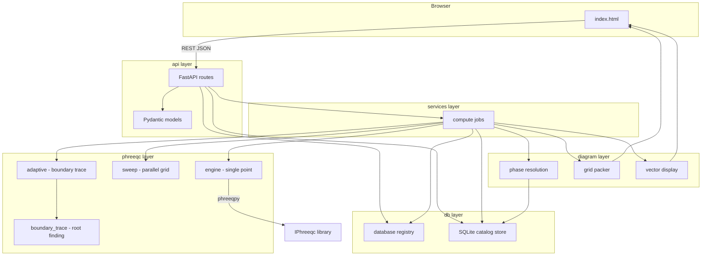
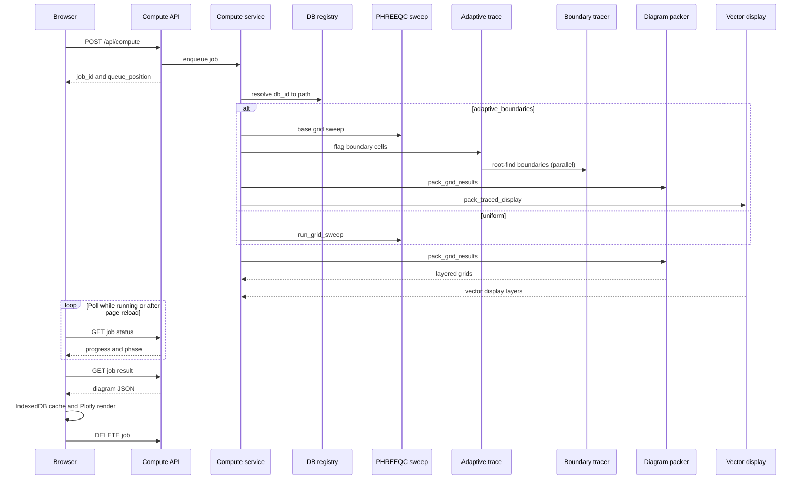

<p align="center">
  
</p>

<p align="center"><em>pH–pe / pH–Eh predominance diagrams from PHREEQC</em></p>

PHASER is a web service for building **pH–pe / pH–Eh predominance diagrams** from PHREEQC thermodynamic databases. Users define a chemical system (total concentrations), select solid phases, and the server evaluates a grid of PHREEQC solutions in parallel to determine which phase or aqueous species is dominant at each point.

Key behaviours:

- **Server-side PHREEQC** with multiprocessing grid sweeps and a **CPU queue** (one sweep at a time by default).
- **Adaptive boundary tracing** — optional mode that evaluates the full selected grid, then locates phase boundaries by root-finding on mixed cells and builds smooth vector fills from exact line geometry (no uniform fine-grid sweep).
- **Selectable diagram layers** — compute solid predominance, aqueous predominance, and/or per-element subset maps independently (`layer_solids`, `layer_aqueous`, `layer_elements`); boundary tracing and packing honour the same toggles.
- **Per-element aqueous hover** — grid sweep punches the top species per element via PHREEQC `SYS`; hover tooltips show up to four ranked species filtered to the active display context.
- **Browser-side settings** and **result cache** — UI state in `localStorage`, diagram results in IndexedDB.
- **Compute reconnect** — refresh or reopen the tab during a run and polling resumes automatically; finished results are fetched when you return.
- **Orphan job cleanup** — a background reaper drops stale queued and finished jobs from server memory when the browser never reconnects.
- **Database registry** — databases are selected by `db_id` from a server-managed catalog.
- **Plotly UI** — three-panel desktop layout (controls · diagram · display options), **database selector in the header**, unified progress bar, **Eh / pe / log fO₂** redox-axis toggle, selectable solid/aqueous layer families, O₂/H₂ gas-limit configuration, vector predominance display, per-element hover species, and browser-side settings/result cache.

---

## Quick start

### Linux / WSL (recommended for PHREEQC)

```bash
cd /path/to/Software_dev/PHASER
python3 -m venv .venv-linux
source .venv-linux/bin/activate
pip install -r requirements.txt

# IPhreeqc must be built and available (see phreeqpy docs)
python run_server.py
```

Open [http://localhost:8765](http://localhost:8765) in your browser.

### Windows

Windows Python cannot load Linux `libiphreeqc.so`. Use **WSL** for compute, or install a matching Windows `IPhreeqc` DLL and run natively.

---

## Project layout

```
PHASER/
├── run_server.py          # CLI entry point (uvicorn)
├── config.py              # Paths, limits, defaults (env-overridable)
├── api/                   # HTTP layer (FastAPI)
│   ├── app.py             # Application factory, static files, /icons mount
│   ├── models.py          # Pydantic request bodies
│   ├── dependencies.py    # DB / DLL resolution for routes
│   └── routes/            # One module per API concern
├── db/                    # PHREEQC database handling
│   ├── registry.py        # Server-side database catalog (trusted paths)
│   └── catalog_store.py   # SQLite PHREEQC catalog (elements/phases/species/collisions)
├── phreeqc/               # PHREEQC solver integration
│   ├── catalog.py         # SYS probes + PHASES-block parse -> catalog snapshot
│   ├── engine.py          # Single-point evaluation via phreeqpy/IPhreeqc
│   ├── sweep.py           # Multiprocessing grid sweep
│   ├── adaptive.py        # Adaptive boundary orchestration
│   └── boundary_trace.py  # Root-finding tracer (brentq, triple/band regions, fallback)
├── diagram/               # Phase diagram assembly
│   ├── phases.py          # Phase name resolution for a chemical system
│   ├── packer.py          # Pack grid results; solid/aqueous name collision labels
│   └── vectors.py         # Signed-distance vector display from traced boundaries
├── services/              # Orchestration logic
│   ├── compute.py         # FIFO compute queue + background grid jobs
│   └── species.py         # Species picker suggestions
├── Icon/                  # Branding assets (served at /icons/)
│   ├── phaser_logo.svg        # Animated header logo (in-app)
│   ├── phaser_logo_v8.png     # Static wordmark (README / docs)
│   └── phaser_favicon.svg     # Square browser-tab icon (spectrum P)
├── static/
│   └── index.html         # Single-page web UI
├── docker-compose.yml     # Local dev: build from source
├── docker-compose.prod.yml # Server: pull GHCR image
├── .github/workflows/
│   └── docker-publish.yml # Build & push to GHCR on main / tags
└── data/
    └── databases/
        └── generated/     # User-generated .dat files (+ optional .meta.json)
```

---

## Architecture overview



### Layer responsibilities

| Layer | Role |
|-------|------|
| **api** | HTTP endpoints only. Validates requests, resolves `db_id` to trusted paths, returns JSON. |
| **services** | FIFO compute queue, job lifecycle, and species helpers. No PHREEQC math here. |
| **db** | Discover/register `.dat` files; build and serve the SQLite PHREEQC catalog (`catalog_store.py`). |
| **phreeqc** | Build PHREEQC input strings, call IPhreeqc, run parallel sweeps, optional adaptive boundary tracing. |
| **diagram** | Turn per-point SI / species data into 2D predominance grids and display layers. |
| **static** | Client UI: species editor, phase picker, plot canvas, job polling, browser-side settings and result cache. |

---

## Database system

Users select a database by **`db_id`** from a server-managed catalog. Filesystem paths are resolved on the server only.

### Sources

1. **builtin** — `.dat` files scanned from the PHREEQC installation directory (`BUILTIN_DB_DIRS` in `config.py`, default: USGS Phreeqc Interactive `database/` folder).
2. **generated** — `.dat` files in `data/databases/generated/`, for output from external tools (e.g. PyGCC).

### Registry flow

1. On startup / first request, `db/registry.py` scans configured directories.
2. Each file becomes a `DatabaseRecord` with `id`, `name`, `source`, `filename`.
3. Optional sidecar metadata: `mydb.meta.json` next to `mydb.dat` (display name, `origin_service`, etc.).
4. `GET /api/databases` returns client-safe records (**no filesystem paths**).
5. Compute requests pass `db_id`; the server resolves to a trusted absolute path internally.

### The PHREEQC catalog (`data/catalog.sqlite`)

Everything the UI needs about a database (elements, phases, species, collisions) is
precomputed into a per-database SQLite catalog at startup and on registration
(`phreeqc/catalog.py` scans, `db/catalog_store.py` stores). There is **no runtime
`.dat` parsing fallback**.

Two distinct sources of truth feed the scan:

| Catalog data | Source | Why |
|--------------|--------|-----|
| Accepted totals / elements | **PHREEQC engine** — `SYS("elements")` + per-total species probes | Only keeps elements PHREEQC actually defines species for |
| Aqueous species (grouped per element) | **PHREEQC engine** — one `SYS("aq")` probe | All species in a single equilibration (probing per element re-equilibrates the whole solution each time and stalls large DBs) |
| Phase names, kind (solid/gas), element composition | **`.dat` `PHASES` block text** (`parse_phase_elements`) | Complete and **independent of temperature / pH / pe**. `SYS("phases")` is condition-dependent (it drops Fe(III) oxides like Hematite/Goethite/Magnetite at a reducing pe) and exposes no element composition |
| Saturation-index metadata (`si_probe`) | **PHREEQC engine** — `SYS("phases")` | Best-effort only (`NaN` if not surfaced); the real SI is recomputed during the sweep |
| Solid/aqueous name collisions | **Derived** — phase names (text) ∩ species names (engine) | e.g. `FeO`, `CuCO3` defined as both a solid and an aqueous complex |

Notes:

- The `PHASES` parser is bounded by datablock keywords (so trailing `PITZER`/`SIT`/`EXCHANGE_*` blocks are not mis-read as phases), takes the phase name as the first token (drops legacy numbers like `Brucite 19`), and reads composition from the **reaction**, not the label (so suffixes like `Ferrihydrite(2L)` don't inject a spurious element `L`).
- **Element-subset eligibility** ("which solids can form given only these elements") is pure set logic on stored compositions (`phase elements ⊆ system elements`) — no per-subset PHREEQC probing. Any subset (singles, pairs, triples, full system) resolves correctly, and scans stay fast even for 50+ element databases.
- **Solid/aqueous collisions** are stored in SQLite and passed to compute on `GridJobParams.solid_aqueous_collisions`; the precipitated solid is labelled `"<name>(s)"` and the aqueous complex keeps the bare name.
- On startup, `services/catalog.py` scans the **default** database synchronously (so the app fails clearly if it is unusable) and scans the rest in a background thread, logging pass/cached/fail per database.
- Each catalog entry is fingerprinted (path, size, mtime, sha256) and tagged with a `SCHEMA_VERSION`; changing the file or bumping the schema triggers an **automatic rebuild** on next startup. Databases whose scan **fails** are marked `failed` and hidden from the UI database selector rather than offered and then erroring.

### Registering a generated database

```bash
# 1. Copy the .dat file into the generated directory
cp custom.dat data/databases/generated/

# 2. Optional: add metadata
cat > data/databases/generated/custom.meta.json <<'EOF'
{
  "name": "My custom thermo DB",
  "origin_service": "pygcc",
  "origin_job_id": "job-123"
}
EOF

# 3. Register (or restart server to rescan)
curl -X POST http://localhost:8765/api/databases/register \
  -H "Content-Type: application/json" \
  -d '{"filename": "custom.dat", "metadata": {"name": "My custom thermo DB"}}'
```

### Environment variables

| Variable | Purpose |
|----------|---------|
| `PHASER_DB` | Default Thermoddem `.dat` path (fallback if not in scan dirs) |
| `PHASER_DEFAULT_DB_ID` | Force default registry id |
| `PHASER_BUILTIN_DB_DIRS` | Extra builtin scan dirs (`os.pathsep`-separated) |
| `PHASER_GENERATED_DB_DIR` | Override generated database directory |
| `PHASER_CATALOG_DB` | SQLite catalog cache path (default `data/catalog.sqlite`) |
| `PHASER_CATALOG_PROBE_AMOUNT` | Total concentration per element for catalog SYS probes (default `1.0` in `mmol/kgw`) |
| `PHASER_IPHREEQC_LIB` | Path to `libiphreeqc.so` / `IPhreeqc.dll` |
| `PHASER_HOST` | Bind address (default `0.0.0.0`) |
| `PHASER_PORT` | Listen port (default `8765`) |
| `PHASER_MAX_CONCURRENT_JOBS` | Max simultaneous grid sweeps (default `1`) |
| `PHASER_ADAPTIVE_REFINE_FACTOR` | Display subdivision factor in adaptive mode (default `5`) |
| `PHASER_MAX_ADAPTIVE_POINTS` | Max total PHREEQC evaluations in adaptive mode (default `120000`) |
| `PHASER_O2_LIMIT_ATM` | O₂ water-stability limit in atm (default `0.21`); per-job override `o2_limit_atm` |
| `PHASER_H2_LIMIT_ATM` | H₂ water-stability limit in atm (default `1.0`); per-job override `h2_limit_atm` |
| `PHASER_COMPONENT_GAS_LIMIT_ATM` | Reference pressure for component-gas over-pressure boundaries (default `1.0`) |
| `PHASER_JOB_RESULT_TTL_SEC` | Drop finished job results from server memory after this (default `3600`) |
| `PHASER_JOB_QUEUE_TTL_SEC` | Drop queued jobs never picked up after this (default `7200`) |
| `PHASER_JOB_REAPER_INTERVAL_SEC` | Background reaper wake interval in seconds (default `60`) |

---

## PHREEQC solver (`phreeqc/`)

### Single-point evaluation (`engine.py`)

Each grid point `(pH, pe)` is equilibrated by a **two-step titration** (`format_grid_input`): an acidic seed solution is brought to the target pH and O₂ fugacity through `EQUILIBRIUM_PHASES`.

1. **Seed `SOLUTION`** — temperature, element totals, and a stable starting point (`pH 1.8`, `pe 4.0`). Electroneutrality is enforced with **`Cl … charge`**. The seed is cation-heavy; PHREEQC adjusts `Cl⁻` upward without bound, which keeps charge balance well posed across the full diagram range. The seed pH/pe are not the target — they are only a numerically benign initial state.

2. **`EQUILIBRIUM_PHASES` titration** — `USE solution 1` followed by:
   - **pH control** — fictitious phase `Fix_H+` (`H+ = H+`, `log_k 0`) titrated with **`NaOH`** at saturation index `−pH` (`-force_equality true`). As pH rises, `Na⁺` from the titrant supplies the required cations.
   - **Redox control** — **`O2(g)`** fixed at target `log10(fO₂)` (`-force_equality true`), where

     ```
     log10(fO₂) = 4 · (pe + pH − log K_O₂)        # O2(g) + 4H+ + 4e- = 2H2O
     ```

     with `log K_O₂` from `gas_limits.log_k_o2_water()`. Redox is therefore imposed as an oxygen fugacity reservoir, consistent with the water-stability limits and the `log fO₂` diagram axis (see [Gas management](#gas-management-water-stability--component-gases) and [Redox axis](#redox-axis-log-fo₂--eh--pe)).

3. **Charge balance** — `Cl⁻` balances the acidic seed; `Na⁺` from NaOH titration balances the equilibrated solution. The UI labels this *"Charge balance: Cl⁻ or Na⁺"*.

4. **`SELECTED_OUTPUT`** — saturation indices (`si`) for selected solid phases and any component trace gases, plus **`USER_PUNCH`** for dominant aqueous species and the **top-N ranked species per element** (`TOP_AQ_SPECIES_PER_ELEMENT`, default 64). For each element, `SYS("Fe", count, name$, type$, moles)` returns the element's total moles as its value and sets `count` by reference; the punch loop must not assign the return value back into `count` (that would break the species loop). `moles(i)` is the element's stoichiometric moles in each species, so multi-element complexes (e.g. `FeHCO3+`) appear under every element they contain. Titration produces one output row per reaction step; `evaluate_point` uses the **last** row (the equilibrated state at the target pH and O₂ fugacity).

5. **`evaluate_point`** — runs the input through **phreeqpy** → **IPhreeqc**, parses selected output and USER_PUNCH, assigns gas-domain labels per point, and returns `GridPointResult` (convergence, SI, dominant solid, aqueous species by element, full per-element species rankings in `aq_species_by_element`, gas SI/domain).

6. **`validate_phreeqc_setup`** — loads library and database once before worker spawn (fail-fast with clear errors).

The sweep coordinate is **`pe`**; `Eh` and `log fO₂` are derived from `(pH, pe, T)` for plotting (see [Redox axis](#redox-axis-log-fo₂--eh--pe)).

### Parallel grid sweep (`sweep.py`)

A phase diagram with 100×100 resolution = **10,000 independent PHREEQC runs**.

- `ProcessPoolExecutor` spawns worker processes (default up to `MAX_WORKERS`).
- Each worker initializes its own IPhreeqc instance (`_worker_init`).
- `pool.map` evaluates all `(pH, pe)` pairs, preserving order.
- Progress callback updates job status for the UI poll loop.

### Adaptive boundary tracing (`adaptive.py` + `boundary_trace.py`)

The optional **Adaptive boundaries** mode evaluates the full user-selected grid, then traces phase boundaries on mixed cells so the diagram renders as smooth vector geometry without evaluating every fine-grid node.

**Pipeline:**

1. **Base sweep** — the full selected grid is evaluated (e.g. 100×100 = 10,000 runs). The base grid is kept for hover and per-point data; nothing is downsampled.
2. **Collision detection** — `solid_aqueous_collisions` scans the base results for phase names that also appear as aqueous species; colliding solids are labelled `"<name>(s)"` on `GridJobParams` before tracing.
3. **Boundary detection** — for each base point a composite signature is built across every **enabled** plottable layer family (solid and/or aqueous, respecting `layer_elements`). A base cell is flagged when this signature differs across its four corners.
4. **Boundary tracing** (`boundary_trace.py`) — only flagged cells are processed, in parallel (`ProcessPoolExecutor` with dynamic chunking). For each layer and cell:
   - **2-category cells** — `scipy.optimize.brentq` along cell edges locates crossings of a continuous scalar whose zero is the boundary:
     - solid↔solid: `SI_A − SI_B`
     - aqueous↔aqueous: `log(m_A) − log(m_B)` (absent species floored so corners always bracket)
     - solid↔aqueous solubility: `SI_solid = 0` (aqueous side uses the bare species name; solid side uses `"<name>(s)"` when the name collides)
     - converged↔failed (`none`): convergence scalar (+1 / −1) for the **stability limit**
   - **Solid/aqueous scalar choice** — the tracer reads solid vs aqueous from the category label (`label_is_solid` in `packer.py`): `"<name>(s)"` ⇒ solid, bare colliding name ⇒ aqueous. No per-corner SI guess.
   - **3-category cells** — the cell is split into **convex fill regions**, each bounded by oriented lines (a category fills where every line's signed distance is ≥ 0). Two cases arise:
     - *Triple point* (three crossings): a 2D root (`scipy.optimize.root` / `least_squares`), or the crossing centroid when one scalar is the convergence step (or the solver clamps to an edge), gives an interior junction `T`. Rays from `T` to the three crossings — plus a virtual ray toward the un-crossed same-category edge — cut the cell into angular sectors, one convex cone per corner; the category sharing two corners gets two sectors (joined by union).
     - *Band* (four crossings): the doubled category sits on the diagonal, so each single-corner category is the half-plane cut off by the line joining its two adjacent crossings, and the doubled category is the convex strip between both cuts.
   - **2-category saddles** (four edge crossings) — two intersecting dividing lines.
   - **Fallback** — unresolved cells (4+ categories, lost brackets) share one local `(factor+1)²` sub-grid evaluation per cell across all layers, then marching squares on the sampled category field.
   - **Crossing cache** — identical edge crossings are cached per worker across layers that share geometry.
5. **Vector display** (`diagram/vectors.py`) — per layer, a fine categorical grid is assembled from base data, traced overrides, and exact dividing-line geometry. Fills come from **signed-distance fields** whose zero contour matches the traced segments: straight lines for 2-category cells, and per-region line bounds (min of half-planes) for triple/band cells, with disconnected pieces of one category combined by union. Boundary polylines are taken directly from the trace bundle. A despeckle pass removes isolated pixels from fallback regions.

Trace mode requests fewer aqueous species per element (`BOUNDARY_TRACE_TOP_AQ_SPECIES`, default 4) while keeping explicit `-mol` output for species seen on boundaries.

**Result metadata** (`adaptive_stats` in the packed JSON):

| Field | Meaning |
|-------|---------|
| `refine_factor` | Display subdivision factor (`ADAPTIVE_REFINE_FACTOR`, default 5) |
| `base_levels_ph`, `base_levels_pe` | Base grid dimensions (same as the user's plot resolution) |
| `boundary_cells` | Number of base cells flagged as straddling a boundary |
| `n_evaluated` | Total PHREEQC runs (base grid + trace/fallback evaluations) |
| `n_trace_evals` | On-demand PHREEQC evaluations during root-finding |
| `n_fallback_evals` | PHREEQC evaluations in sampled fallback sub-grids |
| `n_trace_segments` | Exact boundary line segments emitted |
| `n_stability_segments` | Stability-limit segments (converged↔failed) |
| `refinement_method` | Always `"trace"` in adaptive mode |
| `display_mode` | `"traced"` when vector display is produced, else `"grid"` |

Limits (`config.py`):

| Constant | Default | Purpose |
|----------|---------|---------|
| `GRID_LEVELS` | 100 | Default resolution for both pH and pe/Eh axes |
| `MAX_GRID_POINTS` | 40,000 | Hard cap on `ph_levels × pe_levels` for the **base** grid |
| `ADAPTIVE_BOUNDARIES_DEFAULT` | true | UI and API default for adaptive mode |
| `ADAPTIVE_REFINE_FACTOR` | 5 | Fine display raster + fallback sub-grid factor (env `PHASER_ADAPTIVE_REFINE_FACTOR`) |
| `MAX_ADAPTIVE_POINTS` | 120,000 | Soft cap on total PHREEQC evaluations in adaptive mode (env `PHASER_MAX_ADAPTIVE_POINTS`) |
| `BOUNDARY_TRACE_TOLERANCE` | 1e-4 | Relative tolerance for `brentq` / 2D root finding (env `PHASER_BOUNDARY_TRACE_TOLERANCE`) |
| `BOUNDARY_TRACE_TOP_AQ_SPECIES` | 4 | USER_PUNCH top-N species per element during tracing (env `PHASER_TRACE_TOP_AQ_SPECIES`) |
| `TOP_AQ_SPECIES_PER_ELEMENT` | 64 | Top-N species per element in the base grid sweep (env `PHASER_TOP_AQ_SPECIES`) |
| `HOVER_SPECIES_PER_ELEMENT` | 4 | Species kept per element in packed hover data (env `PHASER_HOVER_SPECIES_PER_ELEMENT`) |
| `TRACE_CHUNK_MULTIPLIER` | 8 | Worker pool chunking multiplier (env `PHASER_TRACE_CHUNK_MULTIPLIER`) |
| `MAX_PHASES_PER_JOB` | 200 | Max phases per compute request |
| `MAX_WORKERS` | 8 | Worker processes per sweep (capped by CPU count) |
| `MAX_CONCURRENT_JOBS` | 1 | Max simultaneous sweeps server-wide |
| `JOB_RESULT_TTL_SEC` | 3600 | Drop finished jobs from memory after this (env `PHASER_JOB_RESULT_TTL_SEC`) |
| `JOB_QUEUE_TTL_SEC` | 7200 | Drop abandoned queued jobs after this (env `PHASER_JOB_QUEUE_TTL_SEC`) |
| `JOB_REAPER_INTERVAL_SEC` | 60 | Reaper thread interval (env `PHASER_JOB_REAPER_INTERVAL_SEC`) |

### Compute queue (`services/compute.py`)

When several users (or tabs) submit computes at once, extra jobs wait in a **FIFO queue** until a compute slot is free.

1. `POST /api/compute` creates a job with status **`queued`**.
2. A dispatcher starts the job when `running_count < MAX_CONCURRENT_JOBS`.
3. Status becomes **`running`** while the sweep executes; progress is polled via `GET /api/job/{id}`.
   - Job payload includes **`progress`** (0–1) and **`phase`** (`grid`, `boundaries`, `packing`, or `compute` for uniform mode).
4. On completion: **`done`** or **`error`**.
5. Queued jobs expose **`queue_position`** (1-based) and **`queue_size`** so the UI can show *"Queued — position 2 of 3"*.
6. After the browser fetches the result, it calls **`DELETE /api/job/{id}`** to free server memory.
7. **Page reload during compute:** the UI stores the active `job_id` in `sessionStorage` and resumes polling on load. If the job finished while the tab was away, the result is fetched automatically.
8. **Orphan cleanup:** a background reaper drops finished jobs after `JOB_RESULT_TTL_SEC` (default 1 h) and queued jobs that were never started after `JOB_QUEUE_TTL_SEC` (default 2 h). Polls update `last_seen_at` on each job.

Job statuses: `queued` → `running` → `done` | `error`.

---

## Phase diagram building (`diagram/`)

### Phase selection (`phases.py`)

Before compute:

1. Derive **system elements** from total concentrations (e.g. `Fe`, `C(4)` → `Fe`, `C`).
2. **`list_phases`** (from `db/catalog_store.py`) returns phases whose element sets are subsets of the system, computed from each phase's stored element composition (`phase_elements`) in the PHREEQC catalog.
3. User-selected phases (or auto-discovered set) become the `phases` tuple passed to PHREEQC.

### Result packing (`packer.py`)

After the sweep, each grid point has SI values and aqueous dominance data. The packer:

1. Builds axis arrays in `pe` (Eh and log fO₂ applied at plot time; see [Redox axis](#redox-axis-log-fo₂--eh--pe)).
2. For each **element subset** enabled by the layer toggles, assigns a category per point:
   - **Solid predominance** (`layer_solids`) — highest SI ≥ 0 among eligible phases in that subset; otherwise dominant aqueous species in the subset.
   - **Aqueous predominance** (`layer_aqueous`) — highest-ranked aqueous species containing an element from the subset (from `aq_species_by_element`; multi-element complexes such as `FeHCO3+` are valid candidates).
3. **Solid/aqueous name collisions** — some databases define a solid phase and an aqueous complex with the same name (e.g. `FeO`, `CuCO3`). Collisions are detected at **catalog scan time** and stored in SQLite; compute receives them on `GridJobParams.solid_aqueous_collisions`. The precipitated solid is then labelled `"<name>(s)"` (e.g. `FeO(s)`); the aqueous complex keeps the bare name.
4. Produces integer category grids mapping each `(pH, y)` cell to a phase/species index.
5. Builds **layers** (only the families requested on the compute job):
   - `solid_subsets` — solid predominance maps (`aqueous_names` lists categories rendered grey in solid view)
   - `aqueous_subsets` — aqueous species predominance maps
6. Packs **`hover_species`** — per grid cell, top `HOVER_SPECIES_PER_ELEMENT` (default 4) species **per element**, stored as `[name, element_moles, element]` so the client can filter to any active element subset.

**Per-element subsets** (`layer_elements`):

| Toggle | Maps computed | Example (Fe–C system) |
|--------|---------------|------------------------|
| **On** | One map per non-empty element subset | `Fe`, `C`, `Fe-C` (7 subsets for 3 elements) |
| **Off** | One combined map over the full system | `Fe-C` only |

The packed JSON records which toggles were used: `layer_solids`, `layer_aqueous`, `layer_elements`.

The UI (`static/index.html`) renders these layers as colored regions with Plotly. In adaptive mode, **display** polygons come from `diagram/vectors.py` instead; the packed grids remain for hover only.

### Hover tooltips

Hover uses an invisible heatmap over the base grid. At each point the tooltip shows the active predominance category plus up to four aqueous species ranked for the **current display context**:

- In **aqueous predominance** view with per-element subsets enabled, species are filtered to the checked element(s).
- In **solid predominance** view, species are filtered the same way when per-element subsets were computed.
- With per-element subsets off, all system elements contribute to the hover pool.
- Multi-element species appear once in the tooltip (deduplicated by name after filtering).

Species molalities in hover are PHREEQC's per-element moles (`stoichiometry × species molality`), matching the `SYS` ranking used for predominance.

### Vector display (`vectors.py`)

When boundary tracing is active, each plottable layer is converted into:

- **Fill polygons** — per-category signed-distance fields built from exact dividing lines (2-category cells) and convex line-bounded regions (3-category triple/band cells), then contoured at zero. Multiple regions of the same category in one cell are combined by union.
- **Boundary polylines** — taken directly from the trace bundle (not re-derived from fills).

A despeckle pass removes isolated fallback pixels before contouring.

---

## Gas management (water stability & component gases)

PHASER draws two kinds of gas boundaries (`phreeqc/gas_limits.py`). Both are reported as overlay regions/lines on the diagram and never alter the chemistry categories underneath.

### Water-stability limits (O₂ / H₂)

Pourbaix diagrams conventionally show the **water stability window**: the region where neither O₂ nor H₂ is supersaturated relative to the liquid. PHASER evaluates these limits as **analytic** functions of `(pH, pe, T)` — no extra PHREEQC runs:

```
log10(fO₂) =  4 · (pe + pH − log K_O₂)        # O2(g) + 4H+ + 4e- = 2H2O
log10(fH₂) = -2 · (pe + pH)                   # 2H+ + 2e- = H2(g),  log K ≈ 0 at 25 °C
log K_O₂   = 20.75 + 0.0018 · (T − 25)        # ≈20.75 at 25 °C, linear dT approximation
```

A point lies **outside** the water window when its O₂ or H₂ fugacity exceeds a configured limit:

| Region | Condition | Default limit | Config / API |
|--------|-----------|---------------|--------------|
| O₂ over-pressure (oxidising) | `log10(fO₂) > log10(o2_limit_atm)` | `0.21` atm (atmospheric pO₂) | `O2_FUGACITY_LIMIT_ATM`, `PHASER_O2_LIMIT_ATM`, request `o2_limit_atm` |
| H₂ over-pressure (reducing) | `log10(fH₂) > log10(h2_limit_atm)` | `1.0` atm | `H2_FUGACITY_LIMIT_ATM`, `PHASER_H2_LIMIT_ATM`, request `h2_limit_atm` |

Each limit line has slope `−1` in `(pH, pe)` space (constant `pe + pH`). Segments are clipped to the plot box (`water_gas_boundary_segments`). Labels reflect the active limits, e.g. `O2(g) > 0.21 atm`, `H2(g) > 1 atm` (`water_gas_outside_labels`). Per grid point, `water_gas_domain_labels` records whether the cell lies inside the window or in an O₂/H₂ over-pressure region (`GridPointResult.gas_domain`).

The equilibration constraint on **`O2(g)`** uses the same `log10(fO₂)` relation, so the plotted O₂ boundary and the imposed redox state share one thermodynamic definition.

### Component-gas limits (CO₂, CH₄, …)

For real gases that are part of the chemical system, the saturation index from PHREEQC **is** the log fugacity. A component gas is "over-pressure" where

```
SI(gas) − log10(P_ref) > 0                    # component_gas_scalar()
```

with `P_ref = COMPONENT_GAS_FUGACITY_LIMIT_ATM` (default `1.0` atm, env `PHASER_COMPONENT_GAS_LIMIT_ATM`). These boundaries are **not** analytic — the zero crossing is refined along base-grid cell edges with the same `scipy.optimize.brentq` root-finder used for phase boundaries (`trace_gas_limit_segments`), reusing SI values already punched in `SELECTED_OUTPUT`. Component trace gases are selected per request (`gas_phases`, or `include_common_gases`).

### Rendering

In `diagram/vectors.py` the gas limits become real overlay geometry: O₂/H₂ regions are clipped half-planes (Sutherland–Hodgman against the plot box and the chemistry fills), and component-gas edges are added as boundary polylines. Chemistry fills are clipped to the `pe + pH` water window so they do not bleed past the gas cut.

---

## Web UI (`static/index.html`)

Single-page app served at `/`. Chemistry and axis settings live in the **left sidebar**; the **diagram** fills the centre; **display options** sit in a resizable panel on the **right**. A fixed **header** carries the logo, compute control, progress, status line, and **database selector**.

### Layout

```
┌──────────────────────────────────────────────────────────────────────────┐
│  [☰]  PHASER   [Compute] [▓▓▓▓░░ 42%]  status…     Database [▼] ●      │
├──────────────┬──────────────────────────────┬───┬───────────────────────┤
│  Sidebar     │                              │ ║ │  Plot panel           │
│  (controls)  │       Phase diagram          │ ║ │  (display)            │
│              │       (Plotly)               │ ║ │                       │
└──────────────┴──────────────────────────────┴───┴───────────────────────┘
```

| Region | Role |
|--------|------|
| **Header** | Animated PHASER logo (rainbow scan while computing), **Compute diagram** button, unified spectrum progress bar, short status line, **Database** label + selector + status dot |
| **Left sidebar** | Chemical system, axes, phases, configuration — collapsible cards (database card on narrow screens only; see below) |
| **Diagram** | Square-ish Plotly canvas (`fitPlotBox` allows up to **1:1.2** aspect so the plot grows on narrow windows instead of shrinking to a tiny square) |
| **Right plot panel** | Display mode, element subset filter, labels/boundaries toggles, diagram metadata |
| **Resizers** | Drag the divider between sidebar and diagram, or between diagram and plot panel; double-click resets width. Widths persist in `phaserLayout.v1` |

**Responsive behaviour**

- **≤1100px** — plot panel moves **above** the diagram as a horizontal toolbar; the panel resizer is hidden.
- **≤900px** — sidebar becomes a slide-out drawer (☰ menu). The database selector moves into the drawer's **Database** card; the header keeps the **Database** / **DB** label and status dot (tap the dot to open the drawer on that card).
- **≥901px** — database selector stays in the header; the sidebar **Database** card is hidden (redundant).
- **≤760px** — header status text hides (progress bar stays).
- **≤560px** — compute button label shortens to **Run**; **Database** label shortens to **DB**; progress bar compacts.

### Header: database

The active PHREEQC database is chosen from the **header** on desktop:

- **Label** — `Database` (or `DB` on very narrow screens).
- **Selector** — dropdown of catalog-ready databases (`db_id`). Changing it reloads species suggestions, element counts, and phase lists automatically.
- **Status dot** — green = catalog ready, red = missing/offline. Hover for details; on mobile, tap to open the drawer to the database card.

Elements no longer need a manual reload button — everything refreshes when the database changes.

### Left sidebar

| Card | Contents |
|------|----------|
| **Database** | *(narrow screens only)* Same `db_id` selector as the header, plus filename / source / catalog-status meta |
| **Chemical system** | Species picker with concentrations, unit selector (`mol/kgw` / `mmol/kgw` / `µmol/kgw`), temperature. Charge balance note: *Cl⁻ or Na⁺* (fixed titration recipe — see [Single-point evaluation](#single-point-evaluation-enginepy)) |
| **Axes** | pH min/max; redox axis **Eh / pe / log fO₂** (default **Eh**); redox min/max (converted for display, stored as `pe` internally). See [Redox axis](#redox-axis-log-fo₂--eh--pe) |
| **Phases** | Searchable checklist of catalog solids; select all/none |
| **Configuration** | Plot resolution slider (`ph_levels` = `pe_levels`), **Adaptive boundaries** toggle, **Compute layers** (solid / aqueous / per-element subsets), **O₂/H₂ stability limits** (atm), estimated PHREEQC run count (scales with enabled layer families and subsets) |

Changing units auto-converts species concentrations. Editing chemistry, axes, phases, or layer toggles marks the diagram **stale** until recomputed. Layer toggles in Configuration apply to the **next** compute; display controls in the plot panel always reflect the **currently plotted** result (see below).

### Header: compute and progress

**Compute diagram** enqueues a server job (or loads an identical request from the browser cache). While a job runs:

- The logo animates (`.is-computing` on the brand link).
- A **single unified progress bar** advances through the whole pipeline — one 0–100% fill, not per-phase resets.
- A short **status line** names the current step (`Computing grid…`, `Refining boundaries…`, etc.).

**Queued** jobs show status text only — the bar stays hidden until the job starts running.

**Done** messages are compact, e.g. `Done · 40k runs · 8.2s`. Cache hits show **`Cached`**.

The bar is a skewed parallelogram (`skewX(-12deg)`, matching the logo) filled with a **blue → red** spectrum gradient; the percentage is rendered inside the bar.

**Unified progress budget** (adaptive mode):

| Step | Bar range |
|------|-----------|
| Grid sweep | 0–20% |
| Boundary refinement | 20–90% |
| Packing | 90–95% |
| Download / cache / render | 95–100% |

Uniform mode maps the main PHREEQC sweep to **0–80%** (no separate refinement slice), then the same packing and tail segments.

### Right plot panel

Display controls describe the **plotted result**, not pending Configuration toggles. Recompute after changing layer options to update them.

| Control | Effect |
|---------|--------|
| **Display** | *Solid predominance* and/or *Aqueous predominance* — only modes that were actually computed appear in the dropdown |
| **Element filter** | Checkboxes for which elements define the active subset map (shown only when per-element subsets were computed; label switches between *Solid elements* / *Aqueous elements* with display mode) |
| **Labels only** | Region labels without fill colours |
| **Boundaries** | Phase and gas-limit boundary polylines |
| **Plot meta** | Convergence count, active layer, temperature, adaptive stats |

**Configuration vs display.** The sidebar **Compute layers** checkboxes set what the next job will pack and trace. The plot panel dropdown and element filter read from the cached result (`layer_solids`, `layer_aqueous`, `layer_elements` in the packed JSON). Toggling layers before recomputing shows the **stale** pill but does not change the plot or its display options until **Compute diagram** finishes.

At least one of **Solid** or **Aqueous** predominance must stay enabled; the UI prevents unchecking both.

Phase/species **colours** persist in `colorByName` (localStorage). New phases get a stable hash-based palette colour on first encounter.

Non-convergent / `none` cells render **white**; aqueous species use light grey in solid predominance view. O₂/H₂ over-pressure regions render as white gas-domain fills with labelled boundaries (see [Gas management](#gas-management-water-stability--component-gases)).

### Diagram rendering

| Mode | Display | Hover |
|------|---------|-------|
| **Adaptive** (default) | Vector polygons + exact boundary lines from `diagram/vectors.py` | Invisible base-grid heatmap with phase name + top aqueous species |
| **Uniform** | Coloured heatmap | Same hover layer |

Vector polygons are sorted by area (largest first) so nested regions paint correctly. Stability limits (converged↔failed) render as distinct dashed lines.

Redox axis choice (**Eh / pe / log fO₂**) is display-only: the packed grid is always in `pe`; vertices are transformed per-point when plotting (`mapPlotXY`).

### Settings persistence

| Storage | Key / store | Contents |
|---------|-------------|----------|
| `localStorage` | `phaseDiagramState.v7` | UI settings (auto-saved on every edit) |
| `localStorage` | `phaserLayout.v1` | Sidebar width and plot-panel width |
| `sessionStorage` | `phaserLastResultKey.v1` | Pointer to the last cached diagram |
| `sessionStorage` | `phaserActiveJob.v1` | Active compute job for reconnect after refresh |
| IndexedDB | `phaserResultCache.v23` / `results` | Packed diagram JSON |

Closing the tab or clearing site data resets settings. Cached diagrams persist until TTL or eviction (**24 results max**, **12-hour TTL**).

### Result cache and reconnect

Identical compute requests (including `adaptive_boundaries`, `adaptive_refine_factor`, gas limits, and **layer toggles**) are served from **IndexedDB** when possible — no server job, status shows **`Cached`**.

On **cache miss**, the job is enqueued; the result is stored in IndexedDB after download and the server job is **`DELETE`**d to free memory.

If you refresh during a **queued** or **running** job, polling resumes from `phaserActiveJob.v1`. A job that finished while you were away is fetched and rendered automatically.

Starting a **new** compute abandons the previous server job reference (running sweeps continue until completion or TTL cleanup).

### Redox axis (log fO₂ / Eh / pe)

The vertical axis can be shown as **Eh**, **pe**, or **log fO₂**. All three describe the same thermodynamic state; conversions are exact at each `(pH, pe, T)`. The compute grid is swept in **`pe`**; Eh and log fO₂ are applied when packing and plotting results. Default display axis: **Eh**.

**Conversion relations** (all logs base-10; `T` in °C, `T_K = T + 273.15`):

| Axis | From `pe` | Back to `pe` |
|------|-----------|--------------|
| **pe** | `pe` | `pe` |
| **Eh (V)** | `Eh = pe · (ln10 · R · T_K / F)` | `pe = Eh / (ln10 · R · T_K / F)` |
| **log fO₂** | `log fO₂ = 4 · (pe + pH − log K_O₂)` | `pe = log fO₂ / 4 − pH + log K_O₂` |

where `R = 8.314462618 J mol⁻¹ K⁻¹`, `F = 96485.33212 C mol⁻¹`, `ln10 ≈ 2.302585`, and

```
log K_O₂ = 20.75 + 0.0018 · (T − 25)      # O2(g) + 4H+ + 4e- = 2H2O, ≈20.75 at 25 °C
```

(`log_k_o2_water()` / `log_f_o2()` in `phreeqc/gas_limits.py`; same relation used for `O2(g)` in equilibration.)

**Coordinate geometry.** `Eh` is a linear, pH-independent rescaling of `pe`. `log fO₂` couples to both `pe` and `pH`, so a rectangular `(pH, pe)` grid maps to a sheared grid in `(pH, log fO₂)`. Vector geometry is transformed **per vertex** (`mapPlotXY(pH, pe)`), which preserves boundary positions when switching axes. O₂/H₂ stability lines are horizontal in a `log fO₂` plot (constant fugacity).

**log fO₂ axis limits** — min/max inputs convert to `pe` at the opposite pH corner: `peMin = fO₂min/4 − pH_max + log K_O₂`, `peMax = fO₂max/4 − pH_min + log K_O₂`. Changing pH refreshes the displayed limits. The hover heatmap uses mid-pH for tick labels; vector fills and boundaries use the exact per-point conversion.

---

## HTTP API

| Method | Path | Description |
|--------|------|-------------|
| `GET` | `/` | Web UI |
| `GET` | `/api/health` | Liveness check |
| `GET` | `/api/config` | Defaults, limits (`max_concurrent_jobs`, `grid_levels`, `adaptive_refine_factor`, `max_adaptive_points`, `job_result_ttl_sec`, `job_queue_ttl_sec`, …), default `db_id` |
| `GET` | `/api/databases` | List available databases |
| `GET` | `/api/databases/{db_id}` | Database details |
| `POST` | `/api/databases/register` | Register generated database metadata |
| `GET` | `/api/elements?db_id=` | Elements in a database |
| `POST` | `/api/phases` | Discover phases for a chemical system |
| `POST` | `/api/compute` | Enqueue grid job → `{job_id, status, queue_position?, queue_size?}` |
| `GET` | `/api/job/{job_id}` | Job status (`queued` \| `running` \| `done` \| `error`), `progress`, `phase`, queue position |
| `GET` | `/api/job/{job_id}/result` | Packed diagram JSON |
| `DELETE` | `/api/job/{job_id}` | Release job/result from server memory (called by UI after fetch) |

### Compute request (`POST /api/compute`)

Key fields in the JSON body:

| Field | Default | Description |
|-------|---------|-------------|
| `totals` | — | Required. Element totals, e.g. `{"Fe": 1.0, "C(4)": 1.0}` |
| `ph_levels`, `pe_levels` | `GRID_LEVELS` | Grid resolution (both axes) |
| `ph_min`, `ph_max`, `pe_min`, `pe_max` | config defaults | Axis bounds |
| `phases` | auto-discover | Selected solid phase names |
| `system_elements` | from totals | Explicit element list for layers |
| `db_id` | server default | Database from registry |
| `adaptive_boundaries` | `true` | Enable adaptive boundary tracing |
| `adaptive_refine_factor` | server default (5) | Display subdivision factor (included in browser cache key) |
| `gas_phases` / `include_common_gases` | none / `false` | Component trace gases (CO₂, CH₄, …) for over-pressure boundaries |
| `o2_limit_atm` | `0.21` | O₂ water-stability limit (atm) — see [Gas management](#gas-management-water-stability--component-gases) |
| `h2_limit_atm` | `1.0` | H₂ water-stability limit (atm) |
| `layer_solids` | `true` | Pack and trace solid predominance maps |
| `layer_aqueous` | `true` | Pack and trace aqueous species predominance maps |
| `layer_elements` | `true` | When `true`, one map per element subset; when `false`, one combined map per enabled family. At least one of `layer_solids` / `layer_aqueous` must be `true`. |

Grid bounds and results use **`pe`** as the redox coordinate. Charge balance follows the titration recipe (`Cl⁻` seed, `Na⁺` titrant); see [Single-point evaluation](#single-point-evaluation-enginepy).

### Compute flow



---

## Configuration (`config.py`)

Central defaults for grid bounds, worker count, concurrency, IPhreeqc library path, and database directories.

| Setting | Env override | Default | Notes |
|---------|--------------|---------|-------|
| Host / port | `PHASER_HOST`, `PHASER_PORT` | `0.0.0.0:8765` | Used by `run_server.py` and Docker |
| Grid resolution | — | `GRID_LEVELS = 100` | Default for both axes (`ph_levels` and `pe_levels` in API requests) |
| Max base grid points | — | `MAX_GRID_POINTS = 40000` | Cap on `ph_levels × pe_levels` (e.g. 200×200) |
| Adaptive refine factor | `PHASER_ADAPTIVE_REFINE_FACTOR` | `5` | Display subdivision factor in adaptive mode |
| Max adaptive evaluations | `PHASER_MAX_ADAPTIVE_POINTS` | `120000` | Soft cap on total PHREEQC runs in adaptive mode |
| Boundary trace tolerance | `PHASER_BOUNDARY_TRACE_TOLERANCE` | `1e-4` | Root-finding tolerance along cell edges |
| Trace top-N species | `PHASER_TRACE_TOP_AQ_SPECIES` | `4` | USER_PUNCH species slots during tracing |
| Grid top-N species | `PHASER_TOP_AQ_SPECIES` | `64` | USER_PUNCH species slots in base grid sweep |
| Hover species per element | `PHASER_HOVER_SPECIES_PER_ELEMENT` | `4` | Species kept per element in packed hover JSON |
| Max workers per sweep | — | `MAX_WORKERS = 8` | Capped by `os.cpu_count()` in `sweep.py` |
| Max concurrent sweeps | `PHASER_MAX_CONCURRENT_JOBS` | `1` | FIFO queue when exceeded |
| Job result TTL | `PHASER_JOB_RESULT_TTL_SEC` | `3600` | Drop finished jobs from server memory |
| Job queue TTL | `PHASER_JOB_QUEUE_TTL_SEC` | `7200` | Drop abandoned queued jobs |
| Job reaper interval | `PHASER_JOB_REAPER_INTERVAL_SEC` | `60` | Background cleanup wake interval |
| O₂ stability limit | `PHASER_O2_LIMIT_ATM` | `0.21` | `O2_FUGACITY_LIMIT_ATM` — water window (atm); per-job `o2_limit_atm` |
| H₂ stability limit | `PHASER_H2_LIMIT_ATM` | `1.0` | `H2_FUGACITY_LIMIT_ATM` — water window (atm); per-job `h2_limit_atm` |
| Component-gas limit | `PHASER_COMPONENT_GAS_LIMIT_ATM` | `1.0` | `COMPONENT_GAS_FUGACITY_LIMIT_ATM` — reference pressure for CO₂/CH₄/… boundaries |
| Default units | — | `mmol/kgw` | UI and API default |
| Default species conc. | — | `1.0` | Per species in UI |

See also the database environment variables in the table above.

---

## PyGCC integration

PHASER can consume databases produced by external tools:

1. PyGCC (or another service) generates a `.dat` file.
2. The file is copied into `data/databases/generated/` or registered via `POST /api/databases/register`.
3. PHASER exposes it through `/api/databases` like any builtin database.

---

## Development notes

- **Package name** = folder name (`PHASER`). `run_server.py` adds the parent directory to `sys.path` so `import PHASER` works when run from inside the folder.
- **WSL + Windows**: run the server in WSL; edit files on the Windows side; paths in `config.py` use `/mnt/c/...` when running under Linux.
- **Networking**: with WSL2 **mirrored networking** (`networkingMode=mirrored` in `%UserProfile%\.wslconfig`), the app is reachable on your LAN at the machine's IP (e.g. `http://192.168.x.x:8765`). You may need a Windows Firewall inbound rule for TCP port 8765.
- **Multi-user**: each browser session is isolated (local settings + IndexedDB cache). Compute jobs are independent but share the server queue and CPU pool. Orphaned jobs are reclaimed by the reaper after the configured TTLs.
- **Smoke check** (imports + registry):
  ```bash
  python scripts/smoke_check.py
  ```
- **Local unit tests** (optional; `tests/` is gitignored and not shipped):
  ```bash
  python -m PHASER.tests.test_boundary_trace
  python -m PHASER.tests.test_vectors
  python -m PHASER.tests.test_layer_toggles
  ```
  From the parent of the `PHASER` folder, with the project venv active (WSL recommended).

---

## Docker

The container builds Linux IPhreeqc from the official USGS source tarball, installs Python dependencies, and includes the PHREEQC database directory from that source package.

For production servers that pull a pre-built image from GHCR, see [Deployment](#deployment).

Build and run locally:

```bash
cp .env.example .env
docker compose up --build phaser
```

Open:

```text
http://localhost:8765
```

Generated databases are mounted into the container:

```text
./data/databases/generated -> /app/PHASER/data/databases/generated
```

The container defaults are:

```env
PHASER_IPHREEQC_LIB=/usr/local/lib/libiphreeqc.so
PHASER_BUILTIN_DB_DIRS=/opt/phreeqc/database
PHASER_GENERATED_DB_DIR=/app/PHASER/data/databases/generated
PHASER_MAX_CONCURRENT_JOBS=1
PHASER_ADAPTIVE_REFINE_FACTOR=5
PHASER_MAX_ADAPTIVE_POINTS=120000
PHASER_JOB_RESULT_TTL_SEC=3600
PHASER_JOB_QUEUE_TTL_SEC=7200
```

Run a smoke check inside the image:

```bash
docker compose run --rm phaser python scripts/smoke_check.py
```

Stop services:

```bash
docker compose down
```

---

## Cloudflare Tunnel

For a temporary public test URL from your local machine:

```bash
cloudflared tunnel --url http://localhost:8765
```

For Docker Compose with a named Cloudflare tunnel:

1. Create a tunnel in Cloudflare and obtain the tunnel token.
2. Copy `.env.example` to `.env`.
3. Set:

   ```env
   CLOUDFLARE_TUNNEL_TOKEN=<your-token>
   ```

4. Start PHASER plus the tunnel:

   ```bash
   docker compose --profile tunnel up --build
   ```

The tunnel container connects to the internal Compose service (`phaser:8765`), so no router port forwarding is required.

Never commit the real tunnel token.

---

## Deployment

PHASER ships as a **Docker image**. Two compose files cover the two common workflows:

| File | Use |
|------|-----|
| `docker-compose.yml` | **Local development** — builds the image from source on your machine |
| `docker-compose.prod.yml` | **Server deployment** — pulls the pre-built image from GitHub Container Registry (GHCR) |

### Image publishing (GitHub Actions)

The workflow `.github/workflows/docker-publish.yml` builds and pushes to **GHCR** on every push to **`main`** and on version tags (`v1.2.3`):

```text
ghcr.io/matteo-loche/phaser:latest     # newest main
ghcr.io/matteo-loche/phaser:sha-<commit>
ghcr.io/matteo-loche/phaser:1.2.3      # when you tag a release
```

**Recommended git workflow:** develop on a `dev` branch (or feature branches); merge to `main` only when you want a new production image. Pushes to `dev` do **not** rebuild `:latest`.

### Production server

On a VPS, NAS, or home server:

```bash
cp .env.example .env
# Optional: PHASER_DATA_DIR=/path/to/persistent/generated/databases

docker compose -f docker-compose.prod.yml pull
docker compose -f docker-compose.prod.yml up -d
```

Generated databases persist via `PHASER_DATA_DIR` (host path) → container `data/databases/generated`. Built-in PHREEQC databases ship inside the image.

**Optional profiles** (same file):

```bash
# Cloudflare Tunnel
docker compose -f docker-compose.prod.yml --profile tunnel up -d

# Auto-pull new :latest once per day (Watchtower)
docker compose -f docker-compose.prod.yml --profile watchtower up -d
```

### Local development vs production

| | Local (`docker-compose.yml`) | Production (`docker-compose.prod.yml`) |
|--|------------------------------|--------------------------------------|
| Image | `build: .` from source | `image: ghcr.io/.../phaser:latest` |
| When to update | `docker compose up --build` | `pull` after a merge to `main` |
| Data volume | `PHASER_DATA_DIR` (optional `.env`) | same |

See also [Docker](#docker) (build from source) and [Cloudflare Tunnel](#cloudflare-tunnel).

### Deployment checklist

1. Mount persistent storage for `data/databases/generated` (`PHASER_DATA_DIR`).
2. Set `PHASER_MAX_CONCURRENT_JOBS` from available CPU/RAM (default `1` is safe on shared hosts).
3. Expose via Cloudflare Tunnel or a reverse proxy if needed.
4. A PyGCC service can drop `.dat` files into the volume or call `POST /api/databases/register`.
