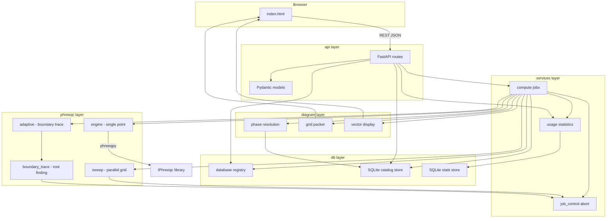
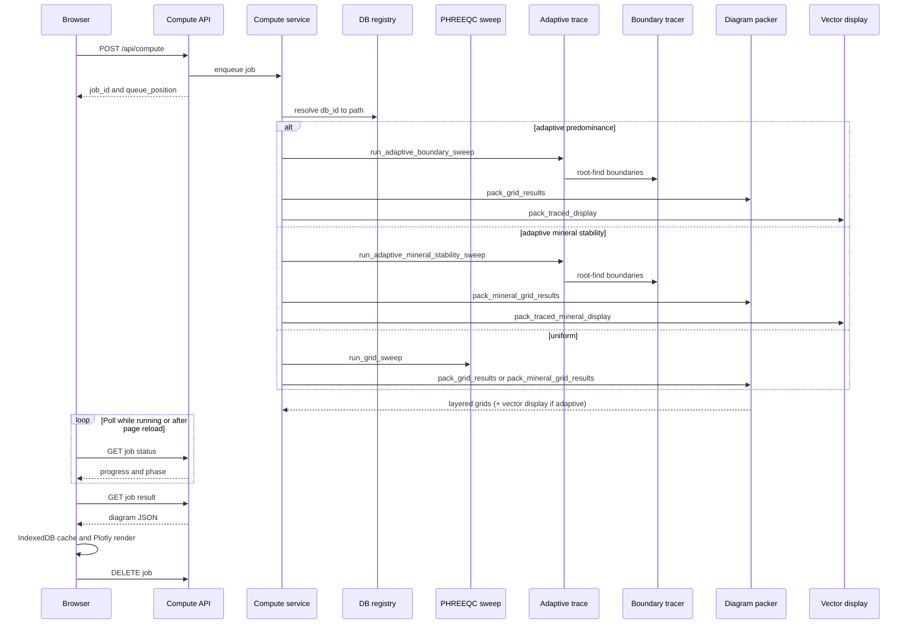

<p align="center">
  
</p>

<p align="center"><em>pH–pe / pH–Eh predominance and mineral-stability diagrams from PHREEQC</em></p>

<p align="center">
  <a href="https://github.com/matteo-loche/phaser/blob/main/LICENSE.txt"></a><!--
  --><a href="https://doi.org/10.5281/zenodo.21145794"></a>
</p>

PHASER is a web service for building **pH–pe / pH–Eh geochemical phase diagrams** from PHREEQC thermodynamic databases. Two diagram products share the same grid and UI shell:

- **Predominance** — SI-based solid and aqueous predominance (which species is thermodynamically preferred at each point).
- **Mineral Stability** — assemblage diagrams under `EQUILIBRIUM_PHASES`: **predominant mineral** (argmax precipitated moles) or **co-stability** (all solids with moles > 0 joined).

Users define a chemical system (total concentrations), select solid phases, and the server evaluates a grid of PHREEQC solutions in parallel. The application ships as a **Docker image** (Linux IPhreeqc and PHREEQC databases bundled) or can be run from source on Linux/WSL.

Key behaviours:

- **Server-side PHREEQC** with multiprocessed grid sweeps and root finding with a **CPU queue** (one sweep at a time by default).
- **Trace phase edges** (API: `adaptive_boundaries`) — default mode that evaluates the full selected grid, then locates exact category boundaries by root-finding on mixed cells and builds vector fills whose edges share the same divide geometry as the drawn boundary lines (SI predominance and mineral-stability plugins).
- **Two diagram modes** — Predominance (SI) and Mineral Stability (EQUI assemblage); each keeps an independent result cache and session state in the browser.
- **Selectable diagram layers** — compute solid / mineral, aqueous, and/or per-element subset maps independently (`layer_solids`, `layer_aqueous`, `layer_elements`); boundary tracing and packing honour the same toggles.
- **Per-element aqueous hover** — grid sweep punches the top species per element via PHREEQC `SYS`; Mineral Stability also shows precipitated moles. Hover tooltips are filtered to the active display context.
- **Browser-side settings** and **result cache** — UI state in `localStorage`, diagram results in IndexedDB (keyed per mode).
- **Compute reconnect** — refresh or reopen the tab during a run and polling resumes automatically; finished results are fetched when you return.
- **Orphan job cleanup** — a background reaper drops stale queued and finished jobs from server memory when the browser never reconnects.
- **Job wall-clock timeout** — running jobs are hard-killed after `PHASER_JOB_WALL_TIMEOUT_SEC` (default 5 min) so a stuck PHREEQC pool cannot pin the server forever.
- **Database registry** — databases are selected by `db_id` from a server-managed catalog.
- **Server usage statistics** — successful Predominance and Mineral Stability computes are logged to SQLite (`data/stats.sqlite`); exposed via `GET /api/stats?window=…` and the **Statistics** UI mode (mode rankings, top-15 lists, selectable windows from 24 h to all-time).
- **Per-IP API rate limiting** — sliding-window caps on all `/api/*` routes, burst limits on compute and database registration, and **post-burst cooldowns** with escalating block duration for repeat abuse (see [API rate limiting](#api-rate-limiting)).
- **Plotly UI** — single-page shell with **mode navigation** (Predominance · Mineral Stability · Statistics), three-panel layout for diagrams (controls · plot · display options), **database selector in the header**, unified progress bar, **Eh / pe / log fO₂** redox-axis toggle, selectable solid/aqueous/mineral layer families, O₂/H₂ gas-limit configuration, vector display, phase labels (name / formula / both, including `"A + B"` joins), per-element hover species, and browser-side settings/result cache.

---

## Quick start

### Docker

Pull the pre-built image from GHCR — no local compiler required:

```bash
cd /path/to/PHASER
cp .env.example .env          # Windows: copy .env.example .env
docker compose pull
docker compose up -d
```

Open [http://localhost:8765](http://localhost:8765). See [Deployment](#deployment) for VPS setup, runtime tuning, and optional Cloudflare Tunnel / Watchtower profiles.

To **build the image from source** instead of pulling (developers / CI only):

```bash
docker compose up --build -d
```

### From source (Linux / WSL)

```bash
cd /path/to/PHASER
python3 -m venv .venv-linux
source .venv-linux/bin/activate
pip install -r requirements.txt

# IPhreeqc must be built and available (see phreeqpy docs)
python run_server.py
```

Open [http://localhost:8765](http://localhost:8765).

### Windows

Windows Python cannot load Linux `libiphreeqc.so`. Use **WSL** or **Docker** for compute, or install a matching Windows `IPhreeqc` DLL and set **`PHASER_IPHREEQC_LIB`** to its path (see `.env.example` / `config.py`).

---

## Project layout

```
PHASER/
├── run_server.py          # CLI entry point (uvicorn)
├── __version__.py         # App version and optional DOI (SemVer)
├── config.py              # Paths, limits, defaults (env-overridable)
├── LICENSE.txt            # AGPL-3.0
├── api/                   # HTTP layer (FastAPI)
│   ├── app.py             # Application factory, static files, rate-limit middleware
│   ├── rate_limit.py      # Per-IP sliding-window limits and post-burst cooldowns
│   ├── models.py          # Pydantic request bodies
│   ├── dependencies.py    # DB resolution for routes
│   └── routes/            # One module per API concern
│       ├── compute.py     # POST /api/compute, job status / result / DELETE
│       ├── config_routes.py
│       ├── databases.py
│       ├── elements.py
│       ├── phases.py
│       ├── stats.py
│       └── health.py
├── chemistry/             # Unit conversion; formal charge guesses (dummy medium)
│   ├── units.py
│   └── charges.py         # formal_eq_of_total_key() for charge-side guessing
├── db/                    # PHREEQC database handling
│   ├── registry.py        # Server-side database catalog (trusted paths)
│   ├── catalog_store.py   # SQLite PHREEQC catalog (elements/phases/species/collisions)
│   └── stats_store.py     # SQLite per-server compute usage statistics
├── phreeqc/               # PHREEQC solver integration
│   ├── catalog.py         # .dat text parsers + optional SI probe → catalog snapshot
│   ├── engine.py          # Single-point evaluation via phreeqpy/IPhreeqc
│   ├── knobs.py           # Numerical KNOBS retry ladder (convergence rescue)
│   ├── input_titration.py # Real electrolyte (Cl⁻/NaOH) pH + O₂(g) titration input
│   ├── input_dummy_titration.py # Dummy-electrolyte titration (SI predominance)
│   ├── input_assemblage_dummy.py # Dummy titration + EQUI solids (mineral stability)
│   ├── input_assemblage_titration.py # Real electrolyte + EQUI solids (mineral stability)
│   ├── mineral_stability.py # Precipitated-mole categories + root scalars (moles / costability)
│   ├── mineral_stability_trace.py # Adaptive trace orchestration for mineral modes
│   ├── dummy_medium.py    # Bgc+/Bga- inert medium definitions
│   ├── gas_limits.py      # O₂/H₂ water window and component-gas helpers
│   ├── sweep.py           # Multiprocessing grid sweep (killable ProcessPool)
│   ├── adaptive.py        # Adaptive boundary orchestration (SI predominance)
│   └── boundary_trace.py  # Root-finding tracer (brentq; predominance + mineral plugins)
├── diagram/               # Phase diagram assembly
│   ├── phases.py          # Phase name resolution for a chemical system
│   ├── packer.py          # Pack grid results; SI + mineral-stability category grids
│   └── vectors.py         # Vector fills (predominance + mineral-stability traced display)
├── services/              # Orchestration logic
│   ├── catalog.py         # Startup / background catalog scans (text parse + SI probe)
│   ├── compute.py         # FIFO compute queue, reaper, wall-clock timeout
│   ├── job_control.py     # Per-job cancel tokens + ProcessPool hard-kill
│   ├── stats.py           # Per-server usage statistics recording
│   └── species.py         # Species picker suggestions
├── Icon/                  # Branding assets (served at /icons/)
│   ├── phaser_logo.svg        # Animated header logo (in-app)
│   ├── phaser_logo_v8.png     # Static wordmark (README / docs)
│   └── phaser_favicon.svg     # Square browser-tab icon (spectrum P)
├── static/
│   └── index.html         # Single-page web UI
├── scripts/
│   └── smoke_check.py     # Import/registry smoke test
├── docker-compose.yml     # Server deployment (pull GHCR; optional local build)
├── Dockerfile             # Image build (used by GitHub Actions and compose --build)
├── .github/workflows/
│   └── docker-publish.yml # Build & push to GHCR on main / tags
└── data/
    ├── catalog.sqlite     # Auto-created PHREEQC catalog cache (gitignored)
    ├── stats.sqlite       # Auto-created per-server usage log (gitignored)
    └── databases/
        └── generated/     # User-generated .dat files (+ optional .meta.json)
```

---

## Architecture overview



### Layer responsibilities

| Layer | Role |
|-------|------|
| **api** | HTTP endpoints only. Validates requests, resolves `db_id` to trusted paths, returns JSON. |
| **services** | FIFO compute queue, job lifecycle (reaper + wall-clock abort via `job_control.py`), species helpers, and usage-statistics recording. No PHREEQC math here. |
| **db** | Discover/register `.dat` files; build and serve the SQLite PHREEQC catalog (`catalog_store.py`); persist per-server compute events (`stats_store.py`). |
| **phreeqc** | Build PHREEQC input strings, call IPhreeqc (with KNOBS ladder), run parallel sweeps / boundary tracing (SI predominance and mineral-stability plugins); register live ProcessPools for hard-kill on timeout. |
| **diagram** | Turn per-point SI / precipitated-mole / species data into 2D category grids and traced display layers (vector fills batched per category). |
| **static** | Client UI: species editor, phase picker, plot canvas, job polling, browser-side settings and result cache. |

---

## Database system

Users select a database by **`db_id`** from a server-managed catalog. Filesystem paths are resolved on the server only.

### Sources

1. **builtin** — `.dat` files scanned from `BUILTIN_DB_DIRS` (default: USGS Phreeqc Interactive `database/` on Windows/WSL dev; `/opt/phreeqc/database` in the Docker image via `PHASER_BUILTIN_DB_DIRS`).
2. **generated** — `.dat` files in `data/databases/generated/`, for output from external tools (e.g. PyGCC).

### Registry flow

1. On startup, `db/registry.py` scans configured directories (and rescans after registration).
2. Each file becomes a `DatabaseRecord` with `id`, `name`, `source`, `filename`.
3. Optional sidecar metadata: `mydb.meta.json` next to `mydb.dat` (display name, `origin_service`, etc.).
4. `GET /api/databases` returns client-safe records (**no filesystem paths**).
5. Compute requests pass `db_id`; the server resolves to a trusted absolute path internally.

### The PHREEQC catalog (`data/catalog.sqlite`)

Everything the UI needs about a database (elements, phases, species, collisions) is
precomputed into a per-database SQLite catalog at startup and on registration
(`phreeqc/catalog.py` scans, `db/catalog_store.py` stores). **Inventories are parsed
from `.dat` text once at scan time**; compute requests read SQLite only (they do not
re-parse the `.dat` on every job).

**How a scan works**

1. Parse `SOLUTION_MASTER_SPECIES` → accepted totals + dissolved element symbols
   (element-resolvable keys only; `Alkalinity` / `Acetate` / `E` dropped).
2. Parse `SOLUTION_SPECIES` → full aqueous species name set (both sides of each reaction).
3. Parse `PHASES` → solid/gas names + element composition from reactions.
4. Derive collisions = phase names ∩ aqueous species names.
5. Run **one** PHREEQC equilibration to attach best-effort `si_probe` values
   (not a parse check; probe totals prefer bare element keys and skip H/O/E).
6. Persist the snapshot under a fingerprint + `SCHEMA_VERSION` (rebuild on file or
   schema change).

| Catalog data | Source | Why |
|--------------|--------|-----|
| Accepted totals / dissolved elements | **`.dat` `SOLUTION_MASTER_SPECIES` text** (`parse_solution_master_species`) | Complete and independent of probe conditions. Element-resolvable keys (`Fe`, `Fe(+3)`, `C(4)`, …); pseudo-totals like `Alkalinity` / `Acetate` are omitted from the totals table that drives the element picker |
| Aqueous species (grouped per element) | **`.dat` `SOLUTION_SPECIES` text** (`parse_solution_species_names`) | Complete and **independent of temperature / pH / pe**. `SYS("aq")` only reports species present at the probe condition and silently drops complexes such as LLNL `Fe(OH)3` |
| Phase names, kind (solid/gas), element composition, **display formula** | **`.dat` `PHASES` block text** (`parse_phases`) | Complete and **independent of temperature / pH / pe**. Formula is the stoichiometric LHS reactant from the dissolution reaction (e.g. Goethite → `FeOOH`), not a PHREEQC probe. `SYS("phases")` is condition-dependent and exposes no element composition |
| Saturation-index metadata (`si_probe`) | **PHREEQC engine** — one `SYS("phases")` equilibration | Best-effort display metadata only — **not** a parse sanity check. Inventories come from text; the probe may miss redox-mismatched solids |
| Solid/aqueous name collisions | **Derived** — phase names (text) ∩ aqueous species names (text) | e.g. `FeO`, `CuCO3`, `Fe(OH)3` defined as both a solid and an aqueous complex |

Notes:

- The `PHASES` / `SOLUTION_SPECIES` / `SOLUTION_MASTER_SPECIES` parsers are bounded by datablock keywords (so trailing `PITZER`/`SIT`/`EXCHANGE_*` blocks are not mis-read). `SOLUTION_SPECIES` reaction tokens are taken from **both sides** of each `=` line (so complexes written as `3 H2O + Fe+3 = Fe(OH)3 + 3 H+` still yield `Fe(OH)3`). Stoichiometric coefficients may be space-separated or **glued** (`1.000Cu+2`, Thermoddem style).
- The `PHASES` parser takes the phase name as the first token (drops legacy numbers like `Brucite 19`), and reads composition from the **reaction**, not the label (so suffixes like `Ferrihydrite(2L)` don't inject a spurious element `L`). It accepts both two-line entries and same-line `Name = reaction` definitions used by Thermoddem.
- **Element-subset eligibility** ("which solids can form given only these elements") is pure set logic on stored compositions (`phase elements ⊆ system elements`) — no per-subset PHREEQC probing. Any subset (singles, pairs, triples, full system) resolves correctly, and scans stay fast even for 50+ element databases.
- **Solid/aqueous collisions** are stored in SQLite and passed to compute on `GridJobParams.solid_aqueous_collisions`; the precipitated solid is labelled `"<name>(s)"` and the aqueous complex keeps the bare name.
- Some shipped files are **not** full aqueous catalogs (e.g. `Concrete_PHR.dat` is a PHASES-only INCLUDE$ add-on). They may have empty master/species blocks; the registry still indexes them, but they are not used as ordinary compute databases.
- On startup, `services/catalog.py` scans the **default** database synchronously (so the app fails clearly if it is unusable) and scans the rest in a background thread, logging pass/cached/fail per database. Databases listed in **`PHASER_DISABLED_DB_STEMS`** are omitted from the selector and skipped by catalog scans.
- Each catalog entry is fingerprinted (path, size, mtime, sha256) and tagged with a `SCHEMA_VERSION`; changing the file or bumping the schema triggers an **automatic rebuild** on next startup. Databases whose scan **fails** are marked `failed` and hidden from the UI database selector rather than offered and then erroring.
- Local parser regression checks (gitignored `tests/`) cover SOLUTION_SPECIES parsing, every registry `.dat` catalog scan, and a pygcc-generated PHREEQC fixture. Can be made available on demand.

### Registering a generated database

```bash
# 1. Copy the .dat file into the generated directory
cp custom.dat data/databases/generated/

# 2. Optional: add metadata
cat > data/databases/generated/custom.meta.json <<'EOF'
{
  "name": "My custom thermo DB",
  "origin_service": "pygcc",
  "origin_job_id": "job-123"
}
EOF

# 3. Register (or restart server to rescan)
curl -X POST http://localhost:8765/api/databases/register \
  -H "Content-Type: application/json" \
  -d '{"filename": "custom.dat", "metadata": {"name": "My custom thermo DB"}}'
```

### Environment variables

| Variable | Purpose |
|----------|---------|
| `PHASER_DB` | Path used to pick the default registry entry when `PHASER_DEFAULT_DB_ID` is unset (matches by file path; typical on Windows dev with ThermoDem; Docker uses scanned builtin DBs) |
| `PHASER_DEFAULT_DB_ID` | Force default registry id |
| `PHASER_REPO_URL` | GitHub repo URL for Statistics About (default `https://github.com/matteo-loche/phaser`) |
| `PHASER_ISSUES_URL` | Bug-report URL (default `{repo}/issues`) |
| `PHASER_LICENSE_NAME` | License label in About (default detected from `LICENSE` / `LICENSE.txt`) |
| `PHASER_LICENSE_URL` | License link in About (default `{repo}/blob/main/<license-file>`) |
| `PHASER_DOI_URL` | Override baked-in Zenodo DOI from `__version__.py` (forks only) |
| `PHASER_BUILD_ID` | Optional build/commit id (set automatically in CI Docker builds) |
| `PHASER_DISABLED_DB_STEMS` | Comma-separated database stems/ids to hide from the UI (default: `iso`, `coldchem`, `frezchem`, `kinec-v2`, `kinec-v3`, `phreeqc-rates`, `pitzer`, `sit` — from `iso.dat`, `ColdChem.dat`, `frezchem.dat`, `Kinec.v2.dat`, `Kinec_v3.dat`, `phreeqc_rates.dat`, `pitzer.dat`, `sit.dat`; empty = show all) |
| `PHASER_BUILTIN_DB_DIRS` | Extra builtin scan dirs (`os.pathsep`-separated) |
| `PHASER_GENERATED_DB_DIR` | Override generated database directory |
| `PHASER_CATALOG_DB` | SQLite catalog cache path (default `data/catalog.sqlite`) |
| `PHASER_STATS_DB` | Per-server usage statistics SQLite path (default `data/stats.sqlite`) |
| `PHASER_CATALOG_PROBE_AMOUNT` | Total concentration per element for catalog SYS probes (default `1.0` in `mmol/kgw`) |
| `PHASER_IPHREEQC_LIB` | Server path to `libiphreeqc.so` / `IPhreeqc.dll` (not a compute API field) |
| `PHASER_HOST` | Bind address (default `0.0.0.0`) |
| `PHASER_PORT` | Listen port (default `8765`) |
| `PHASER_MAX_WORKERS` | Server-side parallel PHREEQC worker processes per grid sweep (default `8`; set via compose `.env`, no rebuild; not a compute API field) |
| `PHASER_MAX_CONCURRENT_JOBS` | Max simultaneous grid sweeps (default `1`) |
| `PHASER_ADAPTIVE_REFINE_FACTOR` | Fallback / local-geometry subdivision in adaptive mode (default `5`) |
| `PHASER_MAX_ADAPTIVE_POINTS` | Max total PHREEQC evaluations in adaptive mode (default `120000`) |
| `PHASER_O2_LIMIT_ATM` | O₂ water-stability limit in atm (default `0.21`); per-job override `o2_limit_atm` |
| `PHASER_H2_LIMIT_ATM` | H₂ water-stability limit in atm (default `1.0`); per-job override `h2_limit_atm` |
| `PHASER_COMPONENT_GAS_LIMIT_ATM` | Reference pressure for component-gas over-pressure boundaries (default `1.0`) |
| `PHASER_KNOBS_MODE` | PHREEQC numerical retry ladder: `ladder` (default) or `off` — server-side only, not exposed on the compute API |
| `PHASER_SWEEP_SKIP_OUTSIDE_WATER` | Skip base-sweep PHREEQC outside the O₂/H₂ water band (`true` default) |
| `PHASER_SWEEP_WATER_MARGIN_CELLS` | Extra base-cell margin beyond the analytic water clip before masking (`1.0` default) |
| `PHASER_JOB_RESULT_TTL_SEC` | Drop finished job results from server memory after this (default `3600`) |
| `PHASER_JOB_QUEUE_TTL_SEC` | Drop queued jobs never picked up after this (default `7200`) |
| `PHASER_JOB_REAPER_INTERVAL_SEC` | Background reaper wake interval in seconds (default `60`) |
| `PHASER_JOB_WALL_TIMEOUT_SEC` | Hard-kill running jobs after this many seconds from `started_at` (default `300`) |
| `PHASER_CPU_LIMIT` | Docker Compose only — max CPUs for the container cgroup (default `8` in `.env.example`) |
| `PHASER_MEMORY_LIMIT` | Docker Compose only — max RAM for the container (default `8G`) |
| `PHASER_DATA_DIR` | Docker Compose only — host path mounted to `data/databases/generated` |
| `CLOUDFLARE_TUNNEL_TOKEN` | Docker Compose `tunnel` profile — Cloudflare tunnel token (never commit) |
| `WATCHTOWER_INTERVAL` | Docker Compose `watchtower` profile — image check interval in seconds (default `3600`) |
| `PHASER_RATE_LIMIT` | Enable per-client API rate limits (`1` default; `0` disables) |
| `PHASER_RATE_LIMIT_WINDOW_SEC` | Sliding-window length in seconds (default `60`) |
| `PHASER_RATE_LIMIT_API_PER_MIN` | All `/api/*` except `/api/health` (default `600`; `0` = off) |
| `PHASER_RATE_LIMIT_COMPUTE_PER_MIN` | Burst cap on `POST /api/compute` (default `12`; `0` = off) |
| `PHASER_RATE_LIMIT_COMPUTE_COOLDOWN_SEC` | After compute burst cap, block that IP (default `600` = 10 min) |
| `PHASER_RATE_LIMIT_DB_REGISTER_PER_MIN` | Burst cap on `POST /api/databases/register` (default `6`) |
| `PHASER_RATE_LIMIT_DB_REGISTER_COOLDOWN_SEC` | Cooldown after register burst (default `300`) |
| `PHASER_RATE_LIMIT_PHASES_PER_MIN` | Cap on `POST /api/phases` (default `60`) |
| `PHASER_RATE_LIMIT_COOLDOWN_ESCALATE` | Double cooldown on each repeat offense (`1` default) |
| `PHASER_RATE_LIMIT_COOLDOWN_MAX_SEC` | Max cooldown duration (default `3600`) |
| `PHASER_RATE_LIMIT_VIOLATION_RESET_SEC` | Reset strike count after this quiet period (default `86400`) |

See [API rate limiting](#api-rate-limiting) for how buckets, cooldowns, and client IP detection interact.

---

## PHREEQC solver (`phreeqc/`)

### Single-point evaluation (`engine.py`)

Each grid point `(pH, pe)` is evaluated through **`format_grid_input`**, which dispatches on **`solution_mode`**:

| `solution_mode` | Role |
|-----------------|------|
| `dummy_titration` (default) | SI predominance — dummy electrolyte, no solid assemblage |
| `titration` | SI predominance — Cl⁻/NaOH electrolyte, no solid assemblage |
| `assemblage_dummy_titration` | Mineral stability — dummy electrolyte + selected solids in `EQUILIBRIUM_PHASES` |
| `assemblage_titration` | Mineral stability — Cl⁻/NaOH + selected solids in `EQUILIBRIUM_PHASES` |

The sweep coordinate is always **`pe`**; `Eh` and `log fO₂` are derived from `(pH, pe, T)` for plotting (see [Redox axis](#redox-axis-log-fo₂--eh--pe)).

#### Titration-style modes (dummy + real electrolyte titration)

**Dummy-electrolyte titration** and **real electrolyte titration** share the same two-step frame: an acidic seed (`pH 1.8`, `pe 4.0`) plus `EQUILIBRIUM_PHASES` that pins the grid point. They differ only in the supporting electrolyte and pH titrant (`Bgc/Bga` + `BgcOH` vs `Cl⁻` + `NaOH`). Assemblage variants reuse that frame and add selected solids (see [Mineral stability](#mineral-stability-assemblage-modes)).

**Redox control (both modes).** **`O2(g)`** is fixed at target `log10(fO₂)` (`-force_equality true`):

```
log10(fO₂) = 4 · (pe + pH − log K_O₂)        # O2(g) + 4H+ + 4e- = 2H2O
```

with `log K_O₂` from `gas_limits.log_k_o2_water()`. Redox is therefore imposed as an oxygen fugacity reservoir — the same thermodynamic definition used for O₂/H₂ water-stability overlays and the `log fO₂` diagram axis (see [Gas management](#gas-management-water-stability--component-gases) and [Redox axis](#redox-axis-log-fo₂--eh--pe)).

**Output row.** Both modes produce one `SELECTED_OUTPUT` row per reaction step; `evaluate_point` uses the **last** row (equilibrated state at target pH and O₂ fugacity).

#### Dummy-electrolyte titration (`input_dummy_titration.py`, default)

Charge-balanced predominance mode using a **fictitious inert medium** (`Bgc+` / `Bga-`) instead of `Cl⁻` / `NaOH`:

1. **`SOLUTION`** — acidic seed, user totals, and dummy-medium charge balance (`Bgc` or `Bga` with `charge`; minimal convention at `background_molality = 0`).
2. **`EQUILIBRIUM_PHASES`** — `Fix_H+` titrated with **`BgcOH`** at `−pH`, and **`O2(g)`** at the target `log10(fO₂)` (see above).
3. **No solids** in the assemblage — saturation indices come from selected phases only (SI predominance diagram).

On convergence failure, a **flip-retry** swaps the charge-carrier side (required when hydrolysis inverts the formal charge guess, e.g. Fe(III) at high pH). Dummy elements (`Bgc`, `Bga`, `BgcOH`) are excluded from `system_elements` and dominance layers. O₂/H₂ overlays apply.

#### Real electrolyte titration (`input_titration.py`)

Electroneutral equilibration with **`Cl … charge`** on the acidic seed and **`NaOH`** as the `Fix_H+` titrant. **Inclusion of Cl and Na may alter the speciation** relative to the dummy-electrolyte frame.

1. **Seed `SOLUTION`** — temperature, element totals, and a stable starting point (`pH 1.8`, `pe 4.0`). Electroneutrality is enforced with **`Cl … charge`**. The seed is cation-heavy; PHREEQC adjusts `Cl⁻` upward without bound, which keeps charge balance well posed across the full diagram range. The seed pH/pe are not the target — they are only a numerically benign initial state.

2. **`EQUILIBRIUM_PHASES` titration** — `USE solution 1` followed by:
   - **pH control** — fictitious phase `Fix_H+` (`H+ = H+`, `log_k 0`) titrated with **`NaOH`** at saturation index `−pH` (`-force_equality true`). As pH rises, `Na⁺` from the titrant supplies the required cations.
   - **Redox control** — **`O2(g)`** at the target `log10(fO₂)` (same relation as dummy titration; see above).

3. **Charge balance** — `Cl⁻` balances the acidic seed; `Na⁺` from NaOH titration balances the equilibrated solution.

4. **`SELECTED_OUTPUT`** — saturation indices (`si`) for selected solid phases and any component trace gases, plus **`USER_PUNCH`** for dominant aqueous species and the **top-N ranked species per element** (`TOP_AQ_SPECIES_PER_ELEMENT`, default 64). For each element, `SYS("Fe", count, name$, type$, moles)` returns the element's total moles as its value and sets `count` by reference; the punch loop must not assign the return value back into `count` (that would break the species loop). `moles(i)` is the element's stoichiometric moles in each species, so multi-element complexes (e.g. `FeHCO3+`) appear under every element they contain.

#### Shared

- **`evaluate_point`** — runs the input through **phreeqpy** → **IPhreeqc**, parses selected output and USER_PUNCH, assigns gas-domain labels per point, and returns `GridPointResult` (convergence, SI, dominant solid, aqueous species by element, full per-element species rankings in `aq_species_by_element`, gas SI/domain, `knobs_level`, optional `synthetic_label`). Assemblage modes additionally fill **`phase_moles`** (precipitated moles per selected solid) and **`dominant_precip`** (argmax moles among solids).
- **`validate_phreeqc_setup`** — loads library and database once before worker spawn (fail-fast with clear errors).

#### Mineral stability (assemblage modes)

Mineral-stability jobs use **`assemblage_dummy_titration`** / **`assemblage_titration`** (`phreeqc/input_assemblage_dummy.py`, `input_assemblage_titration.py`). They keep the same pH / O₂(g) pins as the SI-predominance titration frames, and add every selected solid to **`EQUILIBRIUM_PHASES`** with target SI = 0 and initial moles = 0 so PHREEQC may precipitate them.

**Isolation from SI predominance.** Assemblage and predominance share `evaluate_point` / `sweep.py`, but:

- Predominance inputs never list solids in the assemblage; `phase_moles` stays empty.
- Assemblage `USER_PUNCH` filters `SYS` contributors to `ty$ = "aq"` so precipitated solids do not leak into aqueous rankings. Predominance keeps the original short SYS-by-rank punch (no `ty$` filter).
- Category helpers in `phreeqc/mineral_stability.py` are used only on assemblage paths; SI predominance still uses max-SI packing (`category_solid_subset`).

**Category modes** (`MineralCategoryMode` in `mineral_stability.py`):

| Mode | Fill rule | Typical use |
|------|-----------|-------------|
| `moles` | Argmax precipitated moles in the element subset (near-equal moles → rare `"A + B"` join) | Mineral predominance after precipitation |
| `costability` | Join **all** solids with moles > ε (sorted `"A + B + …"`) | Post-precip co-stability (phases held at SI ≈ 0 by EQUI) |

When no solid has precipitated above ε, both modes fall back to the dominant aqueous species in the subset (same idea as SI predominance falling back when all SI < 0).

**Adaptive tracing** (`mineral_stability_trace.py` + `boundary_trace.py` plugins):

| Trace mode | Alias | Category mode |
|------------|-------|---------------|
| `mineral_moles` | `mineral` | `moles` |
| `mineral_costability` | `mineral_si` (historical name; **not** free-SI co-stability) | `costability` |

Layer ids are `mineral:<subset>` and `aqueous:<subset>`. Root scalars differ from SI predominance:

- solid↔solid (`moles`): precipitated-mole difference (`mol`)
- solid-set edges (`costability`): moles of the phase entering/leaving the set, centered on the presence threshold ε (`mol` / `mol_set`) so nested solid↔join edges bracket for `brentq`
- solid↔fluid: moles-gated SI = 0 (`aq_solid`) — under EQUI, precipitated solids stay near SI = 0 across their field, so ungated SI alone often fails to bracket
- aqueous↔aqueous / convergence: unchanged (`aq` / `conv`)

Entry point: `run_adaptive_mineral_stability_sweep(..., category_mode=...)`. O₂/H₂ water-band masking and gas overlays apply the same way as for SI predominance.

**Packing / vector display** (wired in `services/compute.py` when `solution_mode` is an assemblage mode):

- `diagram.packer.pack_mineral_grid_results` — hover grids with `layers.mineral_subsets`, `diagram_kind="assemblage"`, `mineral_category_mode`, and `hover_precip`
- `diagram.vectors.pack_traced_mineral_display` — traced fills/boundaries from `mineral:*` trace layers

SI predominance continues to use `pack_grid_results` / `pack_traced_display` (`layers.solid_subsets`, `diagram_kind="predominance"`).

#### KNOBS retry ladder (`knobs.py`, server defaults)

Hard grid points are retried with escalating **KNOBS** numerical settings before the point is marked failed. This is always on by default (`KNOBS_MODE_DEFAULT = ladder`); operators change it via `PHASER_KNOBS_MODE=off` or `config.py` — there is **no** compute API or UI toggle.

For **`dummy_titration`** and **`assemblage_dummy_titration`**, attempts run in order: default KNOBS + primary charge guess → default + flip-retry → damped + primary → damped + flip → robust + primary only. Other modes skip flip-retry. Each attempt prefixes an explicit KNOBS block (settings persist on the worker IPhreeqc instance). **`convergence_tolerance` is never loosened** — only path controls (iterations, step sizes, diagonal scale, numerical derivatives) escalate. Successful rescues store **`knobs_level`** on `GridPointResult` (0 = first rung). Selected output is read only on the success path (never after a swallowed exception — stale-output hazard).

Boundary tracing inherits the ladder automatically because `PointEvaluator` calls `evaluate_point`.

#### Water-band sweep mask (`gas_limits.py` + `sweep.py`, server defaults)

In titration-style modes (`dummy_titration`, `titration`, and their assemblage counterparts), the base grid sweep can skip PHREEQC for points outside the analytic O₂/H₂ window (`SWEEP_SKIP_OUTSIDE_WATER = true` by default). Points with `pe + pH` above the O₂ line or below the H₂ line (plus **`SWEEP_WATER_MARGIN_CELLS`** margin in cell units) receive **synthetic** `GridPointResult` rows: `converged=True`, `synthetic_label` such as `O2(g) > 0.21 atm`, and matching `gas_domain` — no PHREEQC call.

Synthetic categories flow through packing and adaptive tracing; numeric boundary tracing **skips** cells that mix real chemistry with synthetic gas labels (O₂/H₂ lines remain **analytic** via `trace_gas_limit_segments`). Job metadata may include **`n_skipped_water`** (internal diagnostic only).

Expected savings: roughly 30–40% fewer base-sweep PHREEQC runs on typical pe–pH frames when the water band covers a minority of the plot.

### Parallel grid sweep (`sweep.py`)

A phase diagram with 100×100 resolution = **10,000 independent PHREEQC runs**.

- `ProcessPoolExecutor` spawns worker processes (`PHASER_MAX_WORKERS`, server-configured).
- Each worker initializes its own IPhreeqc instance and receives **`GridJobParams` once** via the pool initializer (`grid_job_params_from_dict`); per-point tasks carry only `(pH, pe)` (avoids pickling the full job descriptor on every point).
- Boundary tracing uses the same pattern: workers receive `trace_params`, axis arrays, and tolerances once in `_trace_worker_init`; per-chunk jobs carry only `cells` and corner seed data.
- `pool.map` uses **`SWEEP_MAP_CHUNKSIZE`** (default `200`, env `PHASER_SWEEP_MAP_CHUNKSIZE`) so several points share one IPC message. This is separate from boundary-trace chunking (see below).
- `pool.map` evaluates all `(pH, pe)` pairs, preserving order.
- Progress callback updates job status for the UI poll loop.

### Adaptive boundary tracing (`adaptive.py` + `boundary_trace.py`)

The optional **Trace phase edges** mode (`adaptive_boundaries`) evaluates the full user-selected grid, then traces phase boundaries on mixed cells so the diagram renders as smooth vector geometry without evaluating every fine-grid node.

**SI predominance** uses `run_adaptive_boundary_sweep` (`trace_mode="predominance"`). **Mineral stability** uses `run_adaptive_mineral_stability_sweep` with `trace_mode` `mineral_moles` or `mineral_costability` (see [Mineral stability](#mineral-stability-assemblage-modes)). Both share the same cell geometry, ProcessPool, crossing cache, and fallback machinery in `boundary_trace.py`.

**Pipeline:**

1. **Solid/aqueous name collisions** — names shared by a solid phase and an aqueous species come from the SQLite catalog (`solid_aqueous_collisions`, from `PHASES` ∩ `SOLUTION_SPECIES` text at scan time). `services/compute.py` loads them onto `GridJobParams` before the sweep; colliding solids are labelled `"<name>(s)"` during packing and tracing (not inferred from grid results).
2. **Base sweep** — the full selected grid is evaluated (e.g. 100×100 = 10,000 runs). The base grid is kept for hover and per-point data; nothing is downsampled.
3. **Boundary detection** — for each base point a composite signature is built across every **enabled** plottable layer family (solid/mineral and/or aqueous, respecting `layer_elements`). A base cell is flagged when this signature differs across its four corners.
4. **Boundary tracing** (`boundary_trace.py`) — only flagged cells are processed, in parallel (`ProcessPoolExecutor` with **`_chunk_cells`** batching: ~`workers × TRACE_CHUNK_MULTIPLIER` jobs). Mixed cells are **Morton-sorted** into **contiguous** worker chunks so boundary chains and per-worker point/crossing caches stay local; progress is counted as chunks complete, independent of submission order. For each layer and cell:
   - **2-category cells** — `scipy.optimize.brentq` along cell edges locates crossings of a continuous scalar whose zero is the boundary:
     - SI predominance solid↔solid: `SI_A − SI_B`
     - mineral moles solid↔solid: precipitated-mole difference
     - mineral costability set edges: moles of the phase entering/leaving the co-stable set
     - aqueous↔aqueous: `log(m_A) − log(m_B)` (absent species floored so corners always bracket)
     - solid↔aqueous / solid↔fluid: SI predominance uses `SI_solid = 0`; mineral modes use **moles-gated** SI = 0 under EQUI pinning
     - converged↔failed (`none`): convergence scalar (+1 / −1) for the **stability limit**
   - **Solid/aqueous scalar choice** — the tracer reads solid vs aqueous from the category label (`label_is_solid` in `packer.py`): `"<name>(s)"` ⇒ solid, bare colliding name ⇒ aqueous; co-precip joins `"A + B"` count as solid sets. No per-corner SI guess.
   - **3-category cells** — the cell is split into **convex fill regions**, each bounded by oriented lines (a category fills where every line's signed distance is ≥ 0). Two cases arise:
     - *Triple point* (three crossings): a 2D root (`scipy.optimize.root` / `least_squares`), or the crossing centroid when one scalar is the convergence step (or the solver clamps to an edge), gives an interior junction `T`. Rays from `T` to the three crossings — plus a virtual ray toward the un-crossed same-category edge — cut the cell into angular sectors, one convex cone per corner; the category sharing two corners gets two sectors (joined by union).
     - *Band* (four crossings): the doubled category sits on the diagonal, so each single-corner category is the half-plane cut off by the line joining its two adjacent crossings, and the doubled category is the convex strip between both cuts.
   - **2-category saddles** (four edge crossings) — two intersecting dividing lines.
   - **Fallback** — unresolved cells (4+ categories, lost brackets) share one local `(factor+1)²` sub-grid evaluation per cell across all layers, then marching squares on the sampled category field.
   - **Crossing cache** — edge `brentq` results are keyed by canonical grid-node pairs (shared by adjacent cells) and category pair, so each physical edge is root-found once per worker; converged↔failed edges use the same deduplication. Hits apply across layers that share geometry.
   - **Tolerances** — phase-boundary `brentq` uses `BOUNDARY_TRACE_TOLERANCE` (default `1e-3`); converged↔failed edges use the looser `BOUNDARY_TRACE_STABILITY_TOLERANCE` (default `1e-2`). Straight chord geometry dominates display error, so sub-node brentq precision is unnecessary; stability frontiers are numerical artifacts, not thermodynamic boundaries.
5. **Vector display** — SI predominance uses `diagram/vectors.pack_traced_display` (`solid:*` layers → `solid_subsets`). Mineral stability uses `pack_traced_mineral_display` (`mineral:*` layers → `mineral_subsets`). Both share the same local geometry:
   - **Traced 2-category cells** — the base-cell rectangle is clipped by the same local dividing line used for the world-space boundary segment (Sutherland–Hodgman half-planes).
   - **Traced 3-category / band cells** — the cell rectangle is clipped by the same oriented region lines emitted for convex fill regions.
   - **Interior (untraced) cells** — merged mask contours of the coarse category field (one ring family per category) so large regions get a single fill suitable for region labels; avoids a per-cell rectangle mesh.
   - **Fallback cells** — mask contours on the fine categorical sample; their black edges are also marching-squares from that sample (no `brentq` line exists).
   - **Boundaries** — polylines taken directly from the trace bundle. O₂/H₂ overlays and water-band clipping apply when `water_stability_limits_enabled`. Despeckle removes isolated fallback pixels on the categorical sample before mask fills.

Trace mode requests fewer aqueous species per element (`BOUNDARY_TRACE_TOP_AQ_SPECIES`, default 4) while keeping explicit `-mol` output for species seen on boundaries.

**Result metadata** (`adaptive_stats` in the packed JSON):

| Field | Meaning |
|-------|---------|
| `refine_factor` | Display subdivision factor (`ADAPTIVE_REFINE_FACTOR`, default 5) |
| `base_levels_ph`, `base_levels_pe` | Base grid dimensions (same as the user's plot resolution) |
| `boundary_cells` | Number of base cells flagged as straddling a boundary |
| `n_evaluated` | Total PHREEQC runs (base grid + trace/fallback evaluations) |
| `n_trace_evals` | On-demand PHREEQC evaluations during root-finding |
| `n_fallback_evals` | PHREEQC evaluations in sampled fallback sub-grids |
| `n_trace_segments` | Exact boundary line segments emitted |
| `n_stability_segments` | Stability-limit segments (converged↔failed) |
| `refinement_method` | Always `"trace"` in adaptive mode |
| `display_mode` | `"traced"` when vector display is produced, else `"grid"` |
| `trace_mode` | `"predominance"`, `"mineral_moles"`, or `"mineral_costability"` when present |
| `mineral_category_mode` | `"moles"` or `"costability"` on mineral-stability sweeps |
| `n_brentq_mol` | Root finds using precipitated-mole scalars (mineral modes) |

Limits (`config.py`):

| Constant | Default | Purpose |
|----------|---------|---------|
| `GRID_LEVELS` | 100 | Default resolution for both pH and pe/Eh axes |
| `MIN_GRID_LEVELS` | 50 | Minimum allowed `ph_levels` / `pe_levels` |
| `MAX_GRID_LEVELS` | 200 | Maximum allowed `ph_levels` / `pe_levels` |
| `MAX_GRID_POINTS` | 40,000 | Hard cap on `ph_levels × pe_levels` for the **base** grid |
| `ADAPTIVE_BOUNDARIES_DEFAULT` | true | UI and API default for adaptive mode |
| `ADAPTIVE_REFINE_FACTOR` | 5 | Fallback sub-grid + fine-node factor for traced local geometry (env `PHASER_ADAPTIVE_REFINE_FACTOR`) |
| `MAX_ADAPTIVE_POINTS` | 120,000 | Soft cap on total PHREEQC evaluations in adaptive mode (env `PHASER_MAX_ADAPTIVE_POINTS`) |
| `BOUNDARY_TRACE_TOLERANCE` | 1e-3 | Phase-boundary root finding (`brentq` / 2D roots; env `PHASER_BOUNDARY_TRACE_TOLERANCE`) |
| `BOUNDARY_TRACE_STABILITY_TOLERANCE` | 1e-2 | Converged↔failed stability edges (looser; env `PHASER_BOUNDARY_TRACE_STABILITY_TOLERANCE`) |
| `BOUNDARY_TRACE_TOP_AQ_SPECIES` | 4 | USER_PUNCH top-N species per element during tracing (env `PHASER_TRACE_TOP_AQ_SPECIES`) |
| `TOP_AQ_SPECIES_PER_ELEMENT` | 64 | Top-N species per element in the base grid sweep (env `PHASER_TOP_AQ_SPECIES`) |
| `HOVER_SPECIES_PER_ELEMENT` | 8 | Species kept per element in packed hover data (env `PHASER_HOVER_SPECIES_PER_ELEMENT`) |
| `TRACE_CHUNK_MULTIPLIER` | 16 | Worker pool chunking multiplier (env `PHASER_TRACE_CHUNK_MULTIPLIER`) |
| `TRACE_MIN_CELLS_PER_CHUNK` | 4 | Minimum mixed cells per trace chunk (env `PHASER_TRACE_MIN_CELLS_PER_CHUNK`) |
| `SWEEP_MAP_CHUNKSIZE` | 200 | `ProcessPoolExecutor.map` chunksize for base grid sweep (env `PHASER_SWEEP_MAP_CHUNKSIZE`) |
| `MAX_PHASES_PER_JOB` | 200 | Max phases per compute request |
| `MAX_WORKERS` | 8 | Worker processes per sweep (`PHASER_MAX_WORKERS`; server authority) |
| `MAX_CONCURRENT_JOBS` | 1 | Max simultaneous sweeps server-wide |
| `JOB_RESULT_TTL_SEC` | 3600 | Drop finished jobs from memory after this (env `PHASER_JOB_RESULT_TTL_SEC`) |
| `JOB_QUEUE_TTL_SEC` | 7200 | Drop abandoned queued jobs after this (env `PHASER_JOB_QUEUE_TTL_SEC`) |
| `JOB_REAPER_INTERVAL_SEC` | 60 | Reaper thread interval (env `PHASER_JOB_REAPER_INTERVAL_SEC`) |
| `JOB_WALL_TIMEOUT_SEC` | 300 | Hard-kill running jobs after this (env `PHASER_JOB_WALL_TIMEOUT_SEC`); measured from `started_at` |

### Compute queue (`services/compute.py`)

When several users (or tabs) submit computes at once, extra jobs wait in a **FIFO queue** until a compute slot is free.

1. `POST /api/compute` creates a job with status **`queued`**.
2. A dispatcher starts the job when `running_count < MAX_CONCURRENT_JOBS`.
3. Status becomes **`running`** while the sweep executes; progress is polled via `GET /api/job/{id}`.
   - Job payload includes **`progress`** (0–1) and **`phase`** (`grid`, `boundaries`, `packing`, or `compute` for uniform mode).
4. On completion: **`done`** or **`error`**.
5. Queued jobs expose **`queue_position`** (1-based) and **`queue_size`** so the UI can show *"Queued — position 2 of 3"*.
6. After the browser fetches the result, it calls **`DELETE /api/job/{id}`** to free server memory.
7. **Page reload during compute:** the UI stores the active `job_id` in `sessionStorage` and resumes polling on load. If the job finished while the tab was away, the result is fetched automatically.
8. **Orphan cleanup:** a background reaper drops finished jobs after `JOB_RESULT_TTL_SEC` (default 1 h) and queued jobs that were never started after `JOB_QUEUE_TTL_SEC` (default 2 h). Polls update `last_seen_at` on each job.
9. **Wall-clock timeout:** once a job is `running`, a timer (and the reaper as a safety net) hard-aborts it after `JOB_WALL_TIMEOUT_SEC` (default 5 min): ProcessPool children are terminated, the concurrent slot is freed, and the job is marked `error` with `error_code=timed_out`. `DELETE /api/job/{id}` on a running job uses the same abort path.
10. **Usage statistics:** on successful completion, `services/stats.py` records job metadata (database, grid size, layers, jobs ahead at enqueue, wait time, compute duration) to `data/stats.sqlite`. Failed jobs and browser cache hits are not counted.

Job statuses: `queued` → `running` → `done` | `error` (including `error_code` `timed_out` / `cancelled`).

---

## Phase diagram building (`diagram/`)

### Phase selection (`phases.py`)

Before compute:

1. Derive **system elements** from total concentrations (e.g. `Fe`, `C(4)` → `Fe`, `C`).
2. **`list_phases`** (from `db/catalog_store.py`) returns phases whose element sets are subsets of the system, computed from each phase's stored element composition (`phase_elements`) in the PHREEQC catalog. Each phase also includes a **`formula`** field parsed from the PHASES reaction for display (the UI toggles mineral name / formula / both client-side without repacking; join labels format each part the same way).
3. User-selected phases (or auto-discovered set) become the `phases` tuple passed to PHREEQC.

### Result packing (`packer.py`)

After the sweep, each grid point has SI values and aqueous dominance data (assemblage points also carry `phase_moles`). Two pack entry points keep SI predominance and mineral stability separate:

| Entry | Diagram | Solid / mineral layers |
|-------|---------|------------------------|
| `pack_grid_results` | `diagram_kind="predominance"` | `layers.solid_subsets` — max SI ≥ 0 |
| `pack_mineral_grid_results` | `diagram_kind="assemblage"` | `layers.mineral_subsets` — moles or costability |

Shared behaviour:

1. Builds axis arrays in `pe` (Eh and log fO₂ applied at plot time; see [Redox axis](#redox-axis-log-fo₂--eh--pe)).
2. For each **element subset** enabled by the layer toggles, assigns a category per point:
   - **Solid predominance** (`layer_solids` + SI pack) — highest SI ≥ 0 among eligible phases in that subset; otherwise dominant aqueous species in the subset.
   - **Mineral stability** (`layer_solids` + mineral pack) — `moles` (argmax precipitated moles) or `costability` (all moles > ε joined); otherwise dominant aqueous species in the subset.
   - **Aqueous predominance** (`layer_aqueous`) — highest-ranked aqueous species containing an element from the subset (from `aq_species_by_element`; multi-element complexes such as `FeHCO3+` are valid candidates).
3. **Solid/aqueous name collisions** — some databases define a solid phase and an aqueous complex with the same name (e.g. `FeO`, `CuCO3`, `Fe(OH)3`). Collisions are detected at **catalog scan time** from `.dat` text (`PHASES` ∩ `SOLUTION_SPECIES`) and stored in SQLite; compute receives them on `GridJobParams.solid_aqueous_collisions`. The precipitated solid is then labelled `"<name>(s)"` (e.g. `Fe(OH)3(s)`); the aqueous complex keeps the bare name.
4. Produces integer category grids mapping each `(pH, y)` cell to a phase/species index.
5. Builds **layers** (only the families requested on the compute job):
   - `solid_subsets` / `mineral_subsets` — category maps (`aqueous_names` lists categories rendered grey in solid/mineral view). Co-stability / moles-tie joins (`"A + B"`) count as solids via `label_is_solid`, so they are **not** in `aqueous_names`.
   - `aqueous_subsets` — aqueous species predominance maps
6. Packs **`hover_species`** — per grid cell, top `HOVER_SPECIES_PER_ELEMENT` (default 8) species **per element**, stored as `[name, element_moles, element]` so the client can filter to any active element subset and truncate for display.

Mineral packs also set **`mineral_category_mode`** (`moles` | `costability`). The Predominance compute path calls `pack_grid_results`; the Mineral Stability path calls `pack_mineral_grid_results` / `pack_traced_mineral_display` via `services/compute.py` when `solution_mode` is an assemblage mode.

**Per-element subsets** (`layer_elements`):

| Toggle | Maps computed | Example (Fe–C system) |
|--------|---------------|------------------------|
| **On** | One map per non-empty element subset | `Fe`, `C`, `Fe-C` (7 subsets for a 3-element system such as Fe–C–Mg) |
| **Off** | One combined map over the full system | `Fe-C` only |

With **one element** in the system, per-element subsets are ignored automatically (only the full-system map is computed).

The packed JSON records which toggles were used: `layer_solids`, `layer_aqueous`, `layer_elements`.

The UI (`static/index.html`) renders these layers as colored regions with Plotly. In adaptive mode, **display** polygons come from `diagram/vectors.py` instead; the packed grids remain for hover only.

### Hover tooltips

Hover uses an invisible heatmap over the base grid. At each point the tooltip shows the active category plus aqueous species ranked for the **current display context**:

- In **aqueous** view with per-element subsets enabled, species are filtered to the checked element(s).
- In **solid / mineral** view, species are filtered the same way when per-element subsets were computed.
- With per-element subsets off, all system elements contribute to the hover pool.
- Multi-element species appear once in the tooltip (deduplicated by name after filtering).
- The **Hover species** control (Overlays) sets how many aqueous entries are shown (2–8, default 4). The packed grid keeps up to `HOVER_SPECIES_PER_ELEMENT` (default 8) per element so higher UI settings work after a fresh compute; older cached results may only have 4 packed.

Species molalities in hover are PHREEQC's per-element moles (`stoichiometry × species molality`), matching the `SYS` ranking used for predominance.

**Mineral Stability** packs an extra **`hover_precip`** grid: every solid with precipitated moles > 0 at that point (`[label, moles]`, moles descending). The tooltip lists those solids under *Precipitated* and the aqueous ranking under *Aqueous*.

### Vector display (`vectors.py`)

When boundary tracing is active, each plottable layer is converted into fill polygons and boundary polylines that are meant to **coincide on the same edges**:

- **`pack_traced_display`** — SI predominance; reads `solid:<subset>` / `aqueous:<subset>` from the trace bundle; emits `layers.solid_subsets` / `aqueous_subsets` with `diagram_kind="predominance"`.
- **`pack_traced_mineral_display`** — mineral stability; reads `mineral:<subset>` / `aqueous:<subset>`; emits `layers.mineral_subsets` / `aqueous_subsets` with `diagram_kind="assemblage"` and `mineral_category_mode`.

Shared geometry:

- **Boundary polylines** — taken directly from the trace bundle (`brentq` / triple rays for clean cells; marching-squares rings for fallback cells).
- **Fill polygons (traced cells)** — each mixed base cell is clipped in world `(pH, pe)` space by the same dividing line or convex region lines stored with the trace (local `0…factor` coords map linearly onto the cell). Adjacent same-color rings stay geometrically separate (no topology union), then **`batch_polygons_by_category`** concatenates them into one null-separated MultiPolygon per phase so Plotly paints **one fill trace per category** (not one SVG path per cell). Hairline stroke in the fill color still seals antialias seams between rings.
- **Fill polygons (interiors)** — untraced cells of one category are merged into mask contours so labels (area-gated in the UI) still place on large regions.
- **Fill polygons (fallback)** — mask contours on the fine categorical sample, matching how fallback boundaries are drawn (there is no separate root-traced edge to match).

Chemistry rings are clipped to the analytic O₂/H₂ water band in titration-style modes; gas outside regions use closed half-plane polygons.

---

## Gas management (water stability & component gases)

PHASER draws two kinds of gas boundaries (`phreeqc/gas_limits.py`). Both are reported as overlay regions/lines on the diagram and never alter the chemistry categories underneath.

O₂/H₂ water-stability overlays apply for all current solution modes — predominance and assemblage (`water_stability_limits_enabled`); the UI O₂/H₂ limit fields always apply.

### Water-stability limits (O₂ / H₂)

Pourbaix diagrams conventionally show the **water stability window**: the region where neither O₂ nor H₂ is supersaturated relative to the liquid. PHASER evaluates these limits as **analytic** functions of `(pH, pe, T)` — no extra PHREEQC runs:

```
log10(fO₂) =  4 · (pe + pH − log K_O₂)        # O2(g) + 4H+ + 4e- = 2H2O
log10(fH₂) = -2 · (pe + pH)                   # 2H+ + 2e- = H2(g),  log K ≈ 0 at 25 °C
log K_O₂   = 20.75 + 0.0018 · (T − 25)        # ≈20.75 at 25 °C, linear dT approximation
```

A point lies **outside** the water window when its O₂ or H₂ fugacity exceeds a configured limit:

| Region | Condition | Default limit | Config / API |
|--------|-----------|---------------|--------------|
| O₂ over-pressure (oxidising) | `log10(fO₂) > log10(o2_limit_atm)` | `0.21` atm (atmospheric pO₂) | `O2_FUGACITY_LIMIT_ATM`, `PHASER_O2_LIMIT_ATM`, request `o2_limit_atm` |
| H₂ over-pressure (reducing) | `log10(fH₂) > log10(h2_limit_atm)` | `1.0` atm | `H2_FUGACITY_LIMIT_ATM`, `PHASER_H2_LIMIT_ATM`, request `h2_limit_atm` |

Each limit line has slope `−1` in `(pH, pe)` space (constant `pe + pH`). Segments are clipped to the plot box (`water_gas_boundary_segments`). Labels reflect the active limits, e.g. `O2(g) > 0.21 atm`, `H2(g) > 1 atm` (`water_gas_outside_labels`). Per grid point, `water_gas_domain_labels` records whether the cell lies inside the window or in an O₂/H₂ over-pressure region (`GridPointResult.gas_domain`).

In titration-style modes (`dummy_titration` and `titration`), the equilibration constraint on **`O2(g)`** uses the same `log10(fO₂)` relation, so the plotted O₂ boundary and the imposed redox state share one thermodynamic definition.

### Component-gas limits (CO₂, CH₄, …)

For real gases that are part of the chemical system, the saturation index from PHREEQC **is** the log fugacity. A component gas is "over-pressure" where

```
SI(gas) − log10(P_ref) > 0                    # component_gas_scalar()
```

with `P_ref = COMPONENT_GAS_FUGACITY_LIMIT_ATM` (default `1.0` atm, env `PHASER_COMPONENT_GAS_LIMIT_ATM`). These boundaries are **not** analytic — the zero crossing is refined along base-grid cell edges with the same `scipy.optimize.brentq` root-finder used for phase boundaries (`trace_gas_limit_segments`), reusing SI values already punched in `SELECTED_OUTPUT`. Component trace gases are selected per request (`gas_phases`, or `include_common_gases`).

### Rendering

In `diagram/vectors.py` the gas limits become real overlay geometry:

- O₂/H₂ regions are clipped half-planes (Sutherland–Hodgman against the plot box and the chemistry fills). Chemistry fills and boundary segments are clipped to the `pe + pH` water window so they do not bleed past the gas cut. Analytic O₂/H₂ lines are appended in `_pack_one_layer`.

Component-gas edges from `trace_gas_limit_segments` are stored in the trace bundle (`gas_limits`); O₂/H₂ analytic segments are included whenever water-stability overlays are enabled.

---

## Web UI (`static/index.html`)

Single-page app served at `/`. A fixed **header** is shared across all modes: logo, **mode switcher**, compute control, progress, status line, and **database selector**. Diagram modes — **Predominance** and **Mineral Stability** — share the same three-panel workspace: chemistry and axis settings in the **left sidebar**, the **diagram** in the centre, and **display options** in a resizable panel on the **right**. Results are stored independently per mode so you can switch back without losing the other diagram. **Statistics** is a read-only server usage dashboard (no compute on that page).

### Modes and routing

Modes are client-side hash routes inside the same `index.html` shell (no extra backend routes):

| Route | Label | Compute |
|-------|-------|---------|
| `#/phase-diagram` | Predominance | Yes — `/api/compute` (SI predominance packing) |
| `#/mineral-stability` | Mineral Stability | Yes — `/api/compute` (assemblage packing + `mineral_category_mode`) |
| `#/stats` | Statistics | No — server usage dashboard (`GET /api/stats`) |

- **Mode switcher** — dropdown beside the logo (`Mode · Predominance ▼`). The active mode is shown on the button and highlighted in the menu; the document title updates per mode.
- **Compute dispatch** — the header **Compute diagram** button calls the active mode's handler. On **Statistics**, only the button is hidden; **progress and status stay visible** if a job is still running.
- **Cross-mode jobs** — switching modes during a compute does not cancel polling. Finished results are stored under the job’s `mode_id`; switching back restores that mode’s diagram from memory or IndexedDB without clobbering the sibling.
- **Cache keys** include `mode_id` plus the request body (including `mineral_category_mode` for Mineral Stability). Active jobs are tracked in `phaserActiveJob.v2` with a `modeId` field.
- **Calculation mode** radios always show Dummy / Real electrolyte frames only. Predominance sends `dummy_titration` / `titration`; Mineral Stability maps the same radios to `assemblage_dummy_titration` / `assemblage_titration`.
- **Plot options (Mineral Stability only)** — exclusive **Predominant mineral** (`moles`) vs **Co-stability** (`costability`) with `?` help; changing it marks the diagram stale until recompute.

### Layout (diagram modes)

```
┌──────────────────────────────────────────────────────────────────────────┐
│  [☰]  PHASER  [Mode ▼]  [Compute] [▓▓▓▓░░ 42%]  status…   Database [▼] ●│
├──────────────┬──────────────────────────────┬───┬───────────────────────┤
│  Sidebar     │                              │ ║ │  Plot panel           │
│  (controls)  │   Predominance / Mineral     │ ║ │  (display)            │
│              │       Stability (Plotly)     │ ║ │                       │
└──────────────┴──────────────────────────────┴───┴───────────────────────┘
```

| Region | Role |
|--------|------|
| **Header** | Animated PHASER logo (rainbow scan while computing), **mode switcher**, **Compute diagram** button, unified spectrum progress bar, short status line, **Database** label + selector + status dot |
| **Left sidebar** | Chemical system, axes, phases, configuration — collapsible cards (database card on narrow screens only; see below) |
| **Diagram** | Square-ish Plotly canvas (`fitPlotBox` allows up to **1:1.2** aspect so the plot grows on narrow windows instead of shrinking to a tiny square) |
| **Right plot panel** | Display mode, element subset filter, label style (name/formula, size, min area), fill opacity, labels/boundaries toggles, diagram metadata |
| **Resizers** | Drag the divider between sidebar and diagram, or between diagram and plot panel; double-click resets width. Widths persist in `phaserLayout.v1` |

**Responsive behaviour**

- **≤1280px** — header becomes a **two-row grid**: row 1 = menu · logo · compute · database; row 2 = mode switcher under the logo. Plot panel moves **above** the diagram as a horizontal toolbar; the panel resizer is hidden.
- **≤900px** — sidebar becomes a slide-out drawer (☰ menu). The database selector moves into the drawer's **Database** card; the header keeps the **Database** / **DB** label and status dot (tap the dot to open the drawer on that card).
- **≥901px** — database selector stays in the header; the sidebar **Database** card is hidden (redundant).
- **≤760px** — header status text hides (progress bar stays).
- **≤560px** — compute button label shortens to **Run**; **Database** label shortens to **DB**; progress bar compacts.

**Statistics mode** hides the sidebar and diagram workspace; only the statistics dashboard is shown. The mode switcher and database control remain in the header. Data refreshes automatically every **3 minutes** while the page is open (no manual refresh control).

### Statistics dashboard (`#/stats`)

Per-server usage metrics stored in **`data/stats.sqlite`** (env `PHASER_STATS_DB`, gitignored like other `*.sqlite` files). Recorded **only on successful server computes** for Predominance and Mineral Stability (`mode_id` `phase-diagram` / `mineral-stability`) — browser IndexedDB cache hits are excluded.

The dashboard **Period** control selects a trailing window (`24h`, `7d`, `30d` default, `90d`, `1y`, or `all`). KPIs, ranked lists, and activity charts all use that window. Ranked lists are capped at the **top 15** entries.

| Metric | Description |
|--------|-------------|
| **Diagram count** | Successful server jobs in the selected window |
| **Top mode** | Most-used product mode (`Predominance` / `Mineral Stability`) with a Modes bar chart (`top_modes`) |
| **Top databases** | Most-used `db_id` values (≤15) |
| **Top grid sizes** | Most common `grid_levels` (= `ph_levels` = `pe_levels`) (≤15) |
| **Layer configurations** | Solid / aqueous / per-element subset combinations (≤15) |
| **Chemical systems** | Full `system_elements` set per job (e.g. `Fe · C(4) · Mg`), ranked by frequency (≤15) |
| **Avg compute time** | Wall-clock duration from queue dispatch through packing (stored as ms; dashboard displays seconds) |
| **Avg queue at start** | Mean number of jobs ahead when each job began running, captured at enqueue time (`0` = started immediately) |
| **Avg wait time** | Mean time spent queued before compute started; jobs with nothing ahead record exactly `0` (stored as ms, dashboard displays seconds) |
| **Adaptive vs uniform** | Breakdown of boundary-tracing mode usage |
| **Activity** | Compute counts in window-scaled buckets (`activity`, also aliased as `activity_24h`): 5 min (24 h), 30 min (7 d), 2 h (30 d), 6 h (90 d), 12 h (1 y); `all` picks a bucket width from the data span (~250–400 points). Each entry is `{bucket_start, count, avg_wait_ms}`. Companion graph plots average queue wait (seconds) per bucket. |

`GET /api/stats?window=24h|7d|30d|90d|1y|all` (default `30d`). Schema and queries live in `db/stats_store.py`; events are written from `services/compute.py` after each successful job.

### Header: database

The active PHREEQC database is chosen from the **header** on desktop:

- **Label** — `Database` (or `DB` on very narrow screens).
- **Selector** — dropdown of catalog-ready databases (`db_id`). Changing it reloads species suggestions, element counts, and phase lists automatically.
- **Status dot** — green = catalog ready, red = missing/offline. Hover for details; on mobile, tap to open the drawer to the database card.

Elements no longer need a manual reload button — everything refreshes when the database changes.

### Left sidebar

| Card | Contents |
|------|----------|
| **Database** | *(narrow screens only)* Same `db_id` selector as the header, plus filename / source / catalog-status meta |
| **Chemical system** | Species picker with concentrations, unit selector (`mol/kgw` / `mmol/kgw` / `µmol/kgw`), temperature |
| **Axes** | pH min/max; redox axis **Eh / pe / log fO₂** (default **Eh**); redox min/max (converted for display, stored as `pe` internally). See [Redox axis](#redox-axis-log-fo₂--eh--pe) |
| **Phases** | Searchable checklist of catalog solids; select all/none |
| **Plot options** | **Compute layers** — solid/mineral map / aqueous / per-element subset toggles; on Mineral Stability also exclusive **Predominant mineral** vs **Co-stability** (`mineral_category_mode`) with help tips |
| **Configuration** | Plot resolution (`ph_levels` = `pe_levels`, **50–200**, default 100) via slider plus editable − / value / +; **Trace phase edges** toggle (vector boundary tracing; with help tip); **Calculation mode** (Dummy / Real electrolyte only — assemblage ids are mapped for Mineral Stability); **O₂/H₂ stability limits** (atm) |

Changing units auto-converts species concentrations. Editing chemistry, axes, phases, or layer toggles marks the diagram **stale** until recomputed. Layer toggles in Configuration apply to the **next** compute; display controls in the plot panel always reflect the **currently plotted** result (see below).

### Header: compute and progress

**Compute diagram** enqueues a server job (or loads an identical request from the browser cache). While a job runs:

- The logo animates (`.is-computing` on the brand link).
- A **single unified progress bar** advances through the whole pipeline — one 0–100% fill, not per-phase resets.
- A short **status line** names the current step (`Computing grid…`, `Tracing phase edges…`, etc.).

**Queued** jobs show status text only — the bar stays hidden until the job starts running.

**Done** messages are compact, e.g. `Done · Predominance · 40k runs · 8.2s`. Cache hits show **`Cached`**.

The bar is a skewed parallelogram (`skewX(-12deg)`, matching the logo) filled with a **blue → red** spectrum gradient; the percentage is rendered inside the bar.

**Unified progress budget** (adaptive mode):

| Step | Bar range |
|------|-----------|
| Grid sweep | 0–20% |
| Trace phase edges | 20–90% |
| Packing | 90–95% |
| Download / cache / render | 95–100% |

Uniform mode maps the main PHREEQC sweep to **0–80%** (no separate refinement slice), then the same packing and tail segments.

### Right plot panel

Display controls describe the **plotted result**, not pending Configuration toggles. Recompute after changing layer options to update them.

| Control | Effect |
|---------|--------|
| **Display** | *Solid predominance* / *Mineral map* (label depends on diagram mode) and/or *Aqueous predominance* — only families that were actually computed appear in the dropdown. Foldable sections: **Display** (open by default), **Labels**, **Fill**, **Overlays** |
| **Element filter** | Checkboxes for which elements define the active subset map (shown only when per-element subsets were computed; label switches between *Solid elements* / *Aqueous elements* with display mode) |
| **Phase labels** | Solid / mineral region labels: name, formula, or both (aqueous always chem-formatted). Co-stability and moles-tie joins (`"A + B"`) format each part with the same mode. Tip uses max clearance inside the **visible** vector fill when tracing is on (base-grid clearance otherwise) |
| **Label size** | Phase annotation font size in px (default **14**, range 10–20; − / value / +) |
| **Fill opacity** | Region fill transparency (default **100%**, range 10–100%). Vector fills and uniform heatmaps; boundary polylines stay opaque |
| **Hide labels below** | Connected regions smaller than this **% of the grid** are unlabeled (default **0.1%**, range 0–1%). Slider uses a square curve for finer control near 0%. Threshold is `max(4, floor(n_cells × pct/100))` |
| **Arrow callout for conflict or small regions** | When on (default), labels that overlap, would cover another tip, or hide their own small patch (≥ ~92% of the visible bbox) shift aside with an arrow when the leader is clear; otherwise they shift without an arrow. When off, all names stay at the region tip (overlap allowed) |
| **Hover species** | How many aqueous species to list in the plot hover tooltip (default **4**; choices 2 / 4 / 6 / 8). Display-only truncate of packed `hover_species`; new jobs pack up to **8** per element |
| **System label** | Top-right chemical-system badge (e.g. `Fe-C`): show/hide toggle plus − / value / + font size (default **20** px, range 15–35). Full input system, or the active element subset when per-element filters are on |
| **Boundary width** | Phase-boundary stroke thickness in px (default **1**, range 0.25–2.5, step 0.25). Stability/gas-limit dashes scale with it; show/hide via **Boundaries** |
| **Labels only** | Region labels without fill colours |
| **Boundaries** | Phase and gas-limit boundary polylines |
| **Plot meta** | Convergence count, active layer, temperature, adaptive stats |

**Configuration vs display.** The sidebar **Compute layers** checkboxes set what the next job will pack and trace. The plot panel dropdown and element filter read from the cached result (`layer_solids`, `layer_aqueous`, `layer_elements` in the packed JSON). Toggling layers before recomputing shows the **stale** pill but does not change the plot or its display options until **Compute diagram** finishes.

At least one of **Solid** or **Aqueous** predominance must stay enabled; the UI prevents unchecking both.

Phase/species **colours** persist in `colorByName` (localStorage). New phases get a stable hash-based palette colour on first encounter.

Non-convergent / `none` cells render **white**; aqueous species use light grey in solid/mineral view (co-stability joins are solids and use phase colours). O₂/H₂ over-pressure regions render as white gas-domain fills with labelled boundaries (see [Gas management](#gas-management-water-stability--component-gases)).

### Diagram rendering

| Mode | Display | Hover |
|------|---------|-------|
| **Adaptive** (default) | Vector polygons + exact boundary lines from `diagram/vectors.py` | Invisible base-grid heatmap with phase name + top aqueous species |
| **Uniform** | Coloured heatmap | Same hover layer |

Vector polygons are batched by category (largest phase first) so Plotly uses one fill trace per phase; within a trace, null-separated rings paint correctly. Stability limits (converged↔failed) render as distinct dashed lines.

Redox axis choice (**Eh / pe / log fO₂**) is display-only: the packed grid is always in `pe`; vertices are transformed per-point when plotting (`mapPlotXY`).

### Settings persistence

| Storage | Key / store | Contents |
|---------|-------------|----------|
| `localStorage` | `phaseDiagramState.v7` | UI settings (auto-saved on every edit) |
| `localStorage` | `phaserLayout.v1` | Sidebar width and plot-panel width |
| `sessionStorage` | `phaserLastResultKey.v1` | Pointer to the last cached diagram |
| `sessionStorage` | `phaserActiveJob.v2` | Active compute job (`jobId`, `cacheKey`, `modeId`) for reconnect after refresh |
| IndexedDB | `phaserResultCache.v23` / `results` | Packed diagram JSON |

Closing the tab or clearing site data resets settings. Cached diagrams persist until TTL or eviction (**24 results max**, **12-hour TTL**).

### Result cache and reconnect

Identical compute requests (including `mode_id`, `adaptive_boundaries`, `adaptive_refine_factor`, gas limits, and **layer toggles**) are served from **IndexedDB** when possible — no server job, status shows **`Cached`**.

On **cache miss**, the job is enqueued; the result is stored in IndexedDB after download and the server job is **`DELETE`**d to free memory.

If you refresh during a **queued** or **running** job, polling resumes from `phaserActiveJob.v2`. A job that finished while you were away is fetched and rendered automatically (into the mode that started it).

Starting a **new** compute abandons the previous server job reference (running sweeps continue until completion or TTL cleanup).

### Redox axis (log fO₂ / Eh / pe)

The vertical axis can be shown as **Eh**, **pe**, or **log fO₂**. All three describe the same thermodynamic state; conversions are exact at each `(pH, pe, T)`. The compute grid is swept in **`pe`**; Eh and log fO₂ are applied when packing and plotting results. Default display axis: **Eh**.

**Conversion relations** (all logs base-10; `T` in °C, `T_K = T + 273.15`):

| Axis | From `pe` | Back to `pe` |
|------|-----------|--------------|
| **pe** | `pe` | `pe` |
| **Eh (V)** | `Eh = pe · (ln10 · R · T_K / F)` | `pe = Eh / (ln10 · R · T_K / F)` |
| **log fO₂** | `log fO₂ = 4 · (pe + pH − log K_O₂)` | `pe = log fO₂ / 4 − pH + log K_O₂` |

where `R = 8.314462618 J mol⁻¹ K⁻¹`, `F = 96485.33212 C mol⁻¹`, `ln10 ≈ 2.302585`, and

```
log K_O₂ = 20.75 + 0.0018 · (T − 25)      # O2(g) + 4H+ + 4e- = 2H2O, ≈20.75 at 25 °C
```

(`log_k_o2_water()` / `log_f_o2()` in `phreeqc/gas_limits.py`; same relation used for `O2(g)` in equilibration.)

**Coordinate geometry.** `Eh` is a linear, pH-independent rescaling of `pe`. `log fO₂` couples to both `pe` and `pH`, so a rectangular `(pH, pe)` grid maps to a sheared grid in `(pH, log fO₂)`. Vector geometry is transformed **per vertex** (`mapPlotXY(pH, pe)`), which preserves boundary positions when switching axes. Region label placement is scored in **grid-index** space (clearance from edges for chemistry; index centroid for gas domains), then mapped to the active axis — so pe ↔ Eh ↔ log fO₂ does not re-pick a different cell. O₂/H₂ stability lines are horizontal in a `log fO₂` plot (constant fugacity).

**log fO₂ axis limits** — min/max inputs convert to `pe` at the same rectangle corners used for the axis extent: `peMin = fO₂min/4 − pH_min + log K_O₂`, `peMax = fO₂max/4 − pH_max + log K_O₂` (so `displayYMin`/`displayYMax` round-trip). Changing pH refreshes the displayed limits. The hover heatmap uses mid-pH for its rectangular y ticks; vector fills, boundaries, and phase labels use the exact per-point conversion.

---

## HTTP API

| Method | Path | Description |
|--------|------|-------------|
| `GET` | `/` | Web UI |
| `GET` | `/api/health` | Liveness check (**exempt** from rate limits) |
| `GET` | `/api/config` | Defaults, worker/queue limits, `rate_limits`, `about`, default `db_id`, database list, plus `solution_modes` / `assemblage_solution_modes` / `mineral_category_modes` (and their defaults) |
| `GET` | `/api/databases` | List available databases |
| `GET` | `/api/databases/{db_id}` | Database details |
| `POST` | `/api/databases/register` | Register generated database metadata (`.dat` must already be on server) |
| `GET` | `/api/elements?db_id=` | Elements in a database |
| `POST` | `/api/phases` | Discover phases for a chemical system |
| `POST` | `/api/compute` | Enqueue grid job → `{job_id, status, queue_position?, queue_size?}` |
| `GET` | `/api/job/{job_id}` | Job status (`queued` \| `running` \| `done` \| `error`), `progress`, `phase`, queue position |
| `GET` | `/api/stats` | Per-server compute usage summary; query `window=24h`, `7d`, `30d` (default), `90d`, `1y`, or `all`. Includes diagram counts, `top_modes`, top-15 DBs/grids/layers/systems, timing, queue, and `activity` |
| `GET` | `/api/job/{job_id}/result` | Packed diagram JSON |
| `DELETE` | `/api/job/{job_id}` | Release job/result from server memory (called by UI after fetch) |

FastAPI also serves **`/docs`**, **`/redoc`**, and **`/openapi.json`** by default (API discovery; not rate-limited).

### API rate limiting

PHASER has **no built-in user authentication**. On a public host, abuse protection is layered:

1. **In-app per-IP limits** (enabled by default; tunable via `.env`)
2. **`PHASER_MAX_CONCURRENT_JOBS`** — caps simultaneous PHREEQC sweeps

#### Buckets

| Bucket | Routes | Default | Env variable(s) | On burst exceeded |
|--------|--------|---------|-------------------|-------------------|
| **`api`** | All `/api/*` except `/api/health` | 600 / 60 s | `PHASER_RATE_LIMIT_API_PER_MIN`, `PHASER_RATE_LIMIT_WINDOW_SEC` | Short `Retry-After` (sliding window) |
| **`compute`** | `POST /api/compute` | 12 / 60 s | `PHASER_RATE_LIMIT_COMPUTE_PER_MIN`, `PHASER_RATE_LIMIT_COMPUTE_COOLDOWN_SEC` | **Cooldown** — no compute for **10 min** |
| **`db_register`** | `POST /api/databases/register` | 6 / 60 s | `PHASER_RATE_LIMIT_DB_REGISTER_PER_MIN`, `PHASER_RATE_LIMIT_DB_REGISTER_COOLDOWN_SEC` | **Cooldown** — **5 min** |
| **`phases`** | `POST /api/phases` | 60 / 60 s | `PHASER_RATE_LIMIT_PHASES_PER_MIN` | Short `Retry-After` only |

Set any `*_PER_MIN` to **`0`** to disable that bucket. Set **`PHASER_RATE_LIMIT=0`** to disable all limits. Cooldown behaviour: `PHASER_RATE_LIMIT_COOLDOWN_ESCALATE`, `PHASER_RATE_LIMIT_COOLDOWN_MAX_SEC`, `PHASER_RATE_LIMIT_VIOLATION_RESET_SEC`.

Each request is checked against **every bucket that applies**. A compute job counts toward both **`api`** and **`compute`**. Job status polling (`GET /api/job/*`, ~86 req/min at 700 ms) counts only toward **`api`** — the default `600` cap leaves headroom for several active tabs.

#### Cooldown and escalation

When a client exceeds the **compute** or **register** burst cap, that IP enters a **route cooldown** (not just a 60 s window wait). During cooldown, all requests on that route return **HTTP 429** with a longer `Retry-After`.

| Offense (within 24 h) | Compute cooldown (default) |
|-----------------------|----------------------------|
| 1st | 10 min |
| 2nd | 20 min |
| 3rd | 40 min |
| … | doubles until **1 h** cap |

Strike count resets after **`PHASER_RATE_LIMIT_VIOLATION_RESET_SEC`** (default 24 h) without another offense. Set **`PHASER_RATE_LIMIT_COMPUTE_COOLDOWN_SEC=0`** (and register cooldown `0`) to disable cooldowns (burst-only mode).

#### Client IP

Behind **Cloudflare Tunnel**, limits use **`CF-Connecting-IP`**, then **`X-Forwarded-For`**, then the direct socket address.

#### Responses and `/api/config`

Over-limit responses are **HTTP 429** with JSON `{"detail": "…"}` and a **`Retry-After`** header (seconds).

`GET /api/config` → `rate_limits` object:

| Field | Meaning |
|-------|---------|
| `enabled` | Master switch (`PHASER_RATE_LIMIT`) |
| `window_sec` | Sliding-window length |
| `api_per_min` | General API cap |
| `compute_per_min` | Compute burst cap |
| `db_register_per_min` | Register burst cap |
| `phases_per_min` | Phases cap |
| `compute_cooldown_sec` | Post-burst compute block duration |
| `db_register_cooldown_sec` | Post-burst register block duration |
| `cooldown_escalate` | Whether repeat offenses double cooldown |
| `cooldown_max_sec` | Escalation cap |
| `violation_reset_sec` | Quiet period before strike count resets |

---

### Compute request (`POST /api/compute`)

Key fields in the JSON body:

| Field | Default | Description |
|-------|---------|-------------|
| `totals` | — | Required. Element totals, e.g. `{"Fe": 1.0, "C(4)": 1.0}` |
| `ph_levels`, `pe_levels` | `GRID_LEVELS` | Grid resolution (both axes; clamped to `MIN_GRID_LEVELS`–`MAX_GRID_LEVELS`) |
| `ph_min`, `ph_max`, `pe_min`, `pe_max` | config defaults | Axis bounds |
| `phases` | auto-discover | Selected solid phase names |
| `system_elements` | from totals | Explicit element list for layers |
| `db_id` | server default | Database from registry |
| `adaptive_boundaries` | `true` | Enable adaptive boundary tracing |
| `solution_mode` | `dummy_titration` | `dummy_titration`, `titration`, `assemblage_dummy_titration`, or `assemblage_titration` — see [Single-point evaluation](#single-point-evaluation-enginepy) and [Mineral stability](#mineral-stability-assemblage-modes) |
| `mineral_category_mode` | `moles` | `moles` or `costability` — used when `solution_mode` is an assemblage mode; ignored for SI predominance |
| `adaptive_refine_factor` | server default (5) | Display subdivision factor (included in browser cache key) |
| `gas_phases` / `include_common_gases` | none / `false` | Component trace gases (CO₂, CH₄, …) for over-pressure boundaries |
| `o2_limit_atm` | `0.21` | O₂ water-stability limit (atm); see [Gas management](#gas-management-water-stability--component-gases) |
| `h2_limit_atm` | `1.0` | H₂ water-stability limit (atm) |
| `layer_solids` | `true` | Pack and trace solid maps (`solid_subsets` for SI predominance, `mineral_subsets` for assemblage) |
| `layer_aqueous` | `true` | Pack and trace aqueous species predominance maps |
| `layer_elements` | `false` | When `true`, one map per element subset (ignored when the system has only one element); when `false`, one combined map per enabled family. At least one of `layer_solids` / `layer_aqueous` must be `true`. |

Parallel worker count and the IPhreeqc library path are configured on the server (`PHASER_MAX_WORKERS`, `PHASER_IPHREEQC_LIB`); see [Configuration](#configuration-configpy).

Grid bounds and results use **`pe`** as the redox coordinate. **`solution_mode`** selects the titration frame and whether solids may precipitate (assemblage modes); see [Single-point evaluation](#single-point-evaluation-enginepy). Packed SI-predominance results echo `solution_mode` and `diagram_kind="predominance"`. Assemblage packs (via `pack_mineral_grid_results`) also set `diagram_kind="assemblage"` and `mineral_category_mode`.

### Compute flow



---

## Configuration (`config.py`)

Central defaults for grid bounds, worker count, concurrency, IPhreeqc library path, and database directories.

| Setting | Env override | Default | Notes |
|---------|--------------|---------|-------|
| Host / port | `PHASER_HOST`, `PHASER_PORT` | `0.0.0.0:8765` | Used by `run_server.py` and Docker |
| Catalog SQLite | `PHASER_CATALOG_DB` | `data/catalog.sqlite` | PHREEQC element/phase/species index |
| Stats SQLite | `PHASER_STATS_DB` | `data/stats.sqlite` | Per-server compute event log |
| Grid resolution | — | `GRID_LEVELS = 100` (range `MIN_GRID_LEVELS`–`MAX_GRID_LEVELS`, 50–200) | Default for both axes (`ph_levels` and `pe_levels` in API requests) |
| Default solution mode | — | `SOLUTION_MODE_DEFAULT = dummy_titration` | Predominance modes exposed as `/api/config` `solution_modes`; assemblage pair as `assemblage_solution_modes`. All four remain valid on `POST /api/compute`. |
| Default mineral category | — | `MINERAL_CATEGORY_MODE_DEFAULT = moles` | `moles` or `costability`; exposed as `mineral_category_modes` |
| Max base grid points | — | `MAX_GRID_POINTS = 40000` | Cap on `ph_levels × pe_levels` (e.g. 200×200) |
| Adaptive refine factor | `PHASER_ADAPTIVE_REFINE_FACTOR` | `5` | Fallback / local-geometry subdivision in adaptive mode |
| Max adaptive evaluations | `PHASER_MAX_ADAPTIVE_POINTS` | `120000` | Soft cap on total PHREEQC runs in adaptive mode |
| Boundary trace tolerance | `PHASER_BOUNDARY_TRACE_TOLERANCE` | `1e-3` | Phase-boundary root finding along cell edges |
| Stability trace tolerance | `PHASER_BOUNDARY_TRACE_STABILITY_TOLERANCE` | `1e-2` | Converged↔failed edge root finding |
| Trace top-N species | `PHASER_TRACE_TOP_AQ_SPECIES` | `4` | USER_PUNCH species slots during tracing |
| Grid top-N species | `PHASER_TOP_AQ_SPECIES` | `64` | USER_PUNCH species slots in base grid sweep |
| Hover species per element | `PHASER_HOVER_SPECIES_PER_ELEMENT` | `8` | Species kept per element in packed hover JSON |
| Sweep map chunksize | `PHASER_SWEEP_MAP_CHUNKSIZE` | `200` | Points per IPC batch in base grid `pool.map` |
| Max workers per sweep | `PHASER_MAX_WORKERS` | `8` | ProcessPool size for grid/trace work (server-side; exposed read-only in `/api/config`) |
| Max concurrent sweeps | `PHASER_MAX_CONCURRENT_JOBS` | `1` | FIFO queue when exceeded |
| Job result TTL | `PHASER_JOB_RESULT_TTL_SEC` | `3600` | Drop finished jobs from server memory |
| Job queue TTL | `PHASER_JOB_QUEUE_TTL_SEC` | `7200` | Drop abandoned queued jobs |
| Job wall timeout | `PHASER_JOB_WALL_TIMEOUT_SEC` | `300` | Hard-kill running jobs (from `started_at`) |
| Job reaper interval | `PHASER_JOB_REAPER_INTERVAL_SEC` | `60` | Background cleanup wake interval |
| API rate limits | `PHASER_RATE_LIMIT_*` | see [API rate limiting](#api-rate-limiting) | Per-IP caps; enabled by default |
| O₂ stability limit | `PHASER_O2_LIMIT_ATM` | `0.21` | `O2_FUGACITY_LIMIT_ATM` — titration water window (atm); per-job `o2_limit_atm` |
| H₂ stability limit | `PHASER_H2_LIMIT_ATM` | `1.0` | `H2_FUGACITY_LIMIT_ATM` — titration water window (atm); per-job `h2_limit_atm` |
| Component-gas limit | `PHASER_COMPONENT_GAS_LIMIT_ATM` | `1.0` | `COMPONENT_GAS_FUGACITY_LIMIT_ATM` — reference pressure for CO₂/CH₄/… boundaries |
| Default units | — | `mmol/kgw` | UI and API default |
| Default species conc. | — | `1.0` | Per species in UI |

See also the database environment variables in the table above.

---

## PyGCC integration

PHASER can consume databases produced by external tools:

1. PyGCC (or another service) generates a `.dat` file.
2. The file is copied into `data/databases/generated/` or registered via `POST /api/databases/register`.
3. PHASER exposes it through `/api/databases` like any builtin database.

---

## Development notes

- **Package name** = folder name (`PHASER`). `run_server.py` adds the parent directory to `sys.path` so `import PHASER` works when run from inside the folder.
- **WSL + Windows**: run the server in WSL; edit files on the Windows side; paths in `config.py` use `/mnt/c/...` when running under Linux.
- **Networking**: with WSL2 **mirrored networking** (`networkingMode=mirrored` in `%UserProfile%\.wslconfig`), the app is reachable on your LAN at the machine's IP (e.g. `http://192.168.x.x:8765`). You may need a Windows Firewall inbound rule for TCP port 8765.
- **Multi-user**: each browser session is isolated (local settings + IndexedDB cache). Compute jobs are independent but share the server queue and CPU pool. Orphaned jobs are reclaimed by the reaper after the configured TTLs.
- **Smoke check** (imports + registry):
  ```bash
  python scripts/smoke_check.py
  ```
- **Mineral-stability local tests** (gitignored `tests/`): unit coverage in `test_mineral_stability_engine.py`, `test_mineral_stability_trace.py`, `test_mineral_stability_pack.py`; optional full-grid stress in `test_mineral_stability_fe_c_s_grid.py`; paired moles/costability preplots via `diag_mineral_stability_preplot.py` (`PHASER_DIAG_LEVELS` clamped to ≥ 50).

---

## Docker

The **`Dockerfile`** builds a Linux image with IPhreeqc (USGS source tarball) and PHREEQC databases. **GitHub Actions** pushes it to GHCR; servers run it via **`docker-compose.yml`**.

### Server (default)

```bash
cp .env.example .env
docker compose pull
docker compose up -d
```

Generated databases persist on the host at `PHASER_DATA_DIR` (default `./data/databases/generated`). Runtime tuning is via `.env` — no image rebuild. See [Deployment](#deployment).

Smoke check inside the running container:

```bash
docker compose exec phaser python scripts/smoke_check.py
```

Stop:

```bash
docker compose down
```

### Build from source (developers)

```bash
docker compose up --build -d
```

Uses the same `docker-compose.yml`; Compose builds locally and tags `ghcr.io/matteo-loche/phaser:latest`.

---

## Cloudflare Tunnel

For a temporary public test URL from your local machine:

```bash
cloudflared tunnel --url http://localhost:8765
```

For Docker Compose with a named Cloudflare tunnel:

1. Create a tunnel in Cloudflare and obtain the tunnel token.
2. Copy `.env.example` to `.env`.
3. Set:

   ```env
   CLOUDFLARE_TUNNEL_TOKEN=<your-token>
   ```

4. Start PHASER plus the tunnel:

   ```bash
   docker compose --profile tunnel up -d
   ```

The tunnel container connects to the internal Compose service (`phaser:8765`), so no router port forwarding is required.

**Public exposure:** PHASER applies **per-IP rate limits** automatically (see [API rate limiting](#api-rate-limiting)). For a fully open URL, combine tunnel + limits + low `PHASER_MAX_CONCURRENT_JOBS`. Optional hardening: Cloudflare **rate rules** on `/api/*`, or **Zero Trust Access** on the hostname when you want a login wall.

Never commit the real tunnel token.

---

## Deployment

PHASER ships as a **Docker image** on GHCR. One compose file — **`docker-compose.yml`** — covers server deployment (and optional local build).

### Image publishing (GitHub Actions)

The workflow `.github/workflows/docker-publish.yml` builds and pushes to **GHCR** on every push to **`main`** and on version tags (`v1.2.3`):

```text
ghcr.io/matteo-loche/phaser:latest   # newest commit on main
ghcr.io/matteo-loche/phaser:0.1.0    # git tag v0.1.0
```

Pushes to **`main`** and tags matching **`v*`** trigger a build; other branches do not update `:latest`.

Application version (and optional DOI) are defined in **`__version__.py`** and exposed via `GET /api/config` under `about`.

### Production server

On a VPS, NAS, or home server:

```bash
cp .env.example .env
# Optional: PHASER_DATA_DIR=/path/to/persistent/generated/databases

docker compose pull
docker compose up -d
```

Generated databases persist via `PHASER_DATA_DIR` (host path) → container `data/databases/generated`. Built-in PHREEQC databases ship inside the image.

**Runtime tuning (no image rebuild)** — edit `.env` beside `docker-compose.yml` (see `.env.example` for the full template):

| Variable | Layer | Purpose |
|----------|-------|---------|
| `PHASER_CPU_LIMIT` | Docker cgroup | Max CPUs for the container |
| `PHASER_MEMORY_LIMIT` | Docker cgroup | Max RAM for the container |
| `PHASER_MAX_WORKERS` | App | PHREEQC worker processes per sweep |
| `PHASER_MAX_CONCURRENT_JOBS` | App | Simultaneous diagram jobs |
| `PHASER_ADAPTIVE_REFINE_FACTOR` | App | Adaptive fallback / local-geometry subdivision |
| `PHASER_MAX_ADAPTIVE_POINTS` | App | Soft cap on adaptive PHREEQC evals |
| `PHASER_JOB_*_TTL_SEC` | App | Job memory / queue retention |
| `PHASER_RATE_LIMIT` | App | `1` = on, `0` = off |
| `PHASER_RATE_LIMIT_WINDOW_SEC` | App | Rate-limit window (default `60` s) |
| `PHASER_RATE_LIMIT_API_PER_MIN` | App | All `/api/*` except health (default `600`) |
| `PHASER_RATE_LIMIT_COMPUTE_PER_MIN` | App | Compute burst (default `12`) |
| `PHASER_RATE_LIMIT_COMPUTE_COOLDOWN_SEC` | App | Post-burst compute block (default `600`) |
| `PHASER_RATE_LIMIT_DB_REGISTER_PER_MIN` | App | Register burst (default `6`) |
| `PHASER_RATE_LIMIT_DB_REGISTER_COOLDOWN_SEC` | App | Post-burst register block (default `300`) |
| `PHASER_RATE_LIMIT_PHASES_PER_MIN` | App | Phases cap (default `60`) |
| `PHASER_RATE_LIMIT_COOLDOWN_ESCALATE` | App | Double cooldown on repeat offense |
| `PHASER_RATE_LIMIT_COOLDOWN_MAX_SEC` | App | Max cooldown (default `3600`) |
| `PHASER_RATE_LIMIT_VIOLATION_RESET_SEC` | App | Strike reset after quiet period (default `86400`) |
| `CLOUDFLARE_TUNNEL_TOKEN` | Compose profile | Tunnel token (`tunnel` profile) |
| `WATCHTOWER_INTERVAL` | Compose profile | Auto-update poll interval (`watchtower` profile) |
| `PHASER_DATA_DIR` | Compose volume | Host path for generated `.dat` files |

### CPU, workers, and concurrent jobs

| Variable | Role |
|----------|------|
| `PHASER_CPU_LIMIT` | Docker cgroup CPU cap for the container |
| `PHASER_MAX_WORKERS` | PHREEQC worker processes **per sweep** (each holds an IPhreeqc instance) |
| `PHASER_MAX_CONCURRENT_JOBS` | How many sweeps may run at once; extra jobs wait in the FIFO queue |

With **`PHASER_MAX_CONCURRENT_JOBS=1`** (default), a common starting point is **`PHASER_CPU_LIMIT` = `PHASER_MAX_WORKERS`** so one job can use the full pool.

With **`PHASER_MAX_CONCURRENT_JOBS` > 1**, peak demand is roughly **`MAX_CONCURRENT_JOBS × MAX_WORKERS`** processes. Either raise `PHASER_CPU_LIMIT` accordingly, or lower `MAX_WORKERS` so concurrent jobs share the cgroup without heavy oversubscription. **Higher workers** → faster single diagrams; **lower workers + more concurrent jobs** → better throughput when the queue stays busy.

Defaults in `.env.example`: **8 CPUs / 8 workers / 1 concurrent job / 8 GB RAM**. After editing `.env`: `docker compose up -d`.

Verify: `GET /api/config` returns `max_workers`, `max_concurrent_jobs`, and `rate_limits`.

**Optional profiles:**

```bash
# Cloudflare Tunnel
docker compose --profile tunnel up -d

# Auto-pull new :latest when GHCR has a newer image (Watchtower, default check every 1 h)
docker compose --profile watchtower up -d
```

Watchtower **restarts** PHASER only when `:latest` on GHCR is newer than the running image; otherwise each check is a lightweight pull/metadata comparison. Default interval: **3600 s** (`WATCHTOWER_INTERVAL` in `.env`).

See also [Docker](#docker) and [Cloudflare Tunnel](#cloudflare-tunnel).

### Network access (LAN & Tailscale)

PHASER already listens on **`0.0.0.0:8765`** inside the container (`PHASER_HOST` default). Docker publishes **`8765:8765`** on the host, so no compose change is required for LAN or Tailscale testing.

| Access | URL | Notes |
|--------|-----|-------|
| **This machine** | `http://localhost:8765` | Default |
| **Local network (LAN)** | `http://<host-LAN-IP>:8765` | Same Wi‑Fi / subnet (e.g. phone or laptop) |
| **Tailscale** | `http://<host-tailscale-IP>:8765` | Any device on your tailnet (e.g. `100.x.x.x`) |
| **Public internet** | Cloudflare Tunnel profile | See [Cloudflare Tunnel](#cloudflare-tunnel) |

**LAN (Windows + Docker Desktop)**

1. Find the PC’s LAN address: `ipconfig` → IPv4 (e.g. `192.168.1.42`).
2. From another device on the same network: `http://192.168.1.42:8765`.
3. If it fails, allow inbound **TCP 8765** in Windows Defender Firewall (Private profile).

**Tailscale**

1. Install [Tailscale](https://tailscale.com/download) on the machine running Docker (and on clients).
2. Note the host’s Tailscale IP (`100.x.x.x`) in the Tailscale admin or tray menu.
3. From any tailnet device: `http://100.x.x.x:8765`.
4. No router port forwarding; traffic stays on the WireGuard mesh. Use Tailscale ACLs to restrict who can reach the host.

Tailscale and LAN work **alongside** localhost — no extra PHASER config. For HTTPS or a stable hostname on the tailnet, use [Tailscale Serve](https://tailscale.com/kb/1312/serve) in front of `http://localhost:8765` (optional; not part of this compose file).

### Deployment checklist

1. Mount persistent storage for `data/databases/generated` (`PHASER_DATA_DIR`).
2. Catalog and stats SQLite files are created on first run (`PHASER_CATALOG_DB`, `PHASER_STATS_DB`); mount `data/` for persistence across container recreation.
3. Tune **`PHASER_CPU_LIMIT`**, **`PHASER_MAX_CONCURRENT_JOBS`**, and **`PHASER_MAX_WORKERS`** together (see [CPU, workers, and concurrent jobs](#cpu-workers-and-concurrent-jobs) above); set **`PHASER_MEMORY_LIMIT`** for available RAM (defaults: 8 CPUs, 8 workers, 1 concurrent job, 8 GB).
4. On shared hosts, keep **`PHASER_MAX_CONCURRENT_JOBS=1`** unless you have headroom for parallel sweeps.
5. Review **`PHASER_RATE_LIMIT_*`** before exposing publicly (defaults: 12 compute burst → 10 min cooldown; see [API rate limiting](#api-rate-limiting)).
6. For testing: LAN (`http://<LAN-IP>:8765`) or Tailscale (`http://<100.x.x.x>:8765`); for public access use [Cloudflare Tunnel](#cloudflare-tunnel).
7. A PyGCC service can drop `.dat` files into the volume or call `POST /api/databases/register` (subject to register rate limits).
