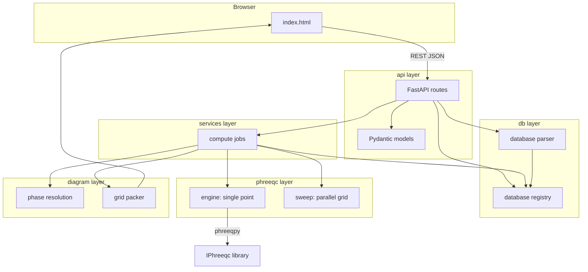

# PHASER — Phase Diagram Calculator

PHASER is a web service for building **pH–pe / pH–Eh predominance diagrams** from PHREEQC thermodynamic databases. Users define a chemical system (total concentrations), select solid phases, and the server evaluates a grid of PHREEQC solutions in parallel to determine which phase or aqueous species is dominant at each point.

Key behaviours:

- **Server-side PHREEQC** with multiprocessing grid sweeps and a **CPU queue** (one sweep at a time by default).
- **Browser-side settings** (`localStorage`) and **result cache** (IndexedDB) — no server-side UI state.
- **Database registry** — users pick databases by `db_id`, not filesystem paths.
- **Plotly UI** with resizable sidebar, square diagram, solid/aqueous display layers, and Eh/pe toggle (Eh conversion is client-side only).

---

## Quick start

### Linux / WSL (recommended for PHREEQC)

```bash
cd /path/to/Software_dev/PHASER
python3 -m venv .venv-linux
source .venv-linux/bin/activate
pip install -r requirements.txt

# IPhreeqc must be built and available (see phreeqpy docs)
python run_server.py
```

Open [http://localhost:8765](http://localhost:8765) in your browser.

### Windows

Windows Python cannot load Linux `libiphreeqc.so`. Use **WSL** for compute, or install a matching Windows `IPhreeqc` DLL and run natively.

---

## Project layout

```
PHASER/
├── run_server.py          # CLI entry point (uvicorn)
├── config.py              # Paths, limits, defaults (env-overridable)
├── api/                   # HTTP layer (FastAPI)
│   ├── app.py             # Application factory, static files, /icons mount
│   ├── models.py          # Pydantic request bodies
│   ├── dependencies.py    # DB / DLL resolution for routes
│   └── routes/            # One module per API concern
├── db/                    # PHREEQC database handling
│   ├── registry.py        # Server-side database catalog (trusted paths)
│   └── parser.py          # Parse PHASES block from .dat files
├── phreeqc/               # PHREEQC solver integration
│   ├── engine.py          # Single-point evaluation via phreeqpy/IPhreeqc
│   └── sweep.py           # Multiprocessing grid sweep
├── diagram/               # Phase diagram assembly
│   ├── phases.py          # Phase name resolution for a chemical system
│   └── packer.py          # Pack raw results into layered grids for the UI
├── services/              # Orchestration logic
│   ├── compute.py         # FIFO compute queue + background grid jobs
│   └── species.py         # Species picker suggestions
├── Icon/                  # Logo and favicon (served at /icons/)
├── static/
│   └── index.html         # Single-page web UI
└── data/
    └── databases/
        └── generated/     # User-generated .dat files (+ optional .meta.json)
```

---

## Architecture overview



### Layer responsibilities

| Layer | Role |
|-------|------|
| **api** | HTTP endpoints only. Validates requests, resolves `db_id` to trusted paths, returns JSON. |
| **services** | FIFO compute queue, job lifecycle, and species helpers. No PHREEQC math here. |
| **db** | Discover and register `.dat` files; parse phase catalogs for the UI. |
| **phreeqc** | Build PHREEQC input strings, call IPhreeqc, run parallel sweeps. |
| **diagram** | Turn per-point SI / species data into 2D predominance grids and display layers. |
| **static** | Client UI: species editor, phase picker, plot canvas, job polling, browser-side settings and result cache. |

---

## Database system

Users **never** send raw filesystem paths in normal operation. They select a database by **`db_id`** from a server-managed catalog.

### Sources

1. **builtin** — `.dat` files scanned from the PHREEQC installation directory (`BUILTIN_DB_DIRS` in `config.py`, default: USGS Phreeqc Interactive `database/` folder).
2. **generated** — `.dat` files in `data/databases/generated/`, intended for output from external tools (e.g. future PyGCC integration).

### Registry flow

1. On startup / first request, `db/registry.py` scans configured directories.
2. Each file becomes a `DatabaseRecord` with `id`, `name`, `source`, `filename`.
3. Optional sidecar metadata: `mydb.meta.json` next to `mydb.dat` (display name, `origin_service`, etc.).
4. `GET /api/databases` returns client-safe records (**no filesystem paths**).
5. Compute requests pass `db_id`; the server resolves to a trusted absolute path internally.

### Registering a generated database

```bash
# 1. Copy the .dat file into the generated directory
cp custom.dat data/databases/generated/

# 2. Optional: add metadata
cat > data/databases/generated/custom.meta.json <<'EOF'
{
  "name": "My custom thermo DB",
  "origin_service": "pygcc",
  "origin_job_id": "job-123"
}
EOF

# 3. Register (or restart server to rescan)
curl -X POST http://localhost:8765/api/databases/register \
  -H "Content-Type: application/json" \
  -d '{"filename": "custom.dat", "metadata": {"name": "My custom thermo DB"}}'
```

### Environment variables

| Variable | Purpose |
|----------|---------|
| `PHASER_DB` | Default Thermoddem `.dat` path (fallback if not in scan dirs) |
| `PHASER_DEFAULT_DB_ID` | Force default registry id |
| `PHASER_BUILTIN_DB_DIRS` | Extra builtin scan dirs (`os.pathsep`-separated) |
| `PHASER_GENERATED_DB_DIR` | Override generated database directory |
| `PHASER_IPHREEQC_LIB` | Path to `libiphreeqc.so` / `IPhreeqc.dll` |
| `PHASER_HOST` | Bind address (default `0.0.0.0`) |
| `PHASER_PORT` | Listen port (default `8765`) |
| `PHASER_MAX_CONCURRENT_JOBS` | Max simultaneous grid sweeps (default `1`) |

---

## PHREEQC solver (`phreeqc/`)

### Single-point evaluation (`engine.py`)

For each grid point `(pH, pe)`:

1. **`format_grid_input`** builds a PHREEQC input string:
   - `SOLUTION` with temperature, totals, charge balance species
   - Fixed `pH` and `pe` (Eh display conversion is handled in the browser UI)
   - `SELECTED_OUTPUT` requesting saturation indices (`si`) for selected phases
   - `USER_PUNCH` blocks to extract dominant aqueous species per element

2. **`evaluate_point`** runs the string through **phreeqpy** → **IPhreeqc**:
   - Parses selected output and USER_PUNCH results
   - Returns `GridPointResult`: convergence flag, SI dict, dominant solid, aqueous species per element

3. **`validate_phreeqc_setup`** loads the library and database once before spawning workers (fail-fast with clear errors).

### Parallel grid sweep (`sweep.py`)

A phase diagram with 60×60 resolution = **3,600 independent PHREEQC runs**.

- `ProcessPoolExecutor` spawns worker processes (default up to `MAX_WORKERS`).
- Each worker initializes its own IPhreeqc instance (`_worker_init`).
- `pool.map` evaluates all `(pH, pe)` pairs, preserving order.
- Progress callback updates job status for the UI poll loop.

Limits (`config.py`):

| Constant | Default | Purpose |
|----------|---------|---------|
| `GRID_LEVELS` | 60 | Default resolution for both pH and pe/Eh axes |
| `MAX_GRID_POINTS` | 40,000 | Hard cap on `ph_levels × pe_levels` |
| `MAX_PHASES_PER_JOB` | 200 | Max phases per compute request |
| `MAX_WORKERS` | 8 | Worker processes per sweep (capped by CPU count) |
| `MAX_CONCURRENT_JOBS` | 1 | Max simultaneous sweeps server-wide |

### Compute queue (`services/compute.py`)

When several users (or tabs) submit computes at once, extra jobs are **queued** instead of all spawning full worker pools.

1. `POST /api/compute` creates a job with status **`queued`**.
2. A dispatcher starts the job when `running_count < MAX_CONCURRENT_JOBS`.
3. Status becomes **`running`** while the sweep executes; progress is polled via `GET /api/job/{id}`.
4. On completion: **`done`** or **`error`**.
5. Queued jobs expose **`queue_position`** (1-based) and **`queue_size`** so the UI can show *"Queued — position 2 of 3"*.
6. After the browser fetches the result, it calls **`DELETE /api/job/{id}`** to free server memory.

Job statuses: `queued` → `running` → `done` | `error`.

---

## Phase diagram building (`diagram/`)

### Phase selection (`phases.py`)

Before compute:

1. Derive **system elements** from total concentrations (e.g. `Fe`, `C(4)` → `Fe`, `C`).
2. **`filter_phases`** (from `db/parser.py`) returns phases whose element sets are subsets of the system.
3. User-selected phases (or auto-discovered set) become the `phases` tuple passed to PHREEQC.

### Result packing (`packer.py`)

After the sweep, each grid point has SI values and aqueous dominance data. The packer:

1. Builds axis arrays (pH, pe or Eh).
2. For each **element subset** of the system, determines the **dominant solid** (highest SI ≥ 0 among eligible phases) or falls back to the dominant aqueous species.
3. Produces integer category grids mapping each `(pH, y)` cell to a phase/species index.
4. Builds **layers**:
   - `solid_subsets` — predominance among solids + aqueous fallback per subset
   - `elements` — per-element aqueous species maps

The UI (`static/index.html`) renders these layers as colored regions with Plotly. Display options (solid vs aqueous-by-element, Eh vs pe, boundaries, labels) are handled client-side.

---

## Web UI (`static/index.html`)

### Chemistry defaults

- Default units: **`mmol/kgw`**, default concentration **1** per species.
- Mol-family unit changes auto-convert concentrations in the UI.
- Charge balance species selectable (default `Na`); `0` concentration means no contribution to balance.

### Settings persistence

User settings (database, species, axes, phase selection, plot resolution, display options) are stored in the browser only:

| Storage | Key | Contents |
|---------|-----|----------|
| `localStorage` | `phaseDiagramState.v7` | Full UI state (auto-saved on every edit) |
| `localStorage` | `phaserLayout.v1` | Sidebar width |
| `sessionStorage` | `phaserLastResultKey.v1` | Pointer to last cached diagram |
| IndexedDB | `phaserResultCache.v1` | Packed diagram JSON (large results) |

There is **no server-side UI state** (`/api/state` was removed). Closing the tab or clearing site data resets settings; cached diagrams persist until TTL or cache eviction.

### Plot resolution

A single **plot resolution** slider in the Configuration panel sets both `ph_levels` and `pe_levels` sent to the compute API (e.g. 60 → 60×60 = 3,600 PHREEQC runs). The server default is `GRID_LEVELS` in `config.py`, exposed as `defaults.grid_levels` from `/api/config`.

### Result cache

To avoid repeated server compute for identical requests:

1. The browser hashes the compute request body (FNV-style key) and checks **IndexedDB**.
2. On **cache hit**, the diagram loads instantly — no server job is created.
3. On **cache miss**, the job is enqueued; when the result is fetched it is stored in IndexedDB.
4. The browser calls **`DELETE /api/job/{job_id}`** so the server releases the result from memory.

Cache limits: **12 results max**, **12-hour TTL** per entry.

On page load, if `sessionStorage` still points to a cached result key, the diagram is **restored from IndexedDB** without recomputing (same browser tab session).

### Queue feedback

While a job is queued, the status line shows **"Queued — position N of M"**. Once running, it shows **"Computing… X%"** with the progress bar.

### Display and layout

- **Solid predominance** vs **aqueous species (by element)** display modes.
- **pe / Eh** axis toggle — Eh is converted for plotting only; the backend always receives `pe`.
- Non-convergent / `none` cells render **white**; aqueous fallback species use light grey in solid view.
- Resizable left sidebar (desktop); double-click the divider to reset width.
- Square-ish phase diagram area (`aspect-ratio: 1 / 1`).
- PHASER logo and favicon from `Icon/` (served at `/icons/` — edit files in `Icon/`, no copy step needed).

---

## HTTP API

| Method | Path | Description |
|--------|------|-------------|
| `GET` | `/` | Web UI |
| `GET` | `/api/health` | Liveness check |
| `GET` | `/api/config` | Defaults, limits (`max_concurrent_jobs`, `grid_levels`, …), default `db_id` |
| `GET` | `/api/databases` | List available databases |
| `GET` | `/api/databases/{db_id}` | Database details |
| `POST` | `/api/databases/register` | Register generated database metadata |
| `GET` | `/api/elements?db_id=` | Elements in a database |
| `POST` | `/api/phases` | Discover phases for a chemical system |
| `POST` | `/api/compute` | Enqueue grid job → `{job_id, status, queue_position?, queue_size?}` |
| `GET` | `/api/job/{job_id}` | Job status (`queued` \| `running` \| `done` \| `error`), progress, queue position |
| `GET` | `/api/job/{job_id}/result` | Packed diagram JSON |
| `DELETE` | `/api/job/{job_id}` | Release job/result from server memory (called by UI after fetch) |

### Compute flow

```mermaid
sequenceDiagram
    participant UI as Browser
    participant API as api/routes/compute
    participant Job as services/compute
    participant Reg as db/registry
    participant Sw as phreeqc/sweep
    participant Pack as diagram/packer

    UI->>API: POST /api/compute {db_id, totals, phases, grid}
    API->>Job: enqueue job (queued if server busy)
    API-->>UI: {job_id, status, queue_position}
    Job->>Reg: resolve db_id → path
    Job->>Sw: run_grid_sweep(params)
  loop each grid point
        Sw->>Sw: evaluate_point via IPhreeqc
    end
    Sw-->>Job: list of GridPointResult
    Job->>Pack: pack_grid_results
    Pack-->>Job: layered grids
    UI->>API: GET /api/job/{id} (poll)
    Note over UI,Job: status queued → show position; running → show progress
    UI->>API: GET /api/job/{id}/result
    API-->>UI: diagram JSON
    UI->>UI: store in IndexedDB
    UI->>API: DELETE /api/job/{id}
```

---

## Configuration (`config.py`)

Central defaults for grid bounds, worker count, concurrency, IPhreeqc library path, and database directories.

| Setting | Env override | Default | Notes |
|---------|--------------|---------|-------|
| Host / port | `PHASER_HOST`, `PHASER_PORT` | `0.0.0.0:8765` | Used by `run_server.py` and Docker |
| Grid resolution | — | `GRID_LEVELS = 60` | Single value for both axes; API still accepts `ph_levels` + `pe_levels` |
| Max workers per sweep | — | `MAX_WORKERS = 8` | Capped by `os.cpu_count()` in `sweep.py` |
| Max concurrent sweeps | `PHASER_MAX_CONCURRENT_JOBS` | `1` | FIFO queue when exceeded |
| Default units | — | `mmol/kgw` | UI and API default |
| Default species conc. | — | `1.0` | Per species in UI |

See also the database environment variables in the table above.

---

## Future: PyGCC integration

PHASER is designed to consume databases produced elsewhere:

1. PyGCC (or another service) generates a `.dat` file.
2. The file is copied into `data/databases/generated/` or registered via `POST /api/databases/register`.
3. PHASER exposes it through `/api/databases` like any builtin database.
4. No changes to the compute pipeline are required.

---

## Development notes

- **Package name** = folder name (`PHASER`). `run_server.py` adds the parent directory to `sys.path` so `import PHASER` works when run from inside the folder.
- **WSL + Windows**: run the server in WSL; edit files on the Windows side; paths in `config.py` use `/mnt/c/...` when running under Linux.
- **Networking**: with WSL2 **mirrored networking** (`networkingMode=mirrored` in `%UserProfile%\.wslconfig`), the app is reachable on your LAN at the machine's IP (e.g. `http://192.168.x.x:8765`). You may need a Windows Firewall inbound rule for TCP port 8765.
- **Multi-user**: each browser session is isolated (local settings + IndexedDB cache). Compute jobs are independent but share the server queue and CPU pool.
- **Tests**: import smoke test:
  ```bash
  python scripts/smoke_check.py
  ```

---

## Docker

The container builds Linux IPhreeqc from the official USGS source tarball, installs Python dependencies, and includes the PHREEQC database directory from that source package.

Build and run:

```bash
cp .env.example .env
docker compose up --build phaser
```

Open:

```text
http://localhost:8765
```

Generated databases are mounted into the container:

```text
./data/databases/generated -> /app/PHASER/data/databases/generated
```

The container defaults are:

```env
PHASER_IPHREEQC_LIB=/usr/local/lib/libiphreeqc.so
PHASER_BUILTIN_DB_DIRS=/opt/phreeqc/database
PHASER_GENERATED_DB_DIR=/app/PHASER/data/databases/generated
PHASER_MAX_CONCURRENT_JOBS=1
```

Run a smoke check inside the image:

```bash
docker compose run --rm phaser python scripts/smoke_check.py
```

Stop services:

```bash
docker compose down
```

---

## Cloudflare Tunnel

For a temporary public test URL from your local machine:

```bash
cloudflared tunnel --url http://localhost:8765
```

For Docker Compose with a named Cloudflare tunnel:

1. Create a tunnel in Cloudflare and obtain the tunnel token.
2. Copy `.env.example` to `.env`.
3. Set:

   ```env
   CLOUDFLARE_TUNNEL_TOKEN=<your-token>
   ```

4. Start PHASER plus the tunnel:

   ```bash
   docker compose --profile tunnel up --build
   ```

The tunnel container connects to the internal Compose service (`phaser:8765`), so no router port forwarding is required.

Never commit the real tunnel token.

---

## Deployment Notes

The Docker image is the deployment unit. A typical deployment path is:

1. Build the Docker image on a VPS or container platform.
2. Mount persistent storage for `data/databases/generated`.
3. Expose the app through Cloudflare Tunnel or a reverse proxy.

The main deployment decisions:

- Built-in PHREEQC databases can live inside the image.
- User-generated databases should live in a persistent mounted volume.
- Set `PHASER_MAX_CONCURRENT_JOBS` based on available CPU/RAM (default `1` is safe for shared hosts).
- A future PyGCC service can copy `.dat` files into that volume or call `/api/databases/register` after generating them.
